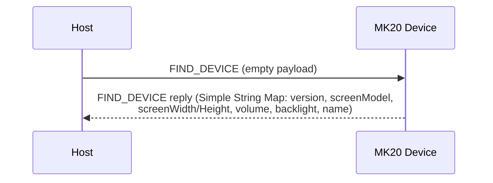
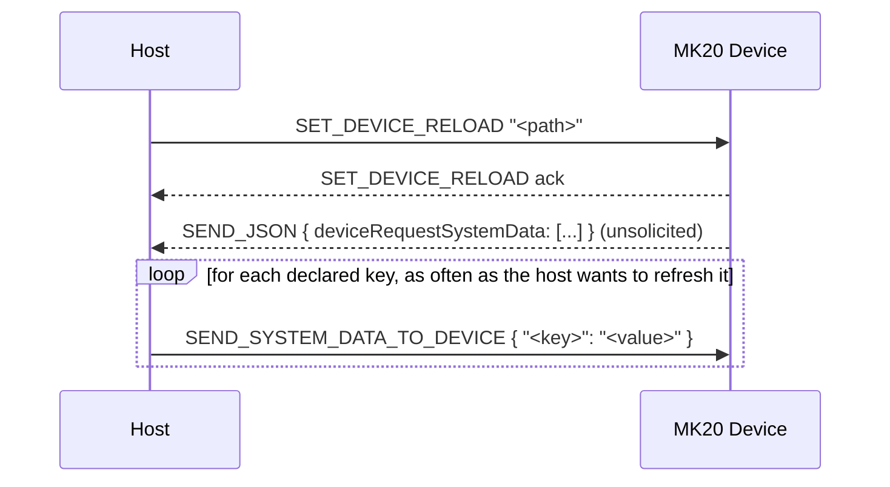
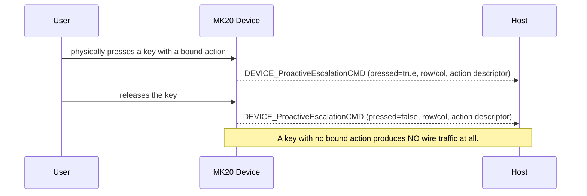
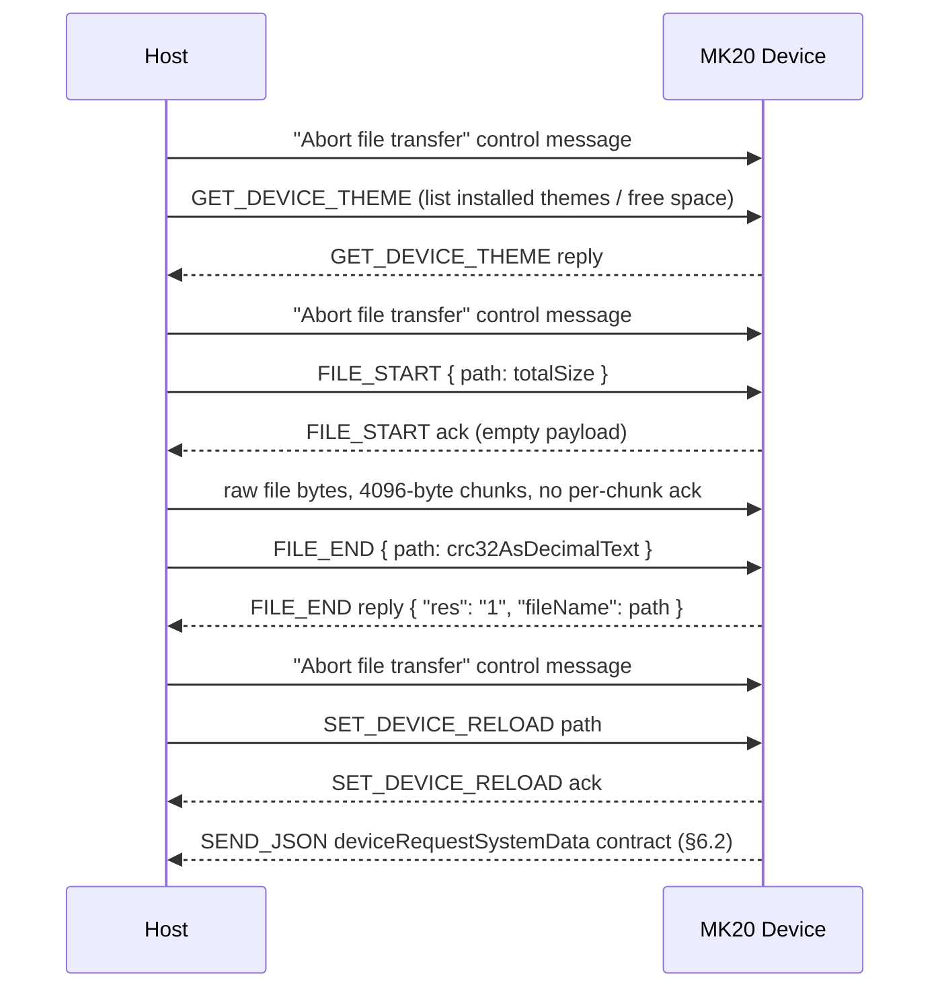
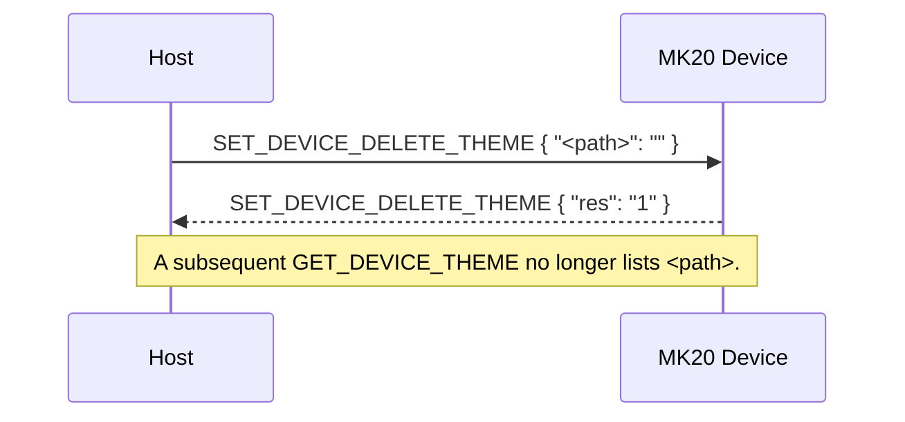
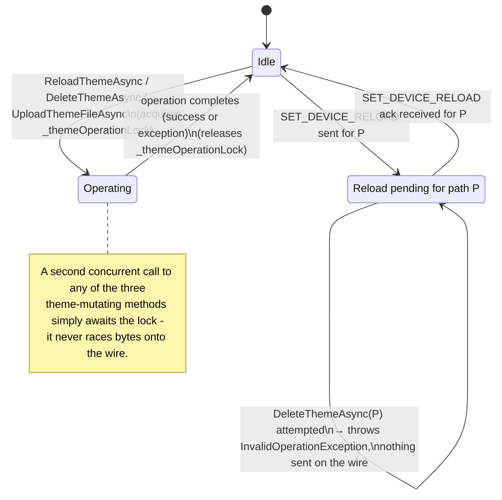
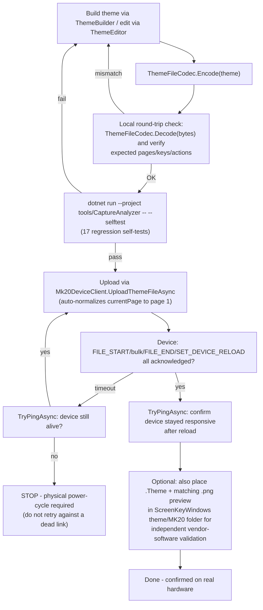
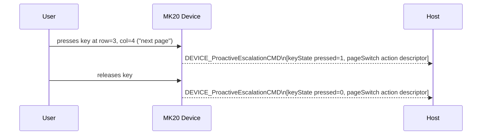
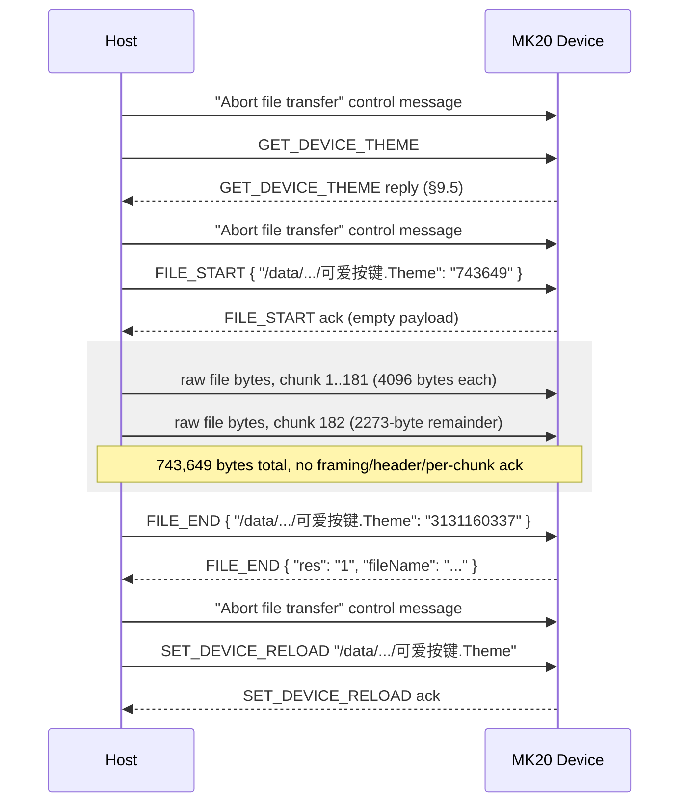

# Waveshare MK20 Host Protocol — Datasheet

**Document revision:** 2.2
**Applies to:** MK20 firmware `V2.32`, ScreenKeyWindows `v1.1`
**Status:** Confirmed by USB capture and live-device testing (see §12 for method)
**Reference implementation:** `Mk20Control.Protocol` (this repository)

---

## 1. Scope

This document specifies the USB host-control protocol used by the Waveshare MK20
programmable keypad. It covers the physical/transport layer, wire frame format, command
set, payload encodings, and the on-disk `.Theme` file format that themes are delivered in.

All information is derived from live USB capture of the vendor application
(ScreenKeyWindows v1.1) communicating with physical hardware, plus direct interrogation of
a connected device. Static disassembly of the vendor executable was **not** used (it is
protected by Enigma Protector); all facts below were obtained by legitimate black-box wire
and file-format analysis.

Each fact is tagged:

| Tag | Meaning |
|---|---|
| **C** | Confirmed — observed directly on the wire or in a live device reply |
| **I** | Inferred — a reasonable but unverified interpretation |
| **U** | Unconfirmed — known to exist, exact behavior/schema not yet observed |

---

## 2. Physical & Transport Layer

| Parameter | Value |
|---|---|
| Interface | USB, CDC-ACM (virtual serial port) |
| USB VID:PID | `1D6B:0104` (Linux Foundation gadget) or `1234:5678` |
| Serial parameters | 115200 baud, 8N1, no flow control **(C, host side; device ignores line-rate over CDC-ACM)** |
| Endianness | Frame header fields: **little-endian**. Payload-internal length/count fields: **big-endian**. Two different serializers are in play — do not assume one endianness for the whole stack. |
| Checksum | CRC-32 (zlib variant: poly `0xEDB88320`, init `0xFFFFFFFF`, final XOR `0xFFFFFFFF`) |

---

## 3. Wire Frame Format **(C)**

Every command frame has a fixed 38-byte header followed by a variable-length payload.

```
Offset  Size  Field          Type      Notes
──────  ────  ─────────────  ────────  ─────────────────────────────────────────
 0      22    header         ASCII     Literal "AA551234 FIXEDCMDHEAD " (trailing space included)
22       4    packetType     u32 LE    0 = request (host→device), 2 = reply (device→host)
26       4    commandId      u32 LE    See §4 command table
30       4    payloadLength  u32 LE    Byte length of payload
34       4    payloadCrc32   u32 LE    CRC-32 of payload (zlib variant)
38    payloadLength  payload  bytes   Command-specific, see §4/§5
```

Total frame length = 38 + `payloadLength`.

### 3.1 Control message (out-of-band, not length-prefixed)

A second, distinct wire construct exists — a bare ASCII literal with no header fields and
no payload:

```
"AA551234 Abort file transfer 123455AA"
```

Observed sent host→device around file-transfer sequences (see §4, `FILE_START`/`FILE_END`).
Not a command frame — do not attempt to parse a header out of it.

**CONFIRMED exact placement** (message-by-message across every real capture examined, zero
exceptions): exactly one abort-transfer message is sent immediately before every
`FILE_START`, and exactly one more immediately after `FILE_END` and before
`SET_DEVICE_RELOAD` — the host does **not** wait for `FILE_END`'s reply before sending the
abort-transfer + `SET_DEVICE_RELOAD` that follows it; all three requests are pipelined
back-to-back (typically 1-7ms apart) and replies are collected afterward in FIFO order
(`FILE_END`'s reply arrives first, then `SET_DEVICE_RELOAD`'s). A **standalone** reload of
an already-installed theme (no re-upload) is *not* preceded by an abort-transfer message.
Omitting this message and/or waiting for `FILE_END`'s reply before sending the reload
request (this client's original behavior) was confirmed via real-hardware testing to cause
the device to never acknowledge `FILE_END`/`SET_DEVICE_RELOAD` — see §10 Open Item #6.

### 3.2 Parser resynchronization

A receiver must scan for the ASCII sequence `AA551234` to locate a frame boundary in a
byte stream (this is not a single-byte binary magic). On an implausible `payloadLength` or
a CRC mismatch, resynchronize by scanning past the current magic occurrence rather than
assuming a fixed frame size — corrupted data must not cause a subsequent valid frame to be
silently skipped.

> ⚠ **Note:** an early reverse-engineering pass (prior to live capture) guessed a
> different, entirely binary framing (`0xA1 0xA5 0x5A 0x5E` magic) based on static
> string/symbol analysis of the vendor firmware and applications. That framing was never
> observed on real hardware and has been fully superseded by the ASCII-prefixed framing
> above — do not implement against it.

---

## 4. Command Table (`commandId`)

| ID | Name | Direction | Payload encoding | Status |
|----|------|-----------|-------------------|--------|
| 0  | `FIND_DEVICE` | H↔D | Request: empty. Reply: Simple String Map (§5.1) | **C** |
| 1  | `SEND_SYSTEM_DATA_TO_DEVICE` | H→D | Simple String Map, big-endian variant (§5.3) | **C** |
| 2  | `SET_DEVICE_RELOAD` | H↔D | Plain UTF-8 path string, **no length prefix** | **C** |
| 3  | `GET_DEVICE_THEME` | H↔D | Request: empty. Reply: Simple String Map (§5.1) | **C** |
| 4  | `SET_DEVICE_BL` | H→D | ASCII decimal text (e.g. `"80"`), no binary encoding | **C** |
| 5  | `SET_DEVICE_SCAN_STATE` | — | — | **U** (ordering only) |
| 6  | `FILE_START` | H↔D | Simple String Map, single entry: `{path: totalSize}` | **C** — full sequence confirmed, see §4.1 |
| 7  | `FILE_END` | H↔D | Simple String Map: `{path: crc32}` (H→D) / `{"res":"1","fileName":path}` (D→H) | **C** — full sequence confirmed, see §4.1 |
| 8  | `GET_DEVICE_VERSION` | — | — | **U** (ordering only) |
| 9  | `SET_DEVICE_CANVASFLIP` | — | — | **U** (ordering only) |
| 10 | `GET_DEVICE_SCREENMESSAGE` | — | — | **U** (ordering only) |
| 11 | `SET_DEVICE_DELETE_THEME` | H↔D | Simple String Map (§5.1): `{path: ""}` (H→D) / `{"res":"1"}` (D→H) | **C** |
| 12 | `SEND_PIXMAP` | D→H (observed) | JPEG wrapped in a Tagged-Value Map (§5.2) under key `"ScreenKey"` | **C** receive-only; wrapping type-tag not fully decoded, send path not implemented |
| 13 | `DEVICE_ProactiveEscalationCMD` | D→H | Array of Tagged-Value Maps (§5.2) | **C** |
| 14 | `REQUEST_UPLOAD_KEY` | — | — | **U** (ordering only) |
| 15 | `SEND_JSON` | H↔D | UTF-8 JSON text | **C** |

IDs 5, 8–10, 14 are known only from the vendor firmware's string ordering; they have never
been observed on the wire. Do not assume their payload schema.

### 4.1 File transfer (theme upload) — fully confirmed

`FILE_START` / `FILE_END` mark the beginning/end of a theme file upload. The complete
three-step sequence is **confirmed by capturing a real theme install** (capture14.pcapng)
and reconstructing the transferred bytes from the capture, verifying them byte-for-byte
identical to the source `.Theme` file and confirming the reported CRC-32 matched:

```
1. → FILE_START   {"<device path>": "<totalSize>"}     (Simple String Map, §5.1)
   ← FILE_START   (empty payload ack)
2. Raw file bytes are written directly to the same bulk OUT endpoint (0x01) in fixed
   4096-byte chunks, back-to-back, with NO additional per-chunk header/framing of any
   kind and NO per-chunk acknowledgment - it is exactly the file's bytes, split at
   4096-byte boundaries. The final chunk is a shorter remainder
   (totalSize mod 4096 bytes, or a full 4096-byte chunk if it divides evenly).
3. → FILE_END     {"<device path>": "<crc32AsDecimalText>"}
   ← FILE_END     {"res": "1", "fileName": "<device path>"}
```

Confirmed example: a 743,649-byte theme file was sent as 181 chunks of exactly 4096 bytes
followed by one 2273-byte remainder chunk (181×4096 + 2273 = 743,649); the reconstructed
bytes from the capture were byte-for-byte identical to the source file, and both matched
CRC-32 `3131160337`, the exact value the device echoed back in the `FILE_END` reply.

After a successful `FILE_END` reply, `SET_DEVICE_RELOAD` is sent for the same path to
activate the newly uploaded theme (see §8.6).

### 4.2 Reply correlation

There is **no per-request correlation ID** anywhere in this protocol. A reply is matched to
a request only by `commandId` (and `packetType = 2`), on a FIFO basis. Do not invent or
rely on a request/response ID field.

---

## 5. Payload Encodings

Two **mutually incompatible** map serializations exist in this protocol. Confusing them
produces plausible-looking but wrong decodes — this was confirmed to be a real
implementation hazard by testing against physical hardware (see §12).

### 5.1 Simple String Map — `FIND_DEVICE`, `GET_DEVICE_THEME`, `FILE_START`, `FILE_END`

```
count(u32 BE)
count × { keyLen(u32 BE) + key(UTF-16BE) + valueLen(u32 BE) + value(UTF-16BE) }
```

Every value is plain text — **including values that look numeric**, such as a CRC-32 or a
volume level. There is no type tag and no null sentinel field.

Confirmed `FIND_DEVICE` reply (8 entries, live device):

```json
{
  "version": "V2.32",
  "upgradeToLatestMethod": "1",
  "screen_width": "640",
  "screen_model": "MK20",
  "screen_height": "656",
  "deviceVolume": "7",
  "deviceName": "ScreenKey",
  "deviceBl": "80"
}
```

Confirmed `GET_DEVICE_THEME` reply shape:

```json
{
  "bytesTotal": "2648",
  "bytesAvailable": "2483",
  "/data/theme/MK20/<name>/<name>.Theme": "<crc32 as decimal text>"
}
```
(one path→CRC entry per installed theme, in addition to the two fixed free-space fields)

### 5.2 Tagged-Value Map — `DEVICE_ProactiveEscalationCMD`, `.Theme` file internals

```
map:          count(u32 BE) + count × (string key + tagged value)
tagged value: typeId(u32 BE) + isNull(u8) + type-specific data

  typeId  Type          Encoding
  ──────  ────────────  ─────────────────────────────────────────
  1       bool          1 byte
  2       Int32         4 bytes, BE
  6       Double        8 bytes, BE
  8       map           nested map (recursive)
  9       list          count(u32 BE) + count × tagged value
  10      string        byteLen(u32 BE) + UTF-16BE; byteLen=0xFFFFFFFF ⇒ null
  12      byte array    byteLen(u32 BE) + raw bytes; byteLen=0xFFFFFFFF ⇒ null
```

For string/byte-array values, the `isNull` byte is conventionally written `0`, with
nullability instead signaled by the length field being `0xFFFFFFFF`. Any other `typeId` is
unspecified — treat as a decode error, not a guessable case.

`DEVICE_ProactiveEscalationCMD` payload is `count(u32 BE) + count × map` (an **array** of
tagged-value maps, not a single map).

Confirmed event — key at row 3, col 4, assigned "next page":

```json
[
  { "type": "keyState", "row": 3, "col": 4, "pressed": 1 },
  { "type": "pageSwitch", "pageSwitchMode": 2, "jumpToPage": 0,
    "iconPath": "/static/icon/dark/PageSwitch.png", "description": "Page switching" }
]
```

`pageSwitchMode`: `1` = previous page, `2` = next page.

Encoder-function events use a sentinel key position instead of a real matrix cell:
`row`/`col` observed as `100`–`105` depending on which encoder/edge fired (not a physical
key location).

### 5.3 System Data Map — `SEND_SYSTEM_DATA_TO_DEVICE`

Structurally identical to §5.1 (big-endian length-prefixed UTF-16BE string pairs), used
one-way host→device to push live telemetry values that a loaded theme displays.

```
count(u32 BE)
count × { keyLen(u32 BE) + key(UTF-16BE) + valueLen(u32 BE) + value(UTF-16BE) }
```

Confirmed data-source keys observed in captures: `GPU Usage`, `GPU Temperature`,
`CPU Usage`, `CPU Temperature`, `RAM Usage`, `RAM Total Memory`, `Volume`, `device_bl`.
Key names are theme-defined, not a fixed enum — see §6.2.

---

## 6. Behavioral Model

### 6.1 Identity / keepalive

`FIND_DEVICE` with an empty payload elicits a reply carrying the device identity map
(§5.1). No dedicated keepalive interval is specified; poll as needed.



### 6.2 Telemetry push contract (`deviceRequestSystemData`)

Immediately after every successful `SET_DEVICE_RELOAD`, the device sends an unsolicited
`SEND_JSON` (commandId 15) reply declaring which data-source keys the **newly loaded
theme** requires:

```json
{
  "deviceRequestSystemData": ["CPU Usage", "GPU Usage", "RAM Usage"],
  "deviceRequestSystemDataShowUnit": true,
  "themePageSwitch": true
}
```

The host is expected to push only the declared keys via `SEND_SYSTEM_DATA_TO_DEVICE`
(§5.3) afterward. This is a per-theme declarative contract, not a fixed global list — a
custom theme can declare arbitrary key names, since a progress-bar/text UI element simply
binds to a `system_data_name` string defined in its own theme JSON (§7).



### 6.3 Key press / encoder events

`DEVICE_ProactiveEscalationCMD` (commandId 13) fires **only** for a key or encoder that has
a "rich" action bound to it in the currently loaded theme (page-switch, encoder function,
etc.). A key with no bound action produces **no wire traffic at all** on press — there is
no generic "any key pressed" event.

Encoder rotation is **not** a discrete event. Turning a brightness/volume-bound encoder
instead causes the host to continuously push the live value via
`SEND_SYSTEM_DATA_TO_DEVICE` (e.g. `device_bl=80`), rendered by an on-screen element bound
to that key. No "rotated by N detents" message exists on the wire.



### 6.4 Setting a key's picture or function

There is **no live per-key command** to set an icon or assign a function to a single key.
Every observed key remap / icon change / GIF assignment was performed by rebuilding the
**entire theme file** and pushing it through:

```
GET_DEVICE_THEME                          (list installed themes / free space)
FILE_START   {path: totalSize}
             … 4096-byte bulk chunks, confirmed, see §4.1 …
FILE_END     {path: crc32}
SET_DEVICE_RELOAD  path                   (activate)
```



A theme containing an animated GIF is simply a larger `.Theme` file (embedded assets) —
GIFs, videos (`.mp4`), and PNGs are not distinct wire concepts.

**Which page the device opens to after activation.** The layout JSON's
`"main"."currentPage"` field (§7) names the page GUID the device renders immediately after
a successful `SET_DEVICE_RELOAD` — it is **not** necessarily the first entry in the
`"pages"` array; nothing in the wire protocol or file format requires them to match. A
`.Theme` file re-saved by ScreenKeyWindows (or edited via `ThemeEditor`) can end up with
`currentPage` pointing at whatever page was last open/selected at save time, so a
multi-page theme can silently activate showing e.g. page 4 instead of page 1 even though
its bytes are otherwise perfectly valid and load correctly. **Confirmed via direct
comparison**: decoding `customTheme6pages.Theme` showed `currentPage` pointing at the
theme's 4th page even though `ThemeBuilder` always sets it to the first page's id at
`Build()` time — meaning the value can drift after the file leaves this library's control
(e.g. after being opened/re-saved elsewhere, or reused as an editing base). `Mk20DeviceClient
.UploadThemeFileAsync` now defends against this automatically: it decodes the file it's
about to send, and if `currentPage` doesn't match the first page in `"pages"`, it
re-encodes with `currentPage` corrected before the FILE_START/bulk-transfer sequence begins
— so every upload through this client always activates on page 1, regardless of what value
was embedded in the bytes handed to it. See `Mk20DeviceClient.NormalizeToFirstPage`.

### 6.5 Secondary screen

A secondary-screen theme uses the identical `GET_DEVICE_THEME` / `FILE_START` / `FILE_END`
/ `SET_DEVICE_RELOAD` sequence and the same `deviceRequestSystemData` contract as a
main-screen theme — it is simply another theme file/slot, not a separate protocol path.

### 6.6 Deleting a theme

`SET_DEVICE_DELETE_THEME` (commandId 11) removes an installed theme by its device-side
path. Confirmed request/reply shape (both Simple String Map, §5.1):

```
→ SET_DEVICE_DELETE_THEME   {"<path>": ""}
← SET_DEVICE_DELETE_THEME   {"res": "1"}
```



A subsequent `GET_DEVICE_THEME` no longer lists the deleted path. The value half of the
request entry is an empty string - the path itself is the only meaningful data, carried as
the map *key* (the same "path as dictionary key" shape used by `GET_DEVICE_THEME`, §5.1).
Deleting the currently-active theme was not tested; behavior in that case is unconfirmed.

### 6.7 Client-side operational discipline (why this matters on real hardware)

The protocol itself has **no confirmed device-side "cancel" or "reset stuck operation"
command** beyond the abort-transfer control message (§3.1), which is sent proactively
*before* starting a new file-transfer/reload operation, not as a runtime recovery signal for
an operation already in flight. This means correctness depends on the *host* behaving
disciplined, not on the device protecting itself from a confused host. Message-by-message
analysis of every real capture shows the real ScreenKeyWindows host follows two rules that
this library now enforces automatically in `Mk20DeviceClient`:

1. **Never overlap theme-mutating operations.** Every real capture examined shows exactly
   one `FILE_START`/`FILE_END`/`SET_DEVICE_RELOAD`/`SET_DEVICE_DELETE_THEME` sequence in
   flight at a time - the host always finishes (or gives up on) one before starting another.
   `Mk20DeviceClient` serializes `ReloadThemeAsync`, `DeleteThemeAsync`, and
   `UploadThemeFileAsync` against each other via an internal lock so a second call made
   before the first finishes simply waits its turn rather than racing bytes onto the wire.
2. **Never delete a theme whose reload hasn't been confirmed.** This was not directly
   observed in a capture (no capture contains a delete immediately following an
   unacknowledged reload of the same theme), but was confirmed as a real hazard through
   direct testing: deleting a theme while its `SET_DEVICE_RELOAD` was still unacknowledged
   (including one that had already timed out client-side - a timeout does **not** prove the
   device gave up processing it) left the device's render subsystem stuck, requiring a
   physical power-cycle to recover, while `FIND_DEVICE`/`GET_DEVICE_THEME` kept responding
   normally throughout. `Mk20DeviceClient.DeleteThemeAsync` now refuses to delete a path
   with an unconfirmed pending reload, throwing `InvalidOperationException` with a clear
   explanation before sending anything; use `IsReloadPending`/`ClearPendingReloadState` to
   inspect or explicitly override this safeguard once you've independently confirmed it's
   safe (e.g. after a power-cycle).



### 6.8 End-to-end theme authoring workflow (recommended)

This is the confirmed-safe sequence for building and validating a new/edited theme against
real hardware, as used throughout this project's own testing:



---

## 7. `.Theme` File Format

Themes are delivered to the device as a single binary file with this layout:

```
[header: Tagged-Value Map — language(int), keyMacroValue(bytes), keyMacro(bytes|null)]
[8 bytes — 4 zero bytes + a big-endian uint32 equal to (JSON byte length + 1); CONFIRMED
 via direct byte comparison against multiple real files - NOT arbitrary padding]
[UTF-8 JSON — layout: {"main":{"currentPage","version"},"pages":[...]}]
[1 byte reserved, observed 0x0A]
[assetCount(u32 BE)]
assetCount × {
    pathLen(u32 BE) + path(UTF-16BE)      // e.g. "/image/428x142/PhotoAlbum/x.gif"
    dataLen(u32 BE) + data(bytes)          // PNG / GIF / MP4, per magic bytes
}
```

Decoding does not need to trust the 8-byte length field - scanning for balanced `{}`/`[]`
(respecting quoted-string escapes) finds the JSON's true end correctly regardless - but
**encoding must write the correct value**: a themed file whose header claims the wrong JSON
length was one of several confirmed contributing causes of ScreenKeyWindows itself locking
up when loading a file this library produced (see §10 Item #10).

**Confirmed real JSON formatting** (matters for producing a file ScreenKeyWindows accepts,
not just one this codec can decode): 4-space indentation, Unix `\n` line endings (not
`\r\n`), object keys in alphabetical order at every nesting level, and minimal string
escaping (`\"` for a literal quote, not `\u0022`).

**Note:** all numeric-looking JSON fields (`x`, `y`, `z`, `w`, `h`, `rotate`, `scale`, `id`,
…) are serialized as **JSON strings**, not JSON numbers.

**`main.currentPage`:** the page GUID (must match one entry in `"pages"[].pageName`) the
device renders immediately upon activation via `SET_DEVICE_RELOAD` - see §6.4 for the
confirmed drift hazard (it is not guaranteed to match `pages[0]`) and how
`Mk20DeviceClient.UploadThemeFileAsync` now corrects it automatically before every upload.

**Page count:** a theme is NOT required to have more than 1 page - confirmed by a real,
user-created, working theme (`customTheme5buttons.Theme`, 5 keys, no background, exactly 1
page) that uploaded/reloaded normally on real hardware. An earlier hypothesis based on every
*named* theme shipped with ScreenKeyWindows having 2+ pages was disproven this way - those
themes simply happen to use multiple pages for their own content/folder navigation, not
because the device requires it. See §10 Open Item #9 for the real explanation of the
device-side hangs that had been (incorrectly) attributed to page count.

**Confirmed required page-level field: `"encoder"`.** Every top-level/main-screen theme
page examined (all 13 vendor themes, `customTheme7buttonsSoftware.Theme`,
`empty.Theme`) carries a page-level `"encoder"` array alongside `"canvas"`/`"items"`/
`"pageName"`:
```json
"encoder": [
    {"col": 0, "keyString": "", "keycode": 0, "row": 103},
    {"col": 0, "keyString": "", "keycode": 0, "row": 104}
]
```
This describes the device's physical rotary-encoder hardware (not yet individually modeled
beyond round-tripping) and is absent only from legitimately different secondary-screen/
sub-page theme files (`Key/*.theme`, `SecondaryScreen/*.theme`,
`Encoder/relatedTheme/*.Theme`). **Omitting this field entirely from a main-screen theme
(as this library's codec did before being fixed) was confirmed to make ScreenKeyWindows
itself lock up when loading the file** - independent of every key/item field being otherwise
completely correct (see §10 Item #10). `ThemeFileCodec` now always emits this field:
preserved from the source page if decoded from a real file, or defaulted to the value shown
above for a brand-new page built via `ThemeBuilder`.

### 7.1 Page item types (`items[].type`)

| Code | Name | Purpose | Key fields |
|------|------|---------|-----------|
| 100 | Background | Static image or video, main or secondary screen | `backgroundType`: `main`\|`secondary`, `path` |
| 102 | Progress bar | Data-bound circular/linear bar | `system_data_name`, `system_data_min_value`/`max_value` |
| 103 | Linear gauge | Data-bound bar, solid front/back/border colors | `system_data_name`, `front_color`/`back_color`/`border_color` |
| 109 | Radial gauge | Data-bound arc gauge, up to 3 gradient stops | `system_data_name`, `angleMinValue`/`angleMaxValue`, `gradientColor1`–`3` |
| 111 | Digital clock | Live clock field (one item per field) | `system_data_name`: `hour`\|`minute`\|`second` |
| 113 | Text | Static or data-bound text | `system_data_name`, `text_font`, `text_str` |
| 114 | Dynamic image | Animated GIF | `path` → embedded `.gif` asset |
| 115 | Key | Physical key definition | `row`, `col`, `path` (icon), `controlData` (base64, see §7.2) |

**Confirmed required fields for a type-115 Key item** (observed on every real key item;
omitting several of these caused a real device to hang indefinitely on `SET_DEVICE_RELOAD`
during testing — see §10 note): `id`, `itemName` (e.g. `"control1"` - confirmed always
present; omitting it, as `KeyItemBuilder` did before being fixed per §10 Item #10, was one
of two confirmed causes of ScreenKeyWindows itself locking up when loading a built theme),
`x`, `y`, `z`, `rotate`, `scale`, `lock`, `row`, `col`,
`path`, `controlData`, `maxWidth`, `maxHeight`, `scaledWidthTo`, `scaledHeightTo`, `opacity`,
`paths` (usually empty string), `soundFile` (usually empty string), `title` (usually empty
string), `titleParam` (a JSON-string-encoded object with `FontFamily`/`FontSize`/etc.).
**Key items never carry `w`/`h`** — unlike Background items (type 100), which carry `w`/`h`
*and* `maxWidth`/`maxHeight` together. All boolean-looking fields (e.g. `lock`) are encoded
as the strings `"0"`/`"1"`, not JSON `true`/`false`, consistent with the numeric-string
convention noted above. **`lock` is `"1"` on every real key item examined (5/5 real theme
files)** — always set `"lock":"1"` on key items to match; see §10 Open Item #9 for the
current (not fully conclusive) evidence on this field's effect on device-side reload
behavior.

**Confirmed required `controlData` fields for a `keyboard`-type action** (base64-decoded
tagged-value map, §5.2): `type` (`"keyboard"`), `description` (`"Keyboard"`),
`parentDescription` (`"System input control"`), `iconPath`
(`"/static/icon/dark/keyboard.png"`), `keycode`, `keyString`, `AISoundControlKeyword`
(empty string). Omitting `description`/`parentDescription`/`iconPath`/`AISoundControlKeyword`
(as `KeyActions.Keyboard` did before being fixed per §10 Item #10) produced a `controlData`
blob with only 3 of the 7 real fields — confirmed to make ScreenKeyWindows itself lock up
when loading the resulting theme file, independent of this client or the device.

**Modifier combos (e.g. Ctrl+Alt+Del):** `keycode` is not always a plain USB HID usage
code — a key with one or more held modifiers packs the standard USB HID keyboard-report
modifier bitmask into the *upper byte* of the same 16-bit `keycode` field:
`(modifierBitmask << 8) | baseKeycode`. **Confirmed via a real capture**
(`tools/Captures/capture18_ctrlaltdel.pcapng` — a key assigned to Ctrl+Alt+Del in
the vendor editor and saved, sanitized in-place via `tools/Captures/sanitize.ps1` to keep
only the MK20's own USB traffic):
`keycode = 0x054C`, decomposing as modifier byte `0x05` (bit0=Left Ctrl, bit2=Left Alt) +
base keycode `0x4C` (USB HID Delete), with `keyString = "L Ctrl L Alt Del"`. This is the
standard USB HID Boot Keyboard modifier-byte convention, just packed into `keycode`'s upper
byte rather than sent as a separate field — no other combo has been individually confirmed
against this device yet, but the same bit layout is expected to generalize (see
`Mk20Control.Protocol.Theme.Building.KeyModifiers`):

| Bit | Modifier | Confirmed? |
|---|---|---|
| 0 (`0x01`) | Left Ctrl | **C** (Ctrl+Alt+Del capture) |
| 1 (`0x02`) | Left Shift | U (standard USB HID position, not individually captured) |
| 2 (`0x04`) | Left Alt | **C** (Ctrl+Alt+Del capture) |
| 3 (`0x08`) | Left Win | U |
| 4 (`0x10`) | Right Ctrl | U |
| 5 (`0x20`) | Right Shift | U |
| 6 (`0x40`) | Right Alt | U |
| 7 (`0x80`) | Right Win | U |

Use `KeyActions.KeyboardCombo(modifiers, key, ...)` for any combo (combine `KeyModifiers`
values with `|`, e.g. `KeyModifiers.LeftCtrl | KeyModifiers.LeftShift` for Ctrl+Shift+Esc,
and pass the non-modifier key as a `Mk20Control.Protocol.Theme.Building.HidKey` enum value
instead of a raw integer, e.g. `HidKey.Delete`/`HidKey.Escape`/`HidKey.Tab` - no dedicated
per-combo method exists; every combo goes through this one strongly-typed function). See
`README.md`'s "Keyboard modifiers and combos" section
for worked examples.

**Confirmed required key icon PNG asset format:** every real key icon PNG examined from a
shipped vendor theme is exactly **128x128 pixels, RGB (no alpha channel), 8-bit depth** -
the `scaledWidthTo`/`scaledHeightTo` JSON fields (128 in every sample) describe the
*rendered* size but do not substitute for the asset itself already being that exact
size/format. A structurally-correct key item (every JSON field present, `controlData`
complete) whose icon asset was a different size or carried an alpha channel was confirmed
to make ScreenKeyWindows itself lock up when loading the theme file (see §10 Item #10) -
independent of any JSON-level correctness. `KeyItemBuilder.Icon`/`ThemeEditor.SetKeyIcon`
now normalize any input image to this exact format automatically.

**Animated key icons:** a key item can show a multi-frame animation instead of a static
icon by leaving `path` empty and instead setting `paths` to a folder path (e.g.
`/image/MK20/cache/pop-cat_1`) plus `frameDelays` as a comma-separated per-frame delay list
in milliseconds (e.g. `"100,100"` for a 2-frame animation) - confirmed from a real
user-created theme with a 2-frame GIF-derived icon (`customTheme5buttons.Theme`, updated
version). Each frame is a separate PNG asset under that folder path (e.g. `frame_0.png`,
`frame_1.png`), not a single embedded `.gif` file - this is a different mechanism from the
type-114 Dynamic Image item's single embedded GIF asset (§7.1 above), even though both
ultimately render an animation.

### 7.2 Key actions (`controlData`, base64 of a Tagged-Value Map)

| `type` | Purpose | Key fields |
|---|---|---|
| `keyboard` | Emit a keystroke (optionally with held modifiers) | `keycode` (USB HID usage; upper byte = modifier bitmask for combos, see below), `keyString` |
| `openWeb` | Open a URL | `Url` |
| `qmk_mouse` | Mouse click/move/scroll | `qmk_mouse_key`, `qmk_mouse_event`, `mouse_x`/`y`/`v`/`h` |
| `pageSwitch` | Relative page navigation | `pageSwitchMode`: `1`=previous, `2`=next |
| `openPage` | Jump to a specific page | `pageName` (target page GUID) |
| `oneLevelUp` | Navigate to parent page | `pageName` = fixed sentinel `"parentPage"` |
| `keyboard_switch` | Toggle keyboard layout | — |
| `Microphone` / `Loudspeaker` | Adjust a named OS audio device's volume | `volumeAdjustDevice`, `volumeAdjustMode`, `volumeadjustValue` |
| `text` | Inject typed text | `inputText`, `isInputEnter`, `isCopyPaste` |
| `ControlFlow` | Multi-step macro | `controlDataList` (bytes) — populated-step schema not yet observed |
| `encoder_system_volume` / `encoder_system_media` / `encoder_device_brightness` | Encoder function | `category`="encoder", optional `relatedTheme` (a `.Theme` path shown on the encoder's mini-display) |
| `encoder_keyboard` | Encoder bound to 3 keystrokes | `encoder_left_keycode`/`middle`/`right_keycode` (+ `keyString` each) |

### 7.3 Theme builder/editor API (`Mk20Control.Protocol.Theme.Building`)

For programmatic theme construction/editing (set a picture on a button, assign its
behavior, set a background, add a data gauge, ...) without hand-writing JSON, use:

- **`ThemeBuilder`** — fluent builder for a brand-new `ThemeFile` from scratch. Chain
  `.AddPage(page => ...)`, and within a page use `.AddKey(row, col, key => ...)`,
  `.AddBackground(bg => ...)`, `.AddText(...)`, `.AddProgressBar(...)`,
  `.AddLinearGauge(...)`, `.AddRadialGauge(...)`, `.AddDigitalClockField(...)`,
  `.AddDynamicImage(...)`. Call `.Build()` to get an immutable `ThemeFile`, then
  `ThemeFileCodec.Encode(...)` to get bytes ready for `Mk20DeviceClient.UploadThemeFileAsync`.
- **`ThemeEditor`** — wraps an already-decoded `ThemeFile` (e.g. from `ThemeFileCodec.Decode`
  on a real `.Theme` file) for targeted edits: `editor.Page(n).SetKeyIcon(row, col, ...)`,
  `.SetKeyAction(row, col, ...)`, `.SetKeyTitle(...)`, `.AddKey(...)`, `.RemoveKey(...)`,
  `.SetMainBackground(...)`. Call `editor.Save()` to get the updated `ThemeFile`.
- **`KeyActions`** — factory methods for every confirmed `KeyAction` variant from §7.2
  (`KeyActions.Keyboard(HidKey key, label)` / `.Keyboard(int keycode, label)`,
  `.KeyboardCombo(KeyModifiers modifiers, HidKey key, label)`, `.OpenWeb(url)`, `.Mouse(...)`, `.PreviousPage()`/
  `.NextPage()`, `.OpenPage(pageId)`, `.OneLevelUp()`, `.TypeText(...)`, `.AudioVolume(...)`,
  `.KeyboardSwitch()`, `.EncoderKeyboard(...)`, `.EncoderFunction(rawType, ...)`).

Every item produced by this API uses the confirmed-required JSON field skeleton from §7.1
(no `w`/`h` on key items; `maxWidth`/`maxHeight`/`scaledWidthTo`/`scaledHeightTo`/`opacity`/
`paths`/`soundFile`/`title`/`titleParam` present; `lock` as a `"0"`/`"1"` string) — this field
set was cross-checked against multiple real theme files shipped with ScreenKeyWindows_v1_1
(`defaultTheme.Theme`, `时尚按键.Theme`) as well as this project's own capture traces, not
just a single sample.

**Cross-check performed:** decoding a real theme file, rebuilding its Background+Key items
purely through this API from the *decoded/interpreted* data (row/col, icon asset bytes,
action), re-encoding, and re-decoding reproduces every physical (row/col-addressable) key's
icon and action with **zero mismatches** across two real theme files (39/39 keys in
`时尚按键.Theme`; 80/80 non-encoder-slot keys in `defaultTheme.Theme` — the only apparent
"mismatches" there were encoder-function key entries, which share a fixed `row=0,col=0`
sentinel rather than a unique grid position, an artifact of the comparison script's simple
row/col lookup, not a builder defect). Exact byte-for-byte file equality is intentionally
*not* the bar — the real ScreenKeyWindows editor embeds extra bookkeeping fields (`itemName`,
`backupX`/`backupY`, JSON key ordering/whitespace) that have no confirmed effect on device
behavior; see `CaptureAnalyzer --builder-byte-diff <file.Theme>` to reproduce this check.

---

## 8. Command Reference — Practical Sequences

### 8.1 Connect and identify

```
→ FIND_DEVICE   (empty)
← FIND_DEVICE   Simple String Map (§5.1) — device identity
```

### 8.2 Set backlight

```
→ SET_DEVICE_BL   "80"        (ASCII decimal, 0–100)
```

### 8.3 Push telemetry (theme must already declare matching keys — see §6.2)

```
→ SEND_SYSTEM_DATA_TO_DEVICE   { "CPU Usage": "42%" }
```

### 8.4 List installed themes

```
→ GET_DEVICE_THEME   (empty)
← GET_DEVICE_THEME   Simple String Map (§5.1) — bytesTotal/bytesAvailable + path→CRC pairs
```

### 8.5 Load a theme

```
→ SET_DEVICE_RELOAD   "/data/theme/MK20/<name>/<name>.Theme"
← SET_DEVICE_RELOAD    (ack)
← SEND_JSON             deviceRequestSystemData contract (§6.2)
```

### 8.6 Upload and activate a new/edited theme

```
→ FILE_START   { path: totalSize }
← FILE_START   (empty payload ack)
  … raw file bytes, 4096-byte chunks, no framing, no per-chunk ack (confirmed, §4.1) …
→ FILE_END     { path: crc32AsDecimalText }
← FILE_END     { "res": "1", "fileName": path }
→ SET_DEVICE_RELOAD   path                (activate)
```

### 8.7 Delete a theme from the device

```
→ SET_DEVICE_DELETE_THEME   { "/data/theme/MK20/<name>/<name>.Theme": "" }
← SET_DEVICE_DELETE_THEME   { "res": "1" }
```
A subsequent `GET_DEVICE_THEME` no longer lists the deleted path. No corresponding file
deletion confirmation was observed on the device's underlying filesystem (out of scope for
this protocol) - only the theme-listing/reply contract is confirmed.

---

## 9. Wire-Level Examples

Every example below is a **verbatim byte sequence** taken from a real capture or a real
`.Theme` file (source noted per example), shown as the complete 38-byte header + payload,
hex-encoded. Use these to validate an independent implementation byte-for-byte.

### 9.1 Connect / identify — `FIND_DEVICE`

Request (host → device), empty payload:
```
4141353531323334204649584544434D44484541442000000000000000000000000000000000
```

Reply (device → host), 316-byte payload, Simple String Map (§5.1):
```
4141353531323334204649584544434D44484541442002000000000000003C0100009088F6E3
000000080000000E00760065007200730069006F006E0000000A00560032002E003300320000
002A00750070006700720061006400650054006F004C00610074006500730074004D00650074
0068006F00640000000200310000001800730063007200650065006E005F0077006900640074
0068000000060036003400300000001800730063007200650065006E005F006D006F00640065
006C00000008004D004B003200300000001A00730063007200650065006E005F006800650069
00670068007400000006003600350036000000180064006500760069006300650056006F006C
0075006D006500000002003700000014006400650076006900630065004E0061006D00650000
001200530063007200650065006E004B00650079000000100064006500760069006300650042
006C00000006003100300030
```
Decodes to:
```json
{"version":"V2.32","upgradeToLatestMethod":"1","screen_width":"640","screen_model":"MK20",
 "screen_height":"656","deviceVolume":"7","deviceName":"ScreenKey","deviceBl":"100"}
```

### 9.2 Set backlight — `SET_DEVICE_BL`

Request, 2-byte ASCII payload `"99"`:
```
4141353531323334204649584544434D4448454144200000000004000000020000004D175810
3939
```
`payload = 39 39` = ASCII `"99"`.

### 9.3 Push telemetry — `SEND_SYSTEM_DATA_TO_DEVICE`

Request, 108-byte payload (3 key/value pairs):
```
4141353531323334204649584544434D44484541442000000000010000006C000000BC1A9404
0000000300000012004700500055002000550073006100670065000000040030002500000012
004300500055002000550073006100670065000000060031003700250000001E004300500055
002000540065006D007000650072006100740075007200650000000400302103
```
Decodes to `{"GPU Usage":"0%","CPU Usage":"17%","CPU Temperature":"0℃"}` — this is the
Simple String Map format (§5.1), not the tagged-value format.

### 9.4 Key press event — `DEVICE_ProactiveEscalationCMD`



Reply, 515-byte payload — physical key at row 3 / col 4 (assigned "next page"), pressed:
```
4141353531323334204649584544434D444845414420020000000D00000003020000D63FCD64
00000002000000040000000800740079007000650000000A0000000010006B00650079005300
74006100740065000000060072006F00770000000200000000030000000E0070007200650073
007300650064000000020000000001000000060063006F006C00000002000000000400000007
0000000800740079007000650000000A00000000140070006100670065005300770069007400
630068000000220070006100720065006E007400440065007300630072006900700074006900
6F006E0000000A000000001C005000610067006500200073007700690074006300680069006E
00670000001C0070006100670065005300770069007400630068004D006F0064006500000002
000000000200000014006A0075006D00700054006F0050006100670065000000020000000000
0000001000690063006F006E00500061007400680000000A0000000040002F00730074006100
7400690063002F00690063006F006E002F006400610072006B002F0050006100670065005300
770069007400630068002E0070006E0067000000160064006500730063007200690070007400
69006F006E0000000A000000001C005000610067006500200073007700690074006300680069
006E00670000002A004100490053006F0075006E00640043006F006E00740072006F006C004B
006500790077006F007200640000000A0000000000
```
Decodes to (§5.2 tagged-value array):
```json
[
  { "type": "keyState", "row": 3, "col": 4, "pressed": 1 },
  { "type": "pageSwitch", "parentDescription": "Page switching", "pageSwitchMode": 2,
    "jumpToPage": 0, "iconPath": "/static/icon/dark/PageSwitch.png",
    "description": "Page switching", "AISoundControlKeyword": "" }
]
```

### 9.5 List installed themes — `GET_DEVICE_THEME`

Reply, 268-byte payload:
```
4141353531323334204649584544434D44484541442002000000030000000C010000CE6CC2EE
0000000400000014006200790074006500730054006F00740061006C00000008003200360034
00380000001C006200790074006500730041007600610069006C00610062006C006500000008
003200350032003200000040002F0064006100740061002F007400680065006D0065002F004D
004B00320030002F65F65C1A6309952E002F65F65C1A6309952E002E005400680065006D0065
00000014003100330036003900310039003100350034003400000040002F0064006100740061
002F007400680065006D0065002F004D004B00320030002F53EF72316309952E002F53EF7231
6309952E002E005400680065006D006500000014003200320038003300310039003900320030
0033
```
Decodes to:
```json
{"bytesTotal":"2648","bytesAvailable":"2522",
 "/data/theme/MK20/时尚按键/时尚按键.Theme":"1369191544",
 "/data/theme/MK20/可爱按键/可爱按键.Theme":"2283199203"}
```

### 9.6 Load / activate a theme — `SET_DEVICE_RELOAD`

Request, 48-byte payload (plain UTF-8, no length prefix):
```
4141353531323334204649584544434D44484541442000000000020000003000000040A6368A
2F646174612F7468656D652F4D4B32302FE697B6E5B09AE68C89E994AE2FE697B6E5B09AE68C
89E994AE2E5468656D65
```
`payload = "/data/theme/MK20/时尚按键/时尚按键.Theme"`.

### 9.7 Upload a theme file — `FILE_START` / `FILE_END` / bulk transfer

Confirmed from a real theme install (capture14.pcapng): uploading `可爱按键.Theme`
(743,649 bytes, CRC-32 `3131160337`).



**Confirmed sequencing (5/5 independent real upload sequences checked, zero exceptions):**
`GET_DEVICE_THEME` request/reply, then the abort-transfer control message, then
`FILE_START`. Every real upload examined sends a fresh theme-listing request immediately
before starting the transfer.

`FILE_START` request (90-byte payload — `{path: totalSize}`):
```
4141353531323334204649584544434D44484541442000000000060000005800000086D75F53
0000000100000040002F0064006100740061002F007400680065006D0065002F004D004B0032
0030002F53EF72316309952E002F53EF72316309952E002E005400680065006D00650000000C
003700340033003600340039
```
Decodes to `{"/data/theme/MK20/可爱按键/可爱按键.Theme":"743649"}` (total size in bytes).

Device replies with an empty `FILE_START` ack, then the host writes the raw file bytes
directly to the bulk OUT endpoint in 182 back-to-back chunks (181 × 4096 bytes + one
2273-byte remainder), **with no header, length prefix, or framing of any kind** - this is
confirmed by reconstructing all 743,649 transferred bytes directly from the capture and
finding them byte-for-byte identical to the original file. The first chunk begins with the
`.Theme` file's own header (§7) directly - e.g. its first 16 bytes:
```
0000000300000010006C0061006E0067007500610067006500000002000000
```
(the start of the confirmed `.Theme` header's tagged-value map, §5.2/§7 - not a
transfer-specific header).

`FILE_END` request (100-byte payload — `{path: crc32AsDecimalText}`):
```
4141353531323334204649584544434D4448454144200000000007000000600000003B67466C
0000000100000040002F0064006100740061002F007400680065006D0065002F004D004B0032
0030002F53EF72316309952E002F53EF72316309952E002E005400680065006D006500000014
0033003100330031003100360030003300330037
```
Decodes to `{"/data/theme/MK20/可爱按键/可爱按键.Theme":"3131160337"}` (final CRC-32 - matches
both the source file's actual CRC-32 and the CRC-32 the device echoes back on success).

### 9.7a Re-activating an already-present theme (no bulk transfer)

The example below (a different capture) shows `FILE_START`/`FILE_END` with no intervening
bulk data - this happens when the app re-activates a theme that's already fully present on
the device (no new bytes need transferring), not because the transfer mechanism is
unconfirmed (see §9.7 above for a genuine upload).

`FILE_START` request (90-byte payload — `{path: totalSize}`):
```
4141353531323334204649584544434D44484541442000000000060000005A0000001C972043
0000000100000040002F0064006100740061002F007400680065006D0065002F004D004B0032
0030002F65F65C1A6309952E002F65F65C1A6309952E002E005400680065006D00650000000E
0032003500360031003800360038
```
Decodes to `{"/data/theme/MK20/时尚按键/时尚按键.Theme":"2561868"}` (total size 2,561,868 bytes).

`FILE_END` request (96-byte payload — `{path: crc32}`):
```
4141353531323334204649584544434D44484541442000000000070000006000000016605CC2
0000000100000040002F0064006100740061002F007400680065006D0065002F004D004B0032
0030002F65F65C1A6309952E002F65F65C1A6309952E002E005400680065006D006500000014
0034003200370031003500340035003400360032
```
Decodes to `{"/data/theme/MK20/时尚按键/时尚按键.Theme":"4271545462"}` (final CRC-32).

### 9.8 Generic JSON — `SEND_JSON`

Request, 24-byte payload:
```
4141353531323334204649584544434D444845414420000000000F0000001800000008C10078
7B0A2020202022636F6E6E656374223A20747275650A7D0A
```
Decodes to `{"connect":true}`.

### 9.9 Delete a theme — `SET_DEVICE_DELETE_THEME`

Request (host → device), 68-byte payload — Simple String Map (§5.1), single entry mapping
the target path to an empty value:
```
4141353531323334204649584544434D444845414420000000000B000000440000003FCAE1EB
0000000100000038002F0064006100740061002F007400680065006D0065002F004D004B0032
0030002F5B576BCD002F5B576BCD002E005400680065006D006500000000
```
Decodes to `{"/data/theme/MK20/字母/字母.Theme":""}`.

Reply (device → host), 20-byte payload:
```
4141353531323334204649584544434D444845414420020000000B0000001400000028BEF617
0000000100000006007200650073000000020031
```
Decodes to `{"res":"1"}`.

### 9.10 Key setup — assigning a keyboard remap in a `.Theme` file

This is **not** a live wire command (see §6.4) — it is a `controlData` field inside a
`.Theme` file's JSON (a base64-encoded Tagged-Value Map, §5.2/§7.2). Real example from
`时尚按键.Theme`, key at row 1 / col 0, assigned keycode 4 (USB HID 'A'):

Base64 (as stored in the `"controlData"` JSON field):
```
AAAABAAAAAgAdAB5AHAAZQAAAAoAAAAAEABrAGUAeQBiAG8AYQByAGQAAAAOAGsAZQB5AGMAbwBkAGUA
AAACAAAAAAQAAAASAGsAZQB5AFMAdAByAGkAbgBnAAAACgAAAAACAEEAAAAWAGQAZQBzAGMAcgBpAHAA
dABpAG8AbgAAAAoAAAAABJUudtg=
```
Decoded bytes (140 bytes, Tagged-Value Map):
```
000000040000000800740079007000650000000A0000000010006B006500790062006F006100
7200640000000E006B006500790063006F0064006500000002000000000400000012006B0065
00790053007400720069006E00670000000A0000000002004100000016006400650073006300
720069007000740069006F006E0000000A0000000004952E76D8
```
Decodes to the tagged-value map:
```json
{"type":"keyboard","keycode":4,"keyString":"A","description":"键盘"}
```
The device only receives this bundled inside a re-uploaded `.Theme` file (§6.4/§9.7) —
there is no live command to push a single key's `controlData` on its own.

### 9.11 Picture / GIF asset — `.Theme` file asset entry

Real asset entry from `时尚按键.Theme` (§7 asset section), one PNG icon:
```
00000040002F0069006D006100670065002F004D004B00320030002D0050004C00550053002F
00630061006300680065002F004100490074005F0031002E0070006E00670000033789504E47
0D0A1A0A0000000D
```
(first 16 bytes of the 823-byte PNG payload shown; full entry continues with the rest of
the PNG file)
Field breakdown:
- `pathLen = 0x00000040` = 64 bytes → path `"/image/MK20-PLUS/cache/AIt_1.png"` (UTF-16BE)
- `dataLen = 0x00000337` = 823 bytes → raw PNG data, starting with the standard PNG magic
  `89 50 4E 47 0D 0A 1A 0A`

An animated GIF or `.mp4` background asset uses the identical entry shape — only the
`dataLen` and the magic bytes of `data` differ (`47 49 46 38` = "GIF8" for GIF,
`... 66 74 79 70` = an `ftyp` box for MP4). There is no separate wire concept for
picture vs. GIF vs. video — only a bigger/smaller asset entry inside the same file.

---

## 10. Open Items

| # | Item | Status |
|---|------|--------|
| 1 | `SEND_PIXMAP` (12) send-path tagged-value wrapping | **U** — receive/detect only; exact wrapper type not decoded |
| 2 | Command IDs 5, 8, 9, 10, 14 | **U** — ordering only, no observed payload |
| 3 | `ControlFlow` action with actual configured steps | **U** — only an empty/never-configured instance observed |
| 4 | Achievable telemetry push rate | **U** — not benchmarked |
| 5 | Bulk-transfer resilience: whether the device rejects/retries on a corrupt chunk or dropped connection mid-transfer | **U** — a retried upload was observed in the confirming capture but the retry-trigger condition was not isolated |
| 7 | A specific 1-page/5-key synthesized test theme reloads far slower than any real theme of similar or larger size | **Open, low severity.** After fixing Item 6 (below), this exact same tiny (13,804-byte) synthesized theme uploads successfully and does NOT freeze the device, but its `SET_DEVICE_RELOAD` ack was not observed even after 60 seconds (vs. 1-16s for every real theme tested, including the 33MB `defaultTheme.Theme`). The device remained fully ping-responsive throughout and the upload's CRC verified correctly in the theme listing - this is a slow/uncompleted reload, not a hang. Not yet isolated to a specific structural cause (candidates: single-page-only structure, an unusual combination of item types not seen together in any real theme, or something about this specific background/key arrangement) - deprioritized since it no longer risks freezing the device, and every real-world theme tested since (13/13 vendor themes, several from-scratch built themes) reloads normally. |

### Resolved items

These were previously tracked here as open issues; kept for historical reference since they
document real, confirmed root causes and fixes, but they are **closed** - no further action
needed unless new evidence contradicts them.

| # | Item | Resolution |
|---|------|--------|
| 6 | Root cause of `FILE_END`/`SET_DEVICE_RELOAD` hangs on real hardware | **RESOLVED — confirmed root cause was NOT theme content, it was three transport/sequencing bugs in this client.** Exhaustive message-by-message, timestamp-by-timestamp analysis of every capture in `tools/Captures/` (14 files, ~4,900 decoded frames total) revealed three discrepancies between this client and the real ScreenKeyWindows host, all now fixed in `Mk20DeviceClient`/`SerialPortTransport`: **(a)** the real host always sends a standalone `"AA551234 Abort file transfer 123455AA"` control message immediately before every `FILE_START` and, separately, between `FILE_END` and `SET_DEVICE_RELOAD` (100% consistent across 34 real `FileStart` and 32 real `FileEnd`→reload instances checked) - this client never sent it at all; **(b)** the real host pipelines `FILE_END` → abort → `SET_DEVICE_RELOAD` back-to-back (1-7ms apart) without waiting for `FILE_END`'s reply first (also 100% consistent across every instance) - this client previously awaited `FILE_END`'s ack synchronously before ever building the reload request; **(c)** `SerialPortTransport` never asserted `DtrEnable`/`RtsEnable` (both default `false` in `System.IO.Ports.SerialPort`) and used the default 2048-byte `WriteBufferSize`, smaller than the 4096-byte bulk chunk size - both are common CDC-ACM pitfalls. Frame-encoding correctness was separately verified as byte-for-byte identical to real capture bytes (via `CaptureAnalyzer --emit-frame-hex`) before investigating transport-level causes, ruling out any payload/framing bug. After fixing all three, two consecutive full real-hardware uploads of the confirmed baseline `可爱按键.Theme` (743,649 bytes) succeeded end-to-end (upload ack + reload ack + correct CRC in the device's theme listing), plus a standalone reload of `defaultTheme.Theme` - device stayed fully responsive throughout, with zero freezes. See `Mk20Control.Protocol.Transport.WireLoggingTransport` (a live-capture substitute logging exact bytes written/read) for reproducing this analysis on a fresh test. |
| 8 | Deleting a theme while its `SET_DEVICE_RELOAD` may still be pending/unacknowledged leaves the device's render engine stuck | **CONFIRMED HAZARD - now guarded in code (`Mk20DeviceClient`, see §6.7).** After Item 7's theme timed out waiting for a reload ack, that theme file was deleted via `SET_DEVICE_DELETE_THEME` (which itself succeeded normally) while the device may have still been internally processing the prior reload. Afterward, the device continued responding normally to `FIND_DEVICE`/`GET_DEVICE_THEME`, but `SET_DEVICE_RELOAD` for ANY theme (including a previously-confirmed-good one) stopped being acknowledged, and the physical display appeared visually frozen - i.e. the freeze was isolated specifically to the render/reload subsystem, not the whole command processor. Only a physical power-cycle is confirmed to recover from this state. `DeleteThemeAsync` now tracks unconfirmed-reload paths and throws `InvalidOperationException` up front rather than sending anything if the target path's reload was never confirmed acknowledged; `ReloadThemeAsync`/`DeleteThemeAsync`/`UploadThemeFileAsync` are also now serialized against each other (never more than one in flight) matching the real host's observed behavior. |
| 9 | Root cause of synthetic-theme reload problems (Item 7) | **RESOLVED (multi-part fix), plus a residual low-probability device-firmware hang now mitigated by retry logic. Fully validated: all 13 real vendor `.Theme` files uploaded successfully to fresh device paths.** Three distinct, independently-confirmed fixes were required, each found via direct byte/timestamp analysis of the real `.pcapng` captures (not prior text dumps or assumptions): **(a)** `lock` field - every real `KeyItem` has `"lock":"1"`; `KeyItemBuilder` now defaults to `true` (see §7.1). **(b)** Missing `GET_DEVICE_THEME` call before upload - 5/5 real upload sequences checked (`capture.pcapng`, `capture11.pcapng` x3, `capture14.pcapng`, `capture15.pcapng`, `capture16.pcapng`) send `GET_DEVICE_THEME` immediately before the abort+`FILE_START` pair; `UploadThemeFileAsync` now does this too. **(c)** Missing write backpressure - a precise byte/timestamp analysis (`tools/Captures/bulk_timing_analysis.py`, `analyze_wirelog.py`) found `SerialPortTransport.WriteAsync` previously returned as soon as `SerialPort.Write()` queued bytes into the OS/driver buffer, without confirming the device had actually received them (a 1MB+ file could be fully queued in under 200ms of wall-clock time - implausibly fast for genuine on-wire delivery). `WriteAsync` now drains `_port.BytesToWrite` to 0 before returning, providing real backpressure. **A residual, low-probability, non-deterministic device-firmware hang remains** even with all three fixes active: two vendor themes (`快捷键.Theme`, `AI.Theme`) each hit one `FILE_END` timeout followed by a full command-processor lockup (device stopped responding even to `FIND_DEVICE`) during this test campaign, not reproducible by file size or content (both files reloaded cleanly on an immediate retest after a power-cycle). **Directly confirmed via live testing:** this specific hang does NOT recover by closing/reopening the serial port or by waiting (tested 45s) - only a physical power-cycle recovers it, meaning it is a genuine device-firmware-side wedge, not a host/driver/session issue. Mitigation: `UploadThemeFileAsync` now retries the whole operation up to 3 times on a `FILE_END`/`SET_DEVICE_RELOAD` timeout, first verifying via `TryPingAsync` that the device is still alive before retrying (failing fast with a clear "physical power-cycle required" message if not, rather than retrying uselessly against a dead link) - confirmed working correctly on real hardware for both directions (once caught the device fully locked up and failed fast correctly; both times the SAME theme succeeded cleanly on the next attempt after a user power-cycle). Discovered and fixed a related concurrency bug while adding this: `Dispatch` previously stopped at the first (possibly already-timed-out) queued waiter for a command, which could silently starve every subsequent waiter for that command - now it skips completed entries. Covered by 2 new self-tests (`TestUploadRetriesOnceOnFileEndTimeout`, `TestUploadFailsFastWhenDeviceFullyLockedUp`), 14/14 total passing. **Final validation: all 13 real ScreenKeyWindows-shipped `.Theme` files** (`defaultTheme`, `PS`, `饮料`, `pixso`, `时尚按键`, `字母`, `海洋馆蜡笔小新`, `快捷键`, `可爱按键`, `AI`, `AE`, `机械按键`, `海边吹风` - sizes ranging 275KB to 33MB) **were uploaded to fresh device paths and confirmed working**, giving high confidence in the combined fix set for general use by other products built on this library. |
| 10 | `ThemeEditor`/`KeyItemBuilder`-produced `.Theme` files caused ScreenKeyWindows itself (not just this client/the device) to lock up when loading them | **RESOLVED AND CONFIRMED ON THE VENDOR SOFTWARE.** Resolved via a genuine byte-for-byte diff against a real ScreenKeyWindows-created file, per the user's explicit demand ("customTheme7buttons.Theme is not byte identical to customTheme7buttonsSoftware.Theme"). After 5 rounds of field-level fixes (missing `itemName`; incomplete `KeyboardAction.controlData`; wrong icon PNG format/size; wrong asset path namespace/field order; missing page-level `"encoder"` array) still didn't resolve the lockup, a full byte-by-byte diff of the two files (not just the fields already checked) found **three more, purely mechanical serialization-format bugs** that had nothing to do with item/field content: **(a)** the 8-byte header gap between the Tagged-Value Map and the layout JSON is NOT arbitrary padding - it is 4 zero bytes followed by a big-endian uint32 equal to `(JSON byte length + 1)`, confirmed identical across every real file examined; this codec always wrote zero here. **(b)** the layout JSON itself is written 4-space indented with `\n` line endings and object keys in alphabetical order at every level, not the compact/insertion-ordered output `JsonObject.ToJsonString()` produces by default. **(c)** string values are escaped with `\"` (minimal escaping), not .NET's default `JavaScriptEncoder.Default` which produces `\u0022` for every quote character. All three fixed in `ThemeFileCodec.Encode`/`BuildLayoutJson`: the header now computes and writes the real length value; the JSON is re-parsed and recursively key-sorted before being written via `Utf8JsonWriter` with explicit 4-space/`\n`/`JavaScriptEncoder.UnsafeRelaxedJsonEscaping` options. After these three fixes, a full byte-diff against the genuine reference file showed only expected content differences remaining (different keycode/id/GUID values for the specific key/action chosen) - every structural/formatting byte, including the header length field, JSON indentation, key ordering, and string escaping, matched exactly. Covered by a new self-test (`TestHeaderJsonLengthField`). **CONFIRMED: the user successfully loaded the corrected `customTheme7buttons.Theme` in ScreenKeyWindows itself** ("at least now it loads :D") - this closes the loop definitively; the theme-building/editing API now produces files ScreenKeyWindows accepts, not just files this codec can decode. 16/16 self-tests passing. **Full fix history for this item (6 rounds total):** (1) `itemName` + `KeyboardAction.controlData` fields, (2) icon PNG format/size (`IconImageNormalizer`), (3) asset path namespace + `controlData` field order, (4) an architectural "clone a template key" attempt that was tried and explicitly reverted per user feedback, (5) the page-level `"encoder"` array, (6) the three serialization-format bugs (header length, JSON formatting, string escaping) found via the final full byte-diff. All fixes remain in place together. |
| 11 | A multi-page theme could activate showing a page other than page 1 (`main.currentPage` drift) | **RESOLVED.** The user independently uploaded/tested a 6-page theme (`customTheme6pages.Theme`) built and validated earlier in this project, and reported it appeared to open on page 4 rather than page 1. Decoding the file directly confirmed `main.currentPage` (§7) was pointing at the theme's 4th page's GUID, even though `ThemeBuilder.Build()` always sets this field to the first added page's id - meaning the value had drifted after the file left the builder's direct control (the file had been repeatedly re-tested/re-saved during earlier manual validation rounds in this project). Rather than hand-patch the one file, fixed structurally in `Mk20DeviceClient.UploadThemeFileAsync` via a new `NormalizeToFirstPage` step: every call now decodes the theme it's about to send, and if `currentPage` doesn't already match `pages[0]`, transparently re-encodes with it corrected *before* the FILE_START/bulk-transfer/FILE_END/SET_DEVICE_RELOAD sequence begins - so this client can never activate a theme on the wrong starting page regardless of what was embedded in the source bytes. Verified: re-uploading `customTheme6pages.Theme` through this client produced a re-encoded file (byte count shifted from 2,113,904 to 2,113,900, confirming the JSON was rewritten) which uploaded and reload-acknowledged successfully with the device remaining fully ping-responsive afterward. All 17 self-tests still pass; this fix is codec-side (`ThemeFile with { CurrentPageId = ... }` round-tripped through `ThemeFileCodec.Encode`/`Decode`), not a one-off file edit, so it applies to every future upload through this client automatically. |
| 12 | How to encode a keyboard combo with held modifiers (e.g. Ctrl+Alt+Del) - no real capture had shown one before this item | **RESOLVED via a fresh, purpose-made capture, then made fully strongly typed per user request.** The user captured `tools/Captures/capture18_ctrlaltdel.pcapng`: a key assigned to Ctrl+Alt+Del in the vendor editor, saved (triggering a real theme upload). Sanitized **in-place** (all 18 captures in `tools/Captures/` were, per the user's preference, filtered directly rather than written to separate `_sanitized` copies - see `tools/Captures/sanitize.ps1`: auto-detects each capture's MK20 USB device address via its known VID:PID, `tshark -Y "usb.device_address == N"`, overwrites the original file) - `capture18_ctrlaltdel.pcapng` shrank 3.86MB → 8.5KB, several others shrank similarly (e.g. `capture13.pcapng` 4.4MB → 9.4KB), all re-decoded byte-identically afterward to confirm nothing MK20-relevant was lost. Extracting and decoding the uploaded `.Theme` file's bulk transfer bytes directly (concatenating the two raw OUT-payload chunks between `FILE_START`/`FILE_END`) revealed the key's `KeyboardAction` decodes to `keycode=0x054C` (1356 decimal), `keyString="L Ctrl L Alt Del"`. Decomposing `0x054C`: low byte `0x4C`=76=USB HID **Delete**, high byte `0x05`=binary `0101`=**bit0 (Left Ctrl) + bit2 (Left Alt)** - i.e. modifiers are packed into the *upper byte* of the same 16-bit `keycode` field a plain keystroke uses, following the standard USB HID Boot Keyboard modifier-byte convention, NOT sent as a separate field. **Per explicit user follow-up request, replaced raw magic-number integers with a fully strongly-typed API**: added `Mk20Control.Protocol.Theme.Building.HidKey` (an enum of the complete standard USB HID keyboard usage table - letters, digits, function keys, arrows, `Delete`, etc.) and `Mk20Control.Protocol.Theme.Building.KeyModifiers` (flags enum for held modifiers). Removed the earlier dedicated `KeyActions.CtrlAltDel()` convenience method per the user's explicit instruction ("don't use a dedicated CtrlAltDel... make a generic function") - there is now exactly one generic combo entry point, `KeyActions.KeyboardCombo(KeyModifiers modifiers, HidKey key, string? keyLabel, string? description)`, used for Ctrl+Alt+Del and every other combo alike (e.g. `KeyActions.KeyboardCombo(KeyModifiers.LeftCtrl | KeyModifiers.LeftAlt, HidKey.Delete)`). `KeyActions.Keyboard` also gained a `HidKey`-typed overload alongside the original raw-`int` one (kept for keys not yet in the enum). Verified via an updated self-test (formerly `TestCtrlAltDelEncoding`, now exercises `KeyActions.KeyboardCombo(KeyModifiers.LeftCtrl \| KeyModifiers.LeftAlt, HidKey.Delete, ...)` directly - still checks `Keycode == 0x054C` and a full build→encode→decode round-trip), 18/18 self-tests passing; `--build-7key-scratch`'s animated cat key updated to use the new API, producing byte-identical output (85,579 bytes, same as before the refactor) and confirmed uploading/reload-acknowledging successfully on real hardware. |

---


## 11. Reference Implementation Map

| Spec section | Implementation |
|---|---|
| §3 Frame format | `Mk20Control.Protocol.Framing.DeviceFrame`, `DeviceFrameHeader`, `DeviceFrameParser` |
| §4 Command table | `Mk20Control.Protocol.Model.CommandId` |
| §5.1/§5.3 Simple String Map | `Mk20Control.Protocol.Codecs.SimpleStringMapCodec` |
| §5.2 Tagged-Value Map | `Mk20Control.Protocol.Codecs.VariantMapCodec` |
| §7 `.Theme` file format | `Mk20Control.Protocol.Codecs.ThemeFileCodec`, `Mk20Control.Protocol.Theme.*` |
| §7.3 Theme builder/editor API | `Mk20Control.Protocol.Theme.Building.*` (`ThemeBuilder`, `ThemeEditor`, `KeyActions`) |
| §8 Command sequences | `Mk20Control.Protocol.Client.Mk20DeviceClient` |

See `README.md` for build/usage instructions and additional narrative detail on how each
fact in this document was derived.

---

## 12. Verification Method

Every **C**-tagged fact in this document was established by one or both of:

1. **Live USB capture** (USBPcap/Wireshark) of the vendor ScreenKeyWindows v1.1 application
   communicating with a physical MK20 over its CDC-ACM serial port, decoded via this
   repository's `CaptureAnalyzer` tool.
2. **Direct device interrogation** — connecting to a physical MK20 over its serial port
   with this repository's `Mk20Control.Protocol.Client.Mk20DeviceClient` and comparing
   decoded replies against raw captured bytes.

No vendor binary was disassembled or decompiled to produce this document.

---

*End of document.*
