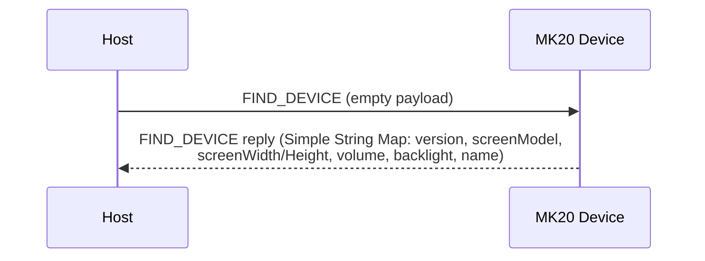
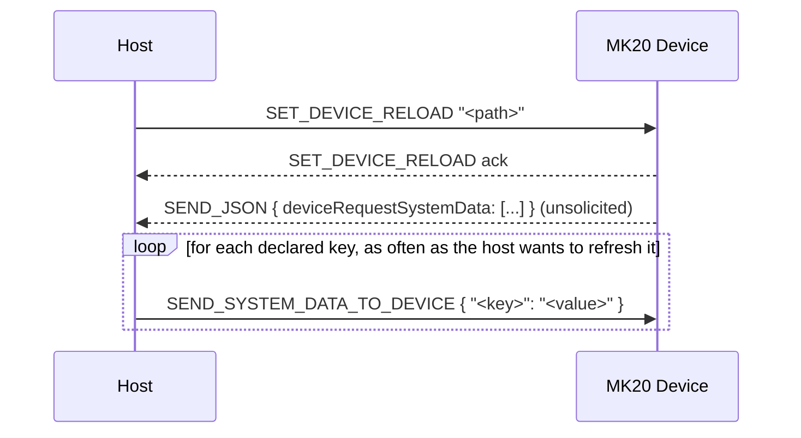
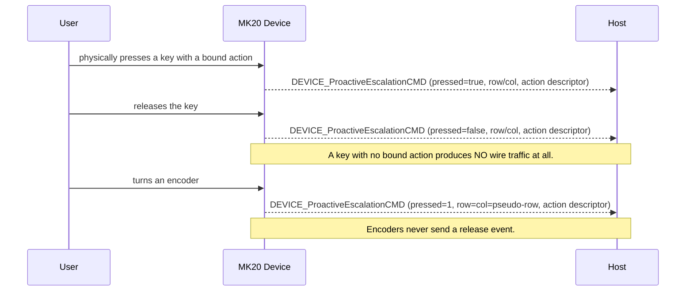
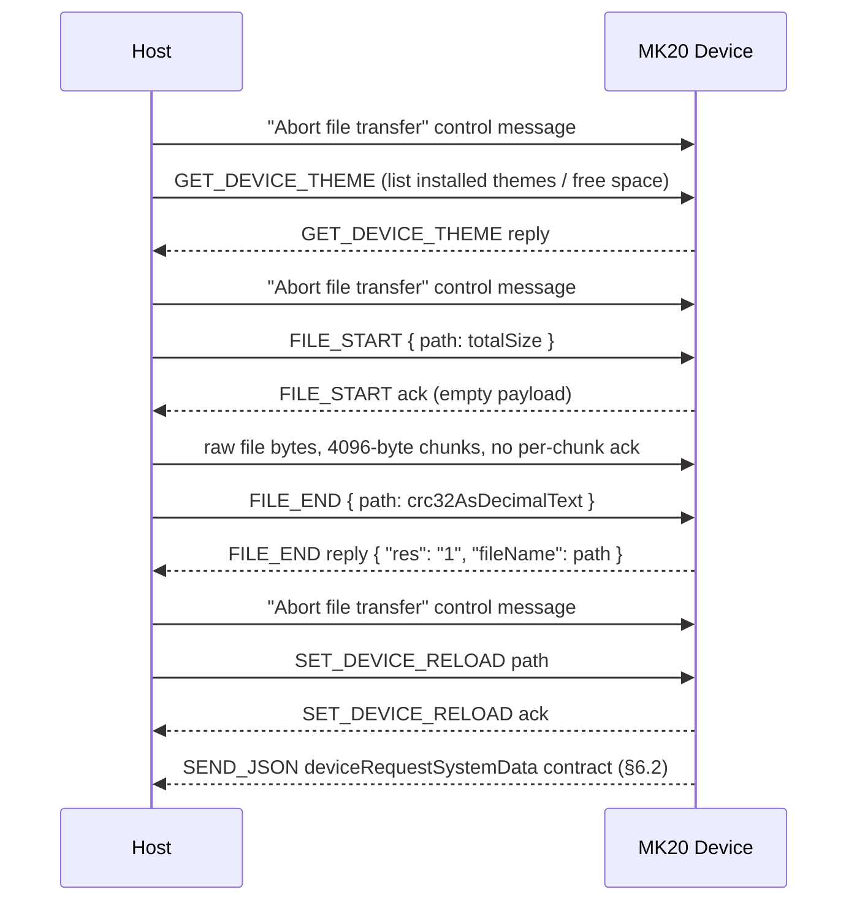
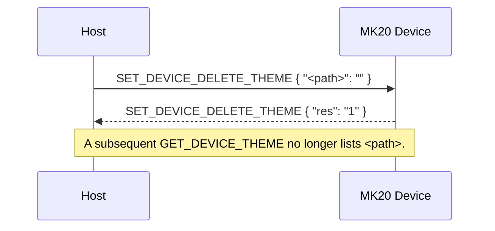
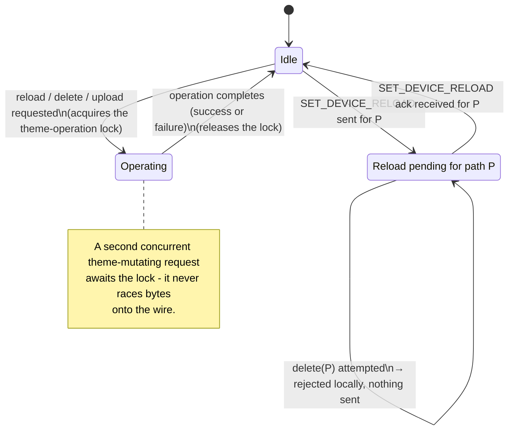
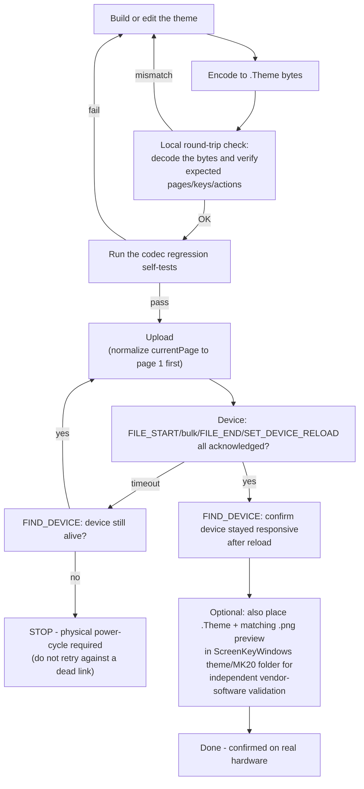
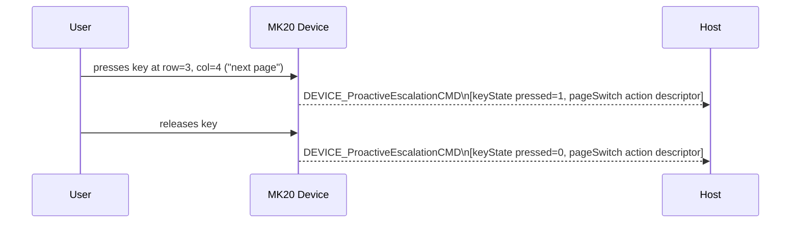
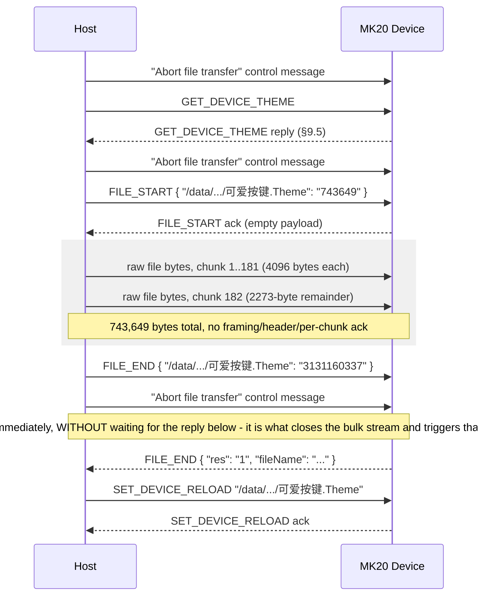

# Waveshare MK20 Host Protocol — Datasheet

**Document revision:** 2.2
**Applies to:** MK20 firmware `V2.32`, ScreenKeyWindows `v1.1`
**Status:** Confirmed by USB capture and live-device testing (see §12 for method)
**Reference implementation:** `Mk20Control.Protocol` (this repository)

For build/run instructions and project layout, see [`README.md`](./README.md). For the
`Mk20Control.Protocol` library's consumer-facing API surface (connecting, building/editing
themes, uploading, widgets), see [`Mk20Control.Protocol.API.md`](./Mk20Control.Protocol.API.md).

---

## 1. Scope

This document specifies the USB host-control protocol used by the Waveshare MK20
programmable keypad. It covers the physical/transport layer, wire frame format, command
set, payload encodings, and the on-disk `.Theme` file format that themes are delivered in.

All information is derived from live USB capture of the vendor application
(ScreenKeyWindows v1.1) communicating with physical hardware, plus direct interrogation of
a connected device. Static disassembly of the vendor executable was **not** used (it is
protected by Enigma Protector); all facts below were obtained by legitimate black-box wire
and file-format analysis.

Each fact is tagged:

| Tag | Meaning |
|---|---|
| **C** | Confirmed — observed directly on the wire or in a live device reply |
| **I** | Inferred — a reasonable but unverified interpretation |
| **U** | Unconfirmed — known to exist, exact behavior/schema not yet observed |

---

## 2. Physical & Transport Layer

| Parameter | Value |
|---|---|
| Interface | USB, CDC-ACM (virtual serial port) |
| USB VID:PID | `1D6B:0104` (Linux Foundation gadget) or `1234:5678` |
| Serial parameters | 115200 baud, 8N1, no flow control **(C, host side; device ignores line-rate over CDC-ACM)** |
| Endianness | Frame header fields: **little-endian**. Payload-internal length/count fields: **big-endian**. Two different serializers are in play — do not assume one endianness for the whole stack. |
| Checksum | CRC-32 (zlib variant: poly `0xEDB88320`, init `0xFFFFFFFF`, final XOR `0xFFFFFFFF`) |

**The MK20 enumerates as two independent USB devices**: a HID composite device (`4250:426F`,
four interfaces) that carries keystrokes and consumer-control usages, and the CDC-ACM serial
device (`1D6B:0104`) that carries this protocol. They fail independently — the serial side can
stop responding while HID keys keep working normally, so a device that still types is not
evidence that the command processor is alive.

---

## 3. Wire Frame Format **(C)**

Every command frame has a fixed 38-byte header followed by a variable-length payload.

```
Offset  Size  Field          Type      Notes
──────  ────  ─────────────  ────────  ─────────────────────────────────────────
 0      22    header         ASCII     Literal "AA551234 FIXEDCMDHEAD " (trailing space included)
22       4    packetType     u32 LE    0 = request (host→device), 2 = reply (device→host)
26       4    commandId      u32 LE    See §4 command table
30       4    payloadLength  u32 LE    Byte length of payload
34       4    payloadCrc32   u32 LE    CRC-32 of payload (zlib variant)
38    payloadLength  payload  bytes   Command-specific, see §4/§5
```

Total frame length = 38 + `payloadLength`.

### 3.1 Control message (out-of-band, not length-prefixed)

A second, distinct wire construct exists — a bare ASCII literal with no header fields and
no payload:

```
"AA551234 Abort file transfer 123455AA"
```

Observed sent host→device around file-transfer sequences (see §4, `FILE_START`/`FILE_END`).
Not a command frame — do not attempt to parse a header out of it.

**CONFIRMED exact placement** (message-by-message across every real capture examined, zero
exceptions): exactly one abort-transfer message is sent immediately before every
`FILE_START`, and exactly one more immediately after `FILE_END`. The second one must be sent
**without waiting for `FILE_END`'s reply** — it is what closes the bulk stream, and the reply
is what it triggers, so waiting first is a deadlock. `SET_DEVICE_RELOAD`, by contrast, *is*
sent only after that reply arrives, and is **not** preceded by an abort of its own. In
`capture20_bg_gif` the host writes `FILE_END` and the abort in the same millisecond (12.318s),
the device's `FILE_END` reply follows at 12.349s, and `SET_DEVICE_RELOAD` only at 12.450s.

A **standalone** reload of an already-installed theme (no re-upload) is *not* preceded by an
abort-transfer message either. Omitting the post-`FILE_END` abort, or withholding it until
the reply arrives (this client's original behavior), was confirmed via real-hardware testing
to cause the device to never acknowledge `FILE_END` and then ignore every subsequent command
until physically replugged — see §4.1 and §10 resolved item 16.

### 3.2 Parser resynchronization

A receiver must scan for the ASCII sequence `AA551234` to locate a frame boundary in a
byte stream (this is not a single-byte binary magic). On an implausible `payloadLength` or
a CRC mismatch, resynchronize by scanning past the current magic occurrence rather than
assuming a fixed frame size — corrupted data must not cause a subsequent valid frame to be
silently skipped.

> ⚠ **Note:** an early reverse-engineering pass (prior to live capture) guessed a
> different, entirely binary framing (`0xA1 0xA5 0x5A 0x5E` magic) based on static
> string/symbol analysis of the vendor firmware and applications. That framing was never
> observed on real hardware and has been fully superseded by the ASCII-prefixed framing
> above — do not implement against it.

---

## 4. Command Table (`commandId`)

| ID | Name | Direction | Payload encoding | Status |
|----|------|-----------|-------------------|--------|
| 0  | `FIND_DEVICE` | H↔D | Request: empty. Reply: Simple String Map (§5.1) | **C** |
| 1  | `SEND_SYSTEM_DATA_TO_DEVICE` | H→D | Simple String Map, big-endian variant (§5.3) | **C** |
| 2  | `SET_DEVICE_RELOAD` | H↔D | Plain UTF-8 path string, **no length prefix** | **C** |
| 3  | `GET_DEVICE_THEME` | H↔D | Request: empty. Reply: Simple String Map (§5.1) | **C** |
| 4  | `SET_DEVICE_BL` | H→D | ASCII decimal text (e.g. `"80"`), no binary encoding | **C** |
| 5  | `SET_DEVICE_SCAN_STATE` | — | — | **U** (ordering only) |
| 6  | `FILE_START` | H↔D | Simple String Map, single entry: `{path: totalSize}` | **C** — full sequence confirmed, see §4.1 |
| 7  | `FILE_END` | H↔D | Simple String Map: `{path: crc32}` (H→D) / `{"res":"1","fileName":path}` (D→H) | **C** — full sequence confirmed, see §4.1 |
| 8  | `GET_DEVICE_VERSION` | — | — | **U** (ordering only) |
| 9  | `SET_DEVICE_CANVASFLIP` | — | — | **U** (ordering only) |
| 10 | `GET_DEVICE_SCREENMESSAGE` | — | — | **U** (ordering only) |
| 11 | `SET_DEVICE_DELETE_THEME` | H↔D | Simple String Map (§5.1): `{path: ""}` (H→D) / `{"res":"1"}` (D→H) | **C** |
| 12 | `SEND_PIXMAP` | D→H (observed) | JPEG wrapped in a Tagged-Value Map (§5.2) under key `"ScreenKey"` | **C** receive-only; wrapping type-tag not fully decoded, send path not implemented |
| 13 | `DEVICE_ProactiveEscalationCMD` | D→H | Array of Tagged-Value Maps (§5.2) | **C** |
| 14 | `REQUEST_UPLOAD_KEY` | — | — | **U** (ordering only) |
| 15 | `SEND_JSON` | H↔D | UTF-8 JSON text | **C** |

IDs 5, 8–10, 14 are known only from the vendor firmware's string ordering; they have never
been observed on the wire. Do not assume their payload schema.

### 4.1 File transfer (theme upload) — fully confirmed

`FILE_START` / `FILE_END` mark the beginning/end of a theme file upload. The complete
three-step sequence is **confirmed by capturing a real theme install** (capture14.pcapng)
and reconstructing the transferred bytes from the capture, verifying them byte-for-byte
identical to the source `.Theme` file and confirming the reported CRC-32 matched:

```
0. → GET_DEVICE_THEME                                   (host polls storage first)
   → "AA551234 Abort file transfer 123455AA"            (§3.1 control message)
1. → FILE_START   {"<device path>": "<totalSize>"}     (Simple String Map, §5.1)
   ← FILE_START   (empty payload ack — MUST be awaited before step 2)
2. Raw file bytes are written directly to the same bulk OUT endpoint (0x01) in fixed
   4096-byte chunks, back-to-back, with NO additional per-chunk header/framing of any
   kind and NO per-chunk acknowledgment - it is exactly the file's bytes, split at
   4096-byte boundaries. The final chunk is a shorter remainder
   (totalSize mod 4096 bytes, or a full 4096-byte chunk if it divides evenly).
3. → FILE_END     {"<device path>": "<crc32AsDecimalText>"}
   → "AA551234 Abort file transfer 123455AA"            (MANDATORY - see below)
   ← FILE_END     {"res": "1", "fileName": "<device path>"}
4. → SET_DEVICE_RELOAD  "<device path>"                 (activates the theme, §8.6)
   ← SEND_JSON, then SET_DEVICE_RELOAD echoed back
```

Two ordering rules are load-bearing, and getting either wrong produces the same symptom — an
unacknowledged `FILE_END`:

**(a) The `FILE_START` reply must be awaited before any bulk byte is written.** The device is
not counting payload until it has opened the destination file, so bytes written earlier are
discarded; its counter then never reaches `totalSize`, it stays in file-receive mode, and it
swallows the following `FILE_END` as if it were more payload. In `capture20_bg_gif` the host
sends `FILE_START` at 12.311 s, the device acks at 12.312 s, and only then does the first
chunk go out. Skipping this wait fails *intermittently*, purely depending on how quickly the
device happens to reply — which is what made this look like flaky hardware.

**(b) The abort control message in step 3 is mandatory and must be sent without waiting for
the `FILE_END` reply.** That message is what closes the bulk stream; the reply is exactly what
it triggers, so waiting for the reply first is a deadlock. The symptom is severe: `FILE_END`
is never acknowledged, the device then ignores every subsequent command (including
`GET_DEVICE_THEME` and `FIND_DEVICE`) while staying enumerated on USB, and neither waiting nor
disabling/re-enabling the USB device recovers it — only a physical replug does.

Both are confirmed identical in 5/5 vendor captures — `capture15`, `capture16`, `capture17`,
`capture20_bg_gif` and `capture22_text_input`. In every one the host writes the abort in the
same millisecond as `FILE_END`, and the device's `FILE_END` reply follows ~30 ms later. No
delays, retries or timeouts are involved anywhere in a healthy upload: a complete 49,869-byte
install in `capture20_bg_gif` takes 0.55 s end to end.

Confirmed example: a 743,649-byte theme file was sent as 181 chunks of exactly 4096 bytes
followed by one 2273-byte remainder chunk (181×4096 + 2273 = 743,649); the reconstructed
bytes from the capture were byte-for-byte identical to the source file, and both matched
CRC-32 `3131160337`, the exact value the device echoed back in the `FILE_END` reply.

### 4.2 Reply correlation

There is **no per-request correlation ID** anywhere in this protocol. A reply is matched to
a request only by `commandId` (and `packetType = 2`), on a FIFO basis. Do not invent or
rely on a request/response ID field.

---

## 5. Payload Encodings

Two **mutually incompatible** map serializations exist in this protocol. Confusing them
produces plausible-looking but wrong decodes — this was confirmed to be a real
implementation hazard by testing against physical hardware (see §12).

### 5.1 Simple String Map — `FIND_DEVICE`, `GET_DEVICE_THEME`, `FILE_START`, `FILE_END`

```
count(u32 BE)
count × { keyLen(u32 BE) + key(UTF-16BE) + valueLen(u32 BE) + value(UTF-16BE) }
```

Every value is plain text — **including values that look numeric**, such as a CRC-32 or a
volume level. There is no type tag and no null sentinel field.

Confirmed `FIND_DEVICE` reply (8 entries, live device):

```json
{
  "version": "V2.32",
  "upgradeToLatestMethod": "1",
  "screen_width": "640",
  "screen_model": "MK20",
  "screen_height": "656",
  "deviceVolume": "7",
  "deviceName": "ScreenKey",
  "deviceBl": "80"
}
```

Confirmed `GET_DEVICE_THEME` reply shape:

```json
{
  "bytesTotal": "2648",
  "bytesAvailable": "2483",
  "/data/theme/MK20/<name>/<name>.Theme": "<crc32 as decimal text>"
}
```

**The two size fields are in MEGABYTES despite their names.** A device with a 32 GB card
reports `bytesTotal: 28003` — 27.3 GB, not 28 KB. Confirmed against a live device: it
reported 153 MB used, and its installed themes total ~109 MB including a 33 MB
`defaultTheme.Theme`, which would be impossible under a byte reading. Themes of several
hundred kilobytes upload without difficulty.
(one path→CRC entry per installed theme, in addition to the two fixed free-space fields)

### 5.2 Tagged-Value Map — `DEVICE_ProactiveEscalationCMD`, `.Theme` file internals

```
map:          count(u32 BE) + count × (string key + tagged value)
tagged value: typeId(u32 BE) + isNull(u8) + type-specific data

  typeId  Type          Encoding
  ──────  ────────────  ─────────────────────────────────────────
  1       bool          1 byte
  2       Int32         4 bytes, BE
  6       Double        8 bytes, BE
  8       map           nested map (recursive)
  9       list          count(u32 BE) + count × tagged value
  10      string        byteLen(u32 BE) + UTF-16BE; byteLen=0xFFFFFFFF ⇒ null
  12      byte array    byteLen(u32 BE) + raw bytes; byteLen=0xFFFFFFFF ⇒ null
```

For string/byte-array values, the `isNull` byte is conventionally written `0`, with
nullability instead signaled by the length field being `0xFFFFFFFF`. Any other `typeId` is
unspecified — treat as a decode error, not a guessable case.

`DEVICE_ProactiveEscalationCMD` payload is `count(u32 BE) + count × map` (an **array** of
tagged-value maps, not a single map).

Confirmed event — key at row 3, col 4, assigned "next page":

```json
[
  { "type": "keyState", "row": 3, "col": 4, "pressed": 1 },
  { "type": "pageSwitch", "pageSwitchMode": 2, "jumpToPage": 0,
    "iconPath": "/static/icon/dark/PageSwitch.png", "description": "Page switching" }
]
```

`pageSwitchMode`: `1` = previous page, `2` = next page, `0` = absolute jump to `jumpToPage`
(zero-based page index).

**The `keyState` map carries no page identity.** It reports only `type`/`row`/`col`/`pressed`,
so the same grid cell on two different pages — or inside a folder — is indistinguishable from
the event alone. The second map (the echoed action descriptor) is the only per-key
discriminator available to a host, which is why an application that needs to tell keys apart
must put an identifier there (see §6.3).

**Encoder events** use a sentinel position rather than a matrix cell: `row` and `col` both
carry the same pseudo-row, and `pressed` is always `1` (an encoder produces **no release
event**). Confirmed pseudo-rows:

| Pseudo-row | Meaning |
|---|---|
| `100` | left encoder |
| `101`, `102` | left encoder, direction-specific (observed only for built-in `encoder_*` functions) |
| `103` | right encoder |
| `104`, `105` | right encoder, direction-specific (observed only for built-in `encoder_*` functions) |

A knob bound to a `text` action reports only the base row (`100`/`103`) regardless of
direction. Captures of knobs bound to `encoder_device_brightness` show the two
direction-specific rows alternating for the same action (e.g. 37×`101` and 29×`102` in one
session), consistent with counter-clockwise/clockwise. A knob bound to `encoder_keyboard`
reports **nothing at all** on this channel — it is executed natively as HID keystrokes.

### 5.3 System Data Map — `SEND_SYSTEM_DATA_TO_DEVICE`

Structurally identical to §5.1 (big-endian length-prefixed UTF-16BE string pairs), used
one-way host→device to push live telemetry values that a loaded theme displays.

```
count(u32 BE)
count × { keyLen(u32 BE) + key(UTF-16BE) + valueLen(u32 BE) + value(UTF-16BE) }
```

Confirmed data-source keys observed in captures: `GPU Usage`, `GPU Temperature`,
`CPU Usage`, `CPU Temperature`, `RAM Usage`, `RAM Total Memory`, `Volume`, `device_bl`.
Key names are theme-defined, not a fixed enum — see §6.2.

---

## 6. Behavioral Model

### 6.1 Identity / keepalive

`FIND_DEVICE` with an empty payload elicits a reply carrying the device identity map
(§5.1). No dedicated keepalive interval is specified; poll as needed.



### 6.2 Telemetry push contract (`deviceRequestSystemData`)

Immediately after every successful `SET_DEVICE_RELOAD`, the device sends an unsolicited
`SEND_JSON` (commandId 15) reply declaring which data-source keys the **newly loaded
theme** requires:

```json
{
  "deviceRequestSystemData": ["CPU Usage", "GPU Usage", "RAM Usage"],
  "deviceRequestSystemDataShowUnit": true,
  "themePageSwitch": true
}
```

The host is expected to push only the declared keys via `SEND_SYSTEM_DATA_TO_DEVICE`
(§5.3) afterward. This is a per-theme declarative contract, not a fixed global list — a
custom theme can declare arbitrary key names, since a progress-bar/text UI element simply
binds to a `system_data_name` string defined in its own theme JSON (§7).



**Value format:** confirmed real values pushed by ScreenKeyWindows are always
pre-formatted display strings, not bare numbers — even for keys bound to a numeric-range
gauge (`system_data_min_value`/`max_value`). Examples from a real capture
(`capture20_widget_data.pcapng`): `"CPU Usage": "22%"`, `"CPU Temperature": "0℃"`,
`"RAM Used Memory": "20 GB"`, `"CPU Model": "13th Gen Intel Core i7-13700K"` (a free-text
value bound to a gauge with `min=0/max=10000` — the device/renderer apparently tolerates a
non-numeric string on a numeric-bound gauge without erroring). This applies uniformly
across text items, progress bars, linear/radial/circular gauges. The renderer parses the
leading numeric portion for gauge fill level and ignores the rest.

### 6.3 Key press / encoder events

`DEVICE_ProactiveEscalationCMD` (commandId 13) fires **only** for a key or encoder that has
an action bound to it in the currently loaded theme. A key with no bound action produces **no
wire traffic at all** on press — there is no generic "any key pressed" event. A host that
wants to observe a key must therefore give it *some* action, even an inert one.

**Not every action type reports.** A `keyboard` key is executed entirely by the device and is
**silent on the serial link**: pressing one emits the HID keystroke but produces no
`DEVICE_ProactiveEscalationCMD` at all. Confirmed on real hardware — with a host listening,
pressing keystroke keys typed into the focused window (visible as stray characters) while the
event log stayed empty, and every other key on the same theme reported normally. No `keyboard`
event appears in any capture examined either (capture6, 11, 12, 19, 21, 22).

Action types confirmed to **report** a press: `text`, `openPage`, `oneLevelUp`, `pageSwitch`,
`openWeb`, `qmk_mouse`, and the `encoder_*` functions. Only `keyboard` is known to be silent.

The practical consequence: a key cannot both send a native keystroke *and* notify the host.
Use `keyboard` for keys the device should handle alone (they then work with no software
running), and a `text` action carrying an identifier for keys the host must see.

Each event is an array of two maps: `keyState` (position + pressed) and the key's full action
descriptor, echoed back verbatim from the theme's `controlData`. Because `keyState` carries no
page identity (§5.2), the echoed descriptor is the only way to distinguish keys across pages
and folders — an arbitrary string placed in a `text` action's `inputText` survives the round
trip and is returned on every press, which is the supported mechanism for host-defined key
identifiers.

**Encoder rotation IS a discrete event.** Turning a knob emits the same
`DEVICE_ProactiveEscalationCMD` structure as a key press, using the pseudo-rows in §5.2 and
always `pressed=1`. Which pseudo-row is reported depends on the bound action type:

| Encoder action | Event on this channel | Direction distinguishable? |
|---|---|---|
| `text` | base row only (`100`/`103`) | No — clockwise, counter-clockwise and click are identical |
| `encoder_system_volume`, `encoder_device_brightness`, … | direction-specific rows (`101`/`102`, `104`/`105`) | Yes, by row number |
| `encoder_keyboard` | none — executed natively as HID keystrokes | Yes, but only as three distinct keystrokes |

Separately, a brightness/volume-bound encoder also causes the live value to be pushed via
`SEND_SYSTEM_DATA_TO_DEVICE` (e.g. `device_bl=80`) for display by an on-screen element. No
"rotated by N detents" delta message exists on the wire in any case.

**Some actions are delegated to the host rather than executed.** Confirmed by capturing the
device's HID endpoint while pressing keys: a `text` key emits **zero** HID keystrokes — 35
presses of text keys produced no keyboard input whatsoever, while a `keyboard` key on the same
theme produced its keystroke normally. The device reports the press with the string attached
and takes no further action; whether anything happens is entirely up to the host. `keyboard`,
`pageSwitch`, `openPage`, `oneLevelUp` and the `encoder_*` functions are device-native.



### 6.4 Setting a key's picture or function

There is **no live per-key command** to set an icon or assign a function to a single key.
Every observed key remap / icon change / GIF assignment was performed by rebuilding the
**entire theme file** and pushing it through:

```
GET_DEVICE_THEME                          (list installed themes / free space)
FILE_START   {path: totalSize}
             … 4096-byte bulk chunks, confirmed, see §4.1 …
FILE_END     {path: crc32}
SET_DEVICE_RELOAD  path                   (activate)
```



A theme containing an animated GIF is simply a larger `.Theme` file (embedded assets) —
GIFs, videos (`.mp4`), and PNGs are not distinct wire concepts.

**Which page opens after activation.** `"main"."currentPage"` (a page GUID) names the page
shown immediately after `SET_DEVICE_RELOAD` — it is not required to match `pages[0]` and
can drift (e.g. after re-saving in an external editor). A host that wants deterministic
activation should normalize `currentPage` to `pages[0]` before uploading.

### 6.5 Secondary screen

A secondary-screen theme uses the identical `GET_DEVICE_THEME` / `FILE_START` / `FILE_END`
/ `SET_DEVICE_RELOAD` sequence and the same `deviceRequestSystemData` contract as a
main-screen theme — it is simply another theme file/slot, not a separate protocol path.

**Embedding secondary-screen content in a main-screen file.** A dedicated `.Theme` file
with a 428x142 canvas (`theme/MK20/SecondaryScreen/<N>/<N>.theme`) is one option. A second,
confirmed option: embed a `DynamicImageItem` (type 114) at the fixed position
`x=106, y=0, w=428, h=142` with `"backgroundType":"secondary"` directly inside a 640x656
main-screen page, driving both screens from one theme file. Confirmed working with an
animated GIF on real hardware.

**Main-screen background: two independent mechanisms.**

| Mechanism | Item type | Content | Asset path | Position |
|---|---|---|---|---|
| Video background | `BackgroundItem` (100) | `.mp4` only | `/theme/MK20-PLUS/MainScreen/<file>` | `x=0,y=144,w=640,h=512,z=-2` |
| Picture/GIF background | `DynamicImageItem` (114), `backgroundType="main"` | static image or GIF | `/image/640x656/cache/<file>` | `x=0,y=144,w=640,h=512,z=-2` |

Every vendor-shipped theme examined uses the video mechanism. The picture/GIF mechanism was
confirmed by capturing a genuine ScreenKeyWindows save of a picture, then separately a GIF,
as the main-screen background. Both item types occupy the identical position/size; only the
item type, asset namespace, and content type differ. The `DynamicImageItem` field set is
identical between the picture and GIF case (`backgroundType, h, id, lock, maxHeight,
maxWidth, path, rotate, scale, type, w, x, y, z`, no `paths`/`system_data_flag`/
`backupX`/`backupY`) — only the asset's extension/content differs. One confirmed rendering
difference: a static image is resized/cropped to exactly fill 640x512; a GIF is embedded at
its original, unresized size. Confirmed visually on real hardware for both a static image and
a GIF. Note the video mechanism requires pre-encoded MP4 bytes — there is no encoder in this
protocol.

### 6.6 Deleting a theme

`SET_DEVICE_DELETE_THEME` (commandId 11) removes an installed theme by its device-side
path. Confirmed request/reply shape (both Simple String Map, §5.1):

```
→ SET_DEVICE_DELETE_THEME   {"<path>": ""}
← SET_DEVICE_DELETE_THEME   {"res": "1"}
```



A subsequent `GET_DEVICE_THEME` no longer lists the deleted path. The value half of the
request entry is an empty string - the path itself is the only meaningful data, carried as
the map *key* (the same "path as dictionary key" shape used by `GET_DEVICE_THEME`, §5.1).
Deleting the currently-active theme was not tested; behavior in that case is unconfirmed.

### 6.7 Client-side operational discipline

The protocol has no device-side "cancel" or "reset stuck operation" command beyond the
abort-transfer control message (§3.1), which is sent proactively before a new operation,
not as runtime recovery for one already in flight. Correctness therefore depends on host
discipline. Two rules are observed in every real capture and are mandatory for a host:

1. **Never overlap theme-mutating operations.** Reload, delete and upload must be serialized
   against each other; a second request must wait for the first to finish rather than racing
   bytes onto the wire.
2. **Never delete a theme whose reload hasn't been confirmed.** Deleting a theme while its
   `SET_DEVICE_RELOAD` was still unacknowledged (confirmed via direct testing; a client-side
   timeout does not prove the device gave up) left the render subsystem stuck, requiring a
   physical power-cycle — `FIND_DEVICE`/`GET_DEVICE_THEME` kept responding normally
   throughout. Track the pending-reload path and refuse the delete until it is acknowledged.



### 6.8 End-to-end theme authoring workflow (recommended)

This is the confirmed-safe sequence for building and validating a new/edited theme against
real hardware:



---

## 7. `.Theme` File Format

Themes are delivered to the device as a single binary file with this layout:

```
[header: Tagged-Value Map — language(int), keyMacroValue(bytes), keyMacro(bytes|null)]
[8 bytes — 4 zero bytes + a big-endian uint32 equal to (JSON byte length + 1); CONFIRMED
 via direct byte comparison against multiple real files - NOT arbitrary padding]
[UTF-8 JSON — layout: {"main":{"currentPage","version"},"pages":[...]}]
[1 byte reserved, observed 0x0A]
[assetCount(u32 BE)]
assetCount × {
    pathLen(u32 BE) + path(UTF-16BE)      // e.g. "/image/428x142/PhotoAlbum/x.gif"
    dataLen(u32 BE) + data(bytes)          // PNG / GIF / MP4, per magic bytes
}
[4 zero bytes — trailer after the LAST asset]
```

**Trailing 4 zero bytes (required).** Every one of the 41 real theme files examined ends with
four zero bytes after the final asset. Files produced without it were the only ones lacking
it, and their `text` keys were inert on the device. Decoders should tolerate its absence;
encoders must write it.

**Header `keyMacroValue` (required).** All 38 vendor themes examined carry an identical
92-byte value, base64
`AAAAEAAAAAAAAAAAAAAAAAAAAAAAAAAAAAAAAAAAAAAAAAAAAAAAAAAAAAAAAAAAAAAAAAAAAAAAAAAAAAAAAAAAAAA=`.
Confirmed on hardware: with an empty `keyMacroValue`, `keyboard` keys still work but `text`
keys are completely dead. Write the value verbatim.

Decoding does not need to trust the 8-byte length field - scanning for balanced `{}`/`[]`
(respecting quoted-string escapes) finds the JSON's true end correctly regardless - but
**encoding must write the correct value**: a themed file whose header claims the wrong JSON
length was one of several confirmed contributing causes of ScreenKeyWindows itself locking
up when loading a file this library produced (see §10 Item #10).

**Confirmed real JSON formatting** (matters for producing a file ScreenKeyWindows accepts,
not just one this codec can decode): 4-space indentation, Unix `\n` line endings (not
`\r\n`), object keys in alphabetical order at every nesting level, and minimal string
escaping (`\"` for a literal quote, not `\u0022`).

**Note:** all numeric-looking JSON fields (`x`, `y`, `z`, `w`, `h`, `rotate`, `scale`, `id`,
…) are serialized as **JSON strings**, not JSON numbers.

**`main.currentPage`:** the page GUID (must match one entry in `"pages"[].pageName`) the
device renders immediately upon activation via `SET_DEVICE_RELOAD` - see §6.4 for the
confirmed drift hazard (it is not guaranteed to match `pages[0]`).

**Page count:** a theme is not required to have more than 1 page — confirmed by a real
user-created theme (5 keys, no background, 1 page) reloading normally.

**Required page-level field `"encoder"`:** every main-screen page carries an `"encoder"`
array alongside `"canvas"`/`"items"`/`"pageName"`, describing the physical rotary-encoder
hardware. Two forms exist; both are boilerplate that never varies with the encoders' actual
assignments (those live in key items — see §7.2a):
```json
// 4-entry form, written by current ScreenKeyWindows (51 real pages)
"encoder": [
    {"col": 0, "keyString": "",  "keycode": 0,     "row": 103},
    {"col": 0, "keyString": "",  "keycode": 0,     "row": 104},
    {"col": 0, "keyString": "E", "keycode": 8,     "row": 100},
    {"col": 0, "keyString": "",  "keycode": 38992, "row": 105}
]

// older 2-entry form (35 real pages)
"encoder": [
    {"col": 0, "keyString": "", "keycode": 0, "row": 103},
    {"col": 0, "keyString": "", "keycode": 0, "row": 104}
]
```
Absent only from secondary-screen/sub-page theme files (`Key/*.theme`,
`SecondaryScreen/*.theme`, `Encoder/relatedTheme/*.Theme`). Omitting it from a main-screen
theme causes ScreenKeyWindows to lock up when loading the file. Encoders must always emit
this field — preserved from the source page when re-encoding, or defaulted for a new page.

**Optional page-level field `"parentPageName"` — this is what makes a page a folder.** A
folder is an ordinary page carrying one extra field naming its parent page's GUID:

```json
{ "canvas": {...}, "items": [...], "pageName": "<this page GUID>",
  "parentPageName": "<parent page GUID>" }
```

Ordinary pages omit it entirely. It is load-bearing for navigation: an `oneLevelUp` key emits
the fixed sentinel `"pageName": "parentPage"`, which means *"go to my page's
`parentPageName`"* — the destination comes from the **page**, not from the key. Confirmed on
hardware: without `parentPageName`, the device navigates *into* a folder via `openPage` and
then cannot leave — the return key's press is received and decoded correctly, but nothing
happens. Nesting is arbitrary-depth (a real theme was found five levels deep); each level
names the level above it.

### 7.1 Page item types (`items[].type`)

| Code | Name | Purpose | Key fields |
|------|------|---------|-----------|
| 100 | Background | `.mp4` video background (main or secondary screen) | `backgroundType`: `main`\|`secondary`, `path` |
| 101 | Circular gauge | Data-bound solid-color ring/dial, no gradient/angle range | `system_data_name`, `front_color`/`back_color`, `margin`, `radius` |
| 102 | Progress bar (rounded) | Data-bound bar with rounded ends and optional linear-gradient fill | `system_data_name`, `system_data_min_value`/`max_value`, `corner_radius`, `lineargradient_color`/`lineargradient_flag` |
| 103 | Linear gauge — the editor's segmented horizontal bar ("seg-hor") | Data-bound bar, solid front/back/border colors. Distinguished from type 102 by carrying **no** `corner_radius` and **no** `lineargradient_*` fields | `system_data_name`, `front_color`/`back_color`/`border_color`, `w`, `h` |
| 104 | Segmented circular gauge ("seg-circular") | Same JSON field set as type 101; editor renders it as a segmented/notched ring instead of a solid arc | `system_data_name`, `front_color`/`back_color`, `margin`, `radius` |
| 109 | Radial gauge | Data-bound arc gauge, up to 3 gradient stops | `system_data_name`, `angleMinValue`/`angleMaxValue`, `gradientColor1`–`3`, `Clockwise` |
| 110 | Light-shadow gauge | Data-bound ring, separate arc stroke color/width plus a glow/shadow highlight | `system_data_name`, `back_color`, `arcColor`/`arcWidth`, `lightShadowColor`/`Lighter`/`Position`, `Clockwise`, `DisplayDirection` |
| 111 | Digital clock | Live clock field (one item per field). `displayType` selects how the digits are drawn — see below | `system_data_name`: `hour`\|`minute`\|`second`, `displayNum`, `displayType`, `paths` |
| 113 | Text | Static or data-bound text | `system_data_name`, `text_font`, `text_str` |
| 114 | Dynamic image | Decorative animated GIF (item-local); also the mechanism for a main/secondary-screen picture or GIF background (`backgroundType`) — see §6.5 | `path` → embedded asset |
| 115 | Key | Physical key definition | `row`, `col`, `path` (icon), `controlData` (base64, see §7.2) |
| 116 | Multi-line text | Same field set as type 113 plus explicit `w`/`h` wrap bounds | `system_data_name`, `text_font`, `text_str`, `w`, `h` |
| 117 | Shadow text | Same field set as type 113 plus a drop-shadow style | `system_data_name`, `text_font`, `text_str`, `border_color`/`border_width`, `shadeColor`, `shadeSize` |

All type 101/104/110/116/117 rows confirmed via `widgetThemeDemo.Theme` (ScreenKeyWindows
editor's "widget" demo, decoded 2026-08-13) — the editor's UI groups image / text /
multiline text / shadow text / circular progress bar (plain, segmented, light-shadow) /
horizontal progress bar / clock widgets.

**This table is complete for the shipped vendor library.** Every `.theme` across all four
device models (MK10, MK20, MK20-PLUS, SK18) was searched twice — once decoded through this
library, once by scanning raw/decompressed bytes for `"type":"NNN"` with no decoder involved.
Both agree exactly on the 13 codes listed above: there is **no type 112**, and no other
unlisted code. Unknown codes would surface either way, since the codec maps them to
`UnknownThemeItem` rather than discarding them.

**The "seg-hor" horizontal bar is type 103 — CONFIRMED, no new type.** Authoring one in the
ScreenKeyWindows editor and saving it (`MK20/SecondaryScreen/seghor.Theme`) produced a plain
type-103 item whose field set matches what this library already emits: it decodes to
`LinearGaugeItem`, re-encodes **byte-identically** (2,362 bytes in, 2,362 out), and uploads
and renders correctly on real hardware. The editor's two horizontal bars therefore map to
types 102 (rounded, gradient-capable) and 103 (segmented/rectangular). Only the analog clock
face remains unconfirmed (§10 Open Item #15).

**Clock digit rendering (`displayType`) — CONFIRMED, two values observed.** A type-111 item
does not only draw digits with a font. Both values below were found in shipped vendor
themes (`MK10/defaultTheme.Theme`, `SK18/defaultTheme.Theme`):

| `displayType` | `paths` | Rendering |
|---|---|---|
| `0` | empty | Digits drawn with the font in `text_font` |
| `1` | e.g. `/image/MK10/PictureFont/点数字` | Digits drawn from a **picture font** — a folder of per-glyph images |

Both are digital faces; `displayType` is NOT an analog/digital switch. This library always
emits `displayType: "0"` and does not expose the picture-font variant.

**Required fields for a type-115 Key item:** `id`, `itemName` (e.g. `"control1"`), `x`,
`y`, `z`, `rotate`, `scale`, `lock`, `row`, `col`, `path`, `controlData`, `maxWidth`,
`maxHeight`, `scaledWidthTo`, `scaledHeightTo`, `opacity`, `paths` (usually empty),
`soundFile` (usually empty), `title` (usually empty), `titleParam` (JSON-string-encoded
object with `FontFamily`/`FontSize`/etc.). Omitting any of these — most notably `itemName`
— causes ScreenKeyWindows to lock up loading the file. Key items never carry `w`/`h`,
unlike Background items (type 100), which carry `w`/`h` *and* `maxWidth`/`maxHeight`
together. Boolean-looking fields (e.g. `lock`) are strings `"0"`/`"1"`, not JSON booleans.
`lock` is always `"1"` on a real key item.

**Required `controlData` fields for a `keyboard` action** (base64-decoded tagged-value
map, §5.2): `type` (`"keyboard"`), `description` (`"Keyboard"`), `parentDescription`
(`"System input control"`), `iconPath` (`"/static/icon/dark/keyboard.png"`), `keycode`,
`keyString`, `AISoundControlKeyword` (empty string). Omitting any of these produces a
`controlData` blob ScreenKeyWindows locks up loading.

**Modifier combos (e.g. Ctrl+Alt+Del):** a key with held modifiers packs the standard
USB HID keyboard-report modifier bitmask into the *upper byte* of the same 16-bit
`keycode` field: `(modifierBitmask << 8) | baseKeycode`. Confirmed via capture:
`keycode = 0x054C` for Ctrl+Alt+Del, decomposing as modifier byte `0x05`
(bit0=Left Ctrl, bit2=Left Alt) + base keycode `0x4C` (USB HID Delete), `keyString =
"L Ctrl L Alt Del"`.
This is the standard USB HID Boot Keyboard modifier-byte convention, packed into the upper
byte rather than sent as a separate field — only Left Ctrl/Left Alt individually confirmed
against this device; the same bit layout is expected to generalize (see
`Mk20Control.Protocol.Theme.Building.KeyModifiers`):

| Bit | Modifier | Confirmed? |
|---|---|---|
| 0 (`0x01`) | Left Ctrl | **C** |
| 1 (`0x02`) | Left Shift | U |
| 2 (`0x04`) | Left Alt | **C** |
| 3 (`0x08`) | Left Win | U |
| 4 (`0x10`) | Right Ctrl | U |
| 5 (`0x20`) | Right Shift | U |
| 6 (`0x40`) | Right Alt | U |
| 7 (`0x80`) | Right Win | U |

Modifiers are combined as a bitmask OR'd together, with the base key's USB HID usage in the
low byte.

**Text/title over a button and icon transparency** (`title`/`opacity`/`titleParam`):
confirmed via capture that these are fields on the *same* `KeyItem`, not a separate overlay
item:
- `"title"`: on-screen text shown over the icon.
- `"opacity"`: `"100"` (opaque, default) down to `"15"` observed — the vendor UI's
  "transparency" control writes this same field a key's icon opacity already uses.
- `titleParam`: JSON-string-encoded font/alignment/color object; observed values
  `Microsoft YaHei`, size 24, white, `"top"`/`"bottom"` alignment only (`"center"` has no
  visible effect on real hardware).

**Key icon PNG format:** every icon in a vendor theme is exactly 128x128, RGB (no alpha
channel), 8-bit. `scaledWidthTo`/`scaledHeightTo` describe the *rendered* size and do not
substitute for the asset itself being correctly sized — a wrong-size icon was one confirmed
contributor to ScreenKeyWindows locking up when loading a file.

**Icon alpha is supported by the firmware** even though the vendor editor never produces it:
a 128x128 **RGBA** icon is composited by the device against whatever is behind the key, so
transparent and partially transparent areas reveal the screen background, including an
animated one. Confirmed on hardware with fully transparent holes, a uniform 50% wash and a
0→255 alpha gradient. This is a device-only capability — such a theme is outside what the
vendor app can author, and loading one back into it is untested.

**Animated key icons:** leave `path` empty, set `paths` to a folder path (e.g.
`/image/MK20/cache/pop-cat_1`) and `frameDelays` to a comma-separated per-frame delay list
in milliseconds. Each frame is a separate PNG asset under that folder (`frame_0.png`,
`frame_1.png`, ...) — distinct from the type-114 Dynamic Image item's single embedded GIF
asset, even though both render an animation.

### 7.2 Key actions (`controlData`, base64 of a Tagged-Value Map)

| `type` | Purpose | Key fields |
|---|---|---|
| `keyboard` | Emit a keystroke (optionally with held modifiers) | `keycode` (USB HID usage; upper byte = modifier bitmask for combos, see below), `keyString` |
| `openWeb` | Open a URL | `Url` |
| `qmk_mouse` | Mouse click/move/scroll | `qmk_mouse_key`, `qmk_mouse_event`, `mouse_x`/`y`/`v`/`h` |
| `pageSwitch` | Relative page navigation, or absolute jump | `pageSwitchMode`: `1`=previous, `2`=next, `0`=jump to `jumpToPage` (zero-based index) |
| `openPage` | Jump to a specific page (enter a folder) | `pageName` (target page GUID) |
| `oneLevelUp` | Navigate to parent page | `pageName` = fixed sentinel `"parentPage"`; destination comes from the page's `parentPageName` |
| `keyboard_switch` | Toggle keyboard layout | — |
| `Microphone` / `Loudspeaker` | Adjust a named OS audio device's volume | `volumeAdjustDevice`, `volumeAdjustMode`, `volumeadjustValue` |
| `text` | Carries a string; **the device executes nothing** and reports the press with the string attached (§6.3) | `inputText`, `isInputEnter`, `isCopyPaste` |
| `ControlFlow` | Multi-step macro, **executed by the host, not the device** — see §7.2b | `controlDataList`: base64 of a Tagged-Value **map array**, one map per step |
| `delay`, `startLoop`, `stopLoop` | **Step-only** — valid inside a `ControlFlow` list, never as a key's own action | `delayMs` / `loopCount` / — |
| `qmk_string` | Types a whole string (as opposed to `keyboard`'s single keystroke). Observed as a `ControlFlow` step | `inputTextPercentEncoding` |
| `encoder_*` | Encoder functions — see §7.2a | |

This table documents the **wire format**, i.e. every action type the vendor's own editor can
produce. It is not the list the library gives you typed access to — see §7.3. Types without a
strongly-typed model decode to `UnknownKeyAction` and re-encode verbatim, so reading and
rewriting a vendor theme preserves them exactly.

### 7.2a Encoder assignments

An encoder is **not a distinct item type**. It is an ordinary type-115 key item placed at a
fixed secondary-screen coordinate, which is how the device recognises it. Both encoder keys
carry `row: 0, col: 0` — their position, not their matrix cell, identifies them:

| Encoder | Item position | Reports pseudo-row (§5.2) |
|---|---|---|
| Left | `x = 106, y = 0` | `100` (`101`/`102` direction-specific) |
| Right | `x = 320, y = 0` | `103` (`104`/`105` direction-specific) |

Encoder keys are normally invisible — vendor themes point them at a built-in icon path and set
`opacity` to 0, since the binding works regardless of what is drawn.

**Confirmed function types** (strings present in the ScreenKeyWindows binaries):
`encoder_system_volume`, `encoder_device_volume` (the device's own speaker),
`encoder_device_brightness`, `encoder_system_media`, `encoder_keyboard`, `encoder_qmk_mouse`,
`encoder_system_brightness`.

**Field set — built-in functions.** Written in exactly this order:

```
type, [relatedTheme,] parentDescription, iconPath, description, category
```

`parentDescription` is `"Encoder"`, `category` is `"encoder"`, and `iconPath`/`description`
are per-function (e.g. `/static/icon/white/systemVolume.png` / `"System volume"`). Vendor
descriptions are localised, so their text is not load-bearing. `relatedTheme` is present for
the volume/brightness variants and holds an **absolute host path** to the mini-theme rendered
on the encoder's own small display, e.g.
`C:/Users/<user>/.../ScreenKeyWindows_v1_1/theme/MK20/Encoder/relatedTheme/system_volume.Theme`.
Downloaded themes retain the original author's path — one examined still points at a
`MK20-PLUS` folder on another machine — so the device tolerates a path that does not resolve.

**Field set — `encoder_keyboard`.** Note the keycode pairs are written **right, middle, left**,
not left-to-right:

```
type, parentDescription, iconPath,
encoder_right_keycode, encoder_right_keyString,
encoder_middle_keycode, encoder_middle_keyString,
encoder_left_keycode, encoder_left_keyString,
description, category
```

`left` = rotate counter-clockwise, `middle` = click, `right` = rotate clockwise. Each slot
uses the **same modifier packing as a `keyboard` key** — `(modifiers << 8) | usage` — so
Ctrl+Shift+C is `0x0306` = `774`, labelled `"L Ctrl L Shift C"`. An **unassigned slot is
keycode `0` with an empty label**, which the vendor writes itself and is therefore valid.

Because `encoder_keyboard` is executed natively, it is the only assignment that distinguishes
rotation direction to the host — as three different keystrokes, not as protocol events.

### 7.2b `ControlFlow` — multi-step macros **(C — decoded, deliberately not implemented)**

A `ControlFlow` key runs an ordered list of actions. The steps are **not** in `controlData`
(which carries only the usual type/description/icon stub); they live in a sibling item field:

```
KeyItem.controlDataList  →  base64 text  →  Tagged-Value MAP ARRAY (§5.2), one map per step
```

An unconfigured key stores `"AAAAAA=="` — base64 of four zero bytes, i.e. an array of zero
steps. That empty case is what previously made the populated schema look unobserved.

Step types observed, each an ordinary action descriptor plus step-only fields:

| Step `type` | Extra fields | Notes |
|-------------|--------------|-------|
| `keyboard` | `keycode`, `keyString` | Same `(mods << 8) \| usage` packing as a key action |
| `text` | `inputText`, `isInputEnter`, `isCopyPaste` | Same shape as a `text` key |
| `qmk_string` | `inputTextPercentEncoding` | Types a whole string; `description` is `"QMKString"` |
| `delay` | `delayMs` | Step-only |
| `startLoop` | `loopCount` | Step-only; repeats until `stopLoop` |
| `stopLoop` | — | Step-only; closes the preceding `startLoop` |

Every step also carries `childTitle` (per-step label, usually empty) and
`AISoundControlKeyword`. Confirmed by decoding the vendor's own "APP" macro
(`MK10`/`MK20` `defaultTheme.Theme`, 7 steps: Win+R → delay → `qmk_string` URL → Enter) and a
macro authored in ScreenKeyWindows covering all six step types.

> **The device does not execute macros — the host does.** Confirmed on hardware: with the
> vendor app closed, pressing a `ControlFlow` key performs nothing. On the wire the device
> reports an ordinary press event whose echoed descriptor is the macro's **first step**
> (identifiable by the step-only `childTitle` field), and the remaining steps are not sent at
> all. So a macro key is really just "notify the host", with the step list stored in the theme
> purely for the vendor app's own use.
>
> **This library therefore does not implement `ControlFlow`, by design** (§10 item 20).
> `KeyActions.Command(id)` plus a `KeyBindings` handler achieves the same thing and is
> strictly more capable: arbitrary C# rather than a fixed six-verb step list, with no
> dependency on the vendor app. `ControlFlow` keys still decode to `UnknownKeyAction` and
> round-trip byte-identically, so reading and rewriting a vendor theme preserves them intact.

### 7.3 Conformance

A theme file is device-acceptable when every item carries the confirmed-required field
skeleton of §7.1, the page-level `"encoder"` array is present (§7), the header
`keyMacroValue` is written (§7), and the file ends with the 4-byte zero trailer (§7).

Verification method: decode a real theme file, rebuild its items from the decoded data,
re-encode, re-decode and diff — this reproduces every key's icon and action with zero
mismatches. Exact byte-for-byte equality with a vendor file is **not** the bar, because the
vendor editor embeds bookkeeping fields with no confirmed device-behaviour effect;
`CaptureAnalyzer --builder-byte-diff <file.Theme>` reproduces the check.

> C# API usage — builders, editors, action factories and event binding — is documented
> separately in `Mk20Control.Protocol.API.md`. This datasheet describes the wire and file
> formats only.

---

## 8. Command Reference — Quick Index

Practical sequences already illustrated in §6 (with sequence diagrams); this is a quick
lookup table only.

| Task | Commands | See |
|---|---|---|
| Connect / identify | `FIND_DEVICE` | §6.1 |
| Set backlight | `SET_DEVICE_BL "<0-100>"` | §4 |
| Push telemetry | `SEND_SYSTEM_DATA_TO_DEVICE` | §6.2 |
| List installed themes | `GET_DEVICE_THEME` | §8.4 below |
| Load a theme | `SET_DEVICE_RELOAD` → `SEND_JSON` contract | §6.2 |
| Upload + activate a theme | `GET_DEVICE_THEME` → `FILE_START` → bulk → `FILE_END` → `SET_DEVICE_RELOAD` | §6.4 |
| Delete a theme | `SET_DEVICE_DELETE_THEME` | §6.6 |

### 8.4 `GET_DEVICE_THEME` reply shape

```
← GET_DEVICE_THEME   Simple String Map (§5.1) — bytesTotal/bytesAvailable + path→CRC pairs
```

---

## 9. Wire-Level Examples

Every example below is a **verbatim byte sequence** taken from a real capture or a real
`.Theme` file (source noted per example), shown as the complete 38-byte header + payload,
hex-encoded. Use these to validate an independent implementation byte-for-byte.

### 9.1 Connect / identify — `FIND_DEVICE`

Request (host → device), empty payload:
```
4141353531323334204649584544434D44484541442000000000000000000000000000000000
```

Reply (device → host), 316-byte payload, Simple String Map (§5.1):
```
4141353531323334204649584544434D44484541442002000000000000003C0100009088F6E3
000000080000000E00760065007200730069006F006E0000000A00560032002E003300320000
002A00750070006700720061006400650054006F004C00610074006500730074004D00650074
0068006F00640000000200310000001800730063007200650065006E005F0077006900640074
0068000000060036003400300000001800730063007200650065006E005F006D006F00640065
006C00000008004D004B003200300000001A00730063007200650065006E005F006800650069
00670068007400000006003600350036000000180064006500760069006300650056006F006C
0075006D006500000002003700000014006400650076006900630065004E0061006D00650000
001200530063007200650065006E004B00650079000000100064006500760069006300650042
006C00000006003100300030
```
Decodes to:
```json
{"version":"V2.32","upgradeToLatestMethod":"1","screen_width":"640","screen_model":"MK20",
 "screen_height":"656","deviceVolume":"7","deviceName":"ScreenKey","deviceBl":"100"}
```

### 9.2 Set backlight — `SET_DEVICE_BL`

Request, 2-byte ASCII payload `"99"`:
```
4141353531323334204649584544434D4448454144200000000004000000020000004D175810
3939
```
`payload = 39 39` = ASCII `"99"`.

### 9.3 Push telemetry — `SEND_SYSTEM_DATA_TO_DEVICE`

Request, 108-byte payload (3 key/value pairs):
```
4141353531323334204649584544434D44484541442000000000010000006C000000BC1A9404
0000000300000012004700500055002000550073006100670065000000040030002500000012
004300500055002000550073006100670065000000060031003700250000001E004300500055
002000540065006D007000650072006100740075007200650000000400302103
```
Decodes to `{"GPU Usage":"0%","CPU Usage":"17%","CPU Temperature":"0℃"}` — this is the
Simple String Map format (§5.1), not the tagged-value format.

### 9.4 Key press event — `DEVICE_ProactiveEscalationCMD`



Reply, 515-byte payload — physical key at row 3 / col 4 (assigned "next page"), pressed:
```
4141353531323334204649584544434D444845414420020000000D00000003020000D63FCD64
00000002000000040000000800740079007000650000000A0000000010006B00650079005300
74006100740065000000060072006F00770000000200000000030000000E0070007200650073
007300650064000000020000000001000000060063006F006C00000002000000000400000007
0000000800740079007000650000000A00000000140070006100670065005300770069007400
630068000000220070006100720065006E007400440065007300630072006900700074006900
6F006E0000000A000000001C005000610067006500200073007700690074006300680069006E
00670000001C0070006100670065005300770069007400630068004D006F0064006500000002
000000000200000014006A0075006D00700054006F0050006100670065000000020000000000
0000001000690063006F006E00500061007400680000000A0000000040002F00730074006100
7400690063002F00690063006F006E002F006400610072006B002F0050006100670065005300
770069007400630068002E0070006E0067000000160064006500730063007200690070007400
69006F006E0000000A000000001C005000610067006500200073007700690074006300680069
006E00670000002A004100490053006F0075006E00640043006F006E00740072006F006C004B
006500790077006F007200640000000A0000000000
```
Decodes to (§5.2 tagged-value array):
```json
[
  { "type": "keyState", "row": 3, "col": 4, "pressed": 1 },
  { "type": "pageSwitch", "parentDescription": "Page switching", "pageSwitchMode": 2,
    "jumpToPage": 0, "iconPath": "/static/icon/dark/PageSwitch.png",
    "description": "Page switching", "AISoundControlKeyword": "" }
]
```

### 9.5 List installed themes — `GET_DEVICE_THEME`

Reply, 268-byte payload:
```
4141353531323334204649584544434D44484541442002000000030000000C010000CE6CC2EE
0000000400000014006200790074006500730054006F00740061006C00000008003200360034
00380000001C006200790074006500730041007600610069006C00610062006C006500000008
003200350032003200000040002F0064006100740061002F007400680065006D0065002F004D
004B00320030002F65F65C1A6309952E002F65F65C1A6309952E002E005400680065006D0065
00000014003100330036003900310039003100350034003400000040002F0064006100740061
002F007400680065006D0065002F004D004B00320030002F53EF72316309952E002F53EF7231
6309952E002E005400680065006D006500000014003200320038003300310039003900320030
0033
```
Decodes to:
```json
{"bytesTotal":"2648","bytesAvailable":"2522",
 "/data/theme/MK20/时尚按键/时尚按键.Theme":"1369191544",
 "/data/theme/MK20/可爱按键/可爱按键.Theme":"2283199203"}
```

### 9.6 Load / activate a theme — `SET_DEVICE_RELOAD`

Request, 48-byte payload (plain UTF-8, no length prefix):
```
4141353531323334204649584544434D44484541442000000000020000003000000040A6368A
2F646174612F7468656D652F4D4B32302FE697B6E5B09AE68C89E994AE2FE697B6E5B09AE68C
89E994AE2E5468656D65
```
`payload = "/data/theme/MK20/时尚按键/时尚按键.Theme"`.

### 9.7 Upload a theme file — `FILE_START` / `FILE_END` / bulk transfer

Confirmed from a real theme install (capture14.pcapng): uploading `可爱按键.Theme`
(743,649 bytes, CRC-32 `3131160337`).



**Confirmed sequencing (5/5 independent real upload sequences checked, zero exceptions):**
`GET_DEVICE_THEME` request/reply, then the abort-transfer control message, then
`FILE_START`. Every real upload examined sends a fresh theme-listing request immediately
before starting the transfer.

`FILE_START` request (90-byte payload — `{path: totalSize}`):
```
4141353531323334204649584544434D44484541442000000000060000005800000086D75F53
0000000100000040002F0064006100740061002F007400680065006D0065002F004D004B0032
0030002F53EF72316309952E002F53EF72316309952E002E005400680065006D00650000000C
003700340033003600340039
```
Decodes to `{"/data/theme/MK20/可爱按键/可爱按键.Theme":"743649"}` (total size in bytes).

Device replies with an empty `FILE_START` ack — which the host **must** await before writing
any bulk bytes (§4.1) — then the host writes the raw file bytes
directly to the bulk OUT endpoint in 182 back-to-back chunks (181 × 4096 bytes + one
2273-byte remainder), **with no header, length prefix, or framing of any kind** - this is
confirmed by reconstructing all 743,649 transferred bytes directly from the capture and
finding them byte-for-byte identical to the original file. The first chunk begins with the
`.Theme` file's own header (§7) directly - e.g. its first 16 bytes:
```
0000000300000010006C0061006E0067007500610067006500000002000000
```
(the start of the confirmed `.Theme` header's tagged-value map, §5.2/§7 - not a
transfer-specific header).

`FILE_END` request (100-byte payload — `{path: crc32AsDecimalText}`):
```
4141353531323334204649584544434D4448454144200000000007000000600000003B67466C
0000000100000040002F0064006100740061002F007400680065006D0065002F004D004B0032
0030002F53EF72316309952E002F53EF72316309952E002E005400680065006D006500000014
0033003100330031003100360030003300330037
```
Decodes to `{"/data/theme/MK20/可爱按键/可爱按键.Theme":"3131160337"}` (final CRC-32 - matches
both the source file's actual CRC-32 and the CRC-32 the device echoes back on success).

### 9.7a Re-activating an already-present theme (no bulk transfer)

The example below (a different capture) shows `FILE_START`/`FILE_END` with no intervening
bulk data - this happens when the app re-activates a theme that's already fully present on
the device (no new bytes need transferring), not because the transfer mechanism is
unconfirmed (see §9.7 above for a genuine upload).

`FILE_START` request (90-byte payload — `{path: totalSize}`):
```
4141353531323334204649584544434D44484541442000000000060000005A0000001C972043
0000000100000040002F0064006100740061002F007400680065006D0065002F004D004B0032
0030002F65F65C1A6309952E002F65F65C1A6309952E002E005400680065006D00650000000E
0032003500360031003800360038
```
Decodes to `{"/data/theme/MK20/时尚按键/时尚按键.Theme":"2561868"}` (total size 2,561,868 bytes).

`FILE_END` request (96-byte payload — `{path: crc32}`):
```
4141353531323334204649584544434D44484541442000000000070000006000000016605CC2
0000000100000040002F0064006100740061002F007400680065006D0065002F004D004B0032
0030002F65F65C1A6309952E002F65F65C1A6309952E002E005400680065006D006500000014
0034003200370031003500340035003400360032
```
Decodes to `{"/data/theme/MK20/时尚按键/时尚按键.Theme":"4271545462"}` (final CRC-32).

### 9.8 Generic JSON — `SEND_JSON`

Request, 24-byte payload:
```
4141353531323334204649584544434D444845414420000000000F0000001800000008C10078
7B0A2020202022636F6E6E656374223A20747275650A7D0A
```
Decodes to `{"connect":true}`.

### 9.9 Delete a theme — `SET_DEVICE_DELETE_THEME`

Request (host → device), 68-byte payload — Simple String Map (§5.1), single entry mapping
the target path to an empty value:
```
4141353531323334204649584544434D444845414420000000000B000000440000003FCAE1EB
0000000100000038002F0064006100740061002F007400680065006D0065002F004D004B0032
0030002F5B576BCD002F5B576BCD002E005400680065006D006500000000
```
Decodes to `{"/data/theme/MK20/字母/字母.Theme":""}`.

Reply (device → host), 20-byte payload:
```
4141353531323334204649584544434D444845414420020000000B0000001400000028BEF617
0000000100000006007200650073000000020031
```
Decodes to `{"res":"1"}`.

### 9.10 Key setup — assigning a keyboard remap in a `.Theme` file

This is **not** a live wire command (see §6.4) — it is a `controlData` field inside a
`.Theme` file's JSON (a base64-encoded Tagged-Value Map, §5.2/§7.2). Real example from
`时尚按键.Theme`, key at row 1 / col 0, assigned keycode 4 (USB HID 'A'):

Base64 (as stored in the `"controlData"` JSON field):
```
AAAABAAAAAgAdAB5AHAAZQAAAAoAAAAAEABrAGUAeQBiAG8AYQByAGQAAAAOAGsAZQB5AGMAbwBkAGUA
AAACAAAAAAQAAAASAGsAZQB5AFMAdAByAGkAbgBnAAAACgAAAAACAEEAAAAWAGQAZQBzAGMAcgBpAHAA
dABpAG8AbgAAAAoAAAAABJUudtg=
```
Decoded bytes (140 bytes, Tagged-Value Map):
```
000000040000000800740079007000650000000A0000000010006B006500790062006F006100
7200640000000E006B006500790063006F0064006500000002000000000400000012006B0065
00790053007400720069006E00670000000A0000000002004100000016006400650073006300
720069007000740069006F006E0000000A0000000004952E76D8
```
Decodes to the tagged-value map:
```json
{"type":"keyboard","keycode":4,"keyString":"A","description":"键盘"}
```
The device only receives this bundled inside a re-uploaded `.Theme` file (§6.4/§9.7) —
there is no live command to push a single key's `controlData` on its own.

### 9.10a Encoder event — `DEVICE_ProactiveEscalationCMD`

Turning the right-hand knob while it is bound to `encoder_device_brightness` (§7.2a). Note
`row == col == 105` (a pseudo-row, not a matrix cell), `pressed = 1` with no matching release,
and the full action descriptor echoed as the second map:

```json
[
  { "type": "keyState", "row": 105, "pressed": 1, "col": 105 },
  { "type": "encoder_device_brightness",
    "relatedTheme": "C:/Users/.../theme/MK20/Encoder/relatedTheme/device_brightness.Theme",
    "parentDescription": "Encoder",
    "iconPath": "/static/icon/white/deviceBrightness.png",
    "description": "Device brightness",
    "category": "encoder" }
]
```

Rotating the same knob the other way reports `104` instead — the only place direction appears
on this channel. A knob bound to a `text` action would report `103` for every motion.

### 9.11 Picture / GIF asset — `.Theme` file asset entry

Real asset entry from `时尚按键.Theme` (§7 asset section), one PNG icon:
```
00000040002F0069006D006100670065002F004D004B00320030002D0050004C00550053002F
00630061006300680065002F004100490074005F0031002E0070006E00670000033789504E47
0D0A1A0A0000000D
```
(first 16 bytes of the 823-byte PNG payload shown; full entry continues with the rest of
the PNG file)
Field breakdown:
- `pathLen = 0x00000040` = 64 bytes → path `"/image/MK20-PLUS/cache/AIt_1.png"` (UTF-16BE)
- `dataLen = 0x00000337` = 823 bytes → raw PNG data, starting with the standard PNG magic
  `89 50 4E 47 0D 0A 1A 0A`

An animated GIF or `.mp4` background asset uses the identical entry shape — only the
`dataLen` and the magic bytes of `data` differ (`47 49 46 38` = "GIF8" for GIF,
`... 66 74 79 70` = an `ftyp` box for MP4). There is no separate wire concept for
picture vs. GIF vs. video — only a bigger/smaller asset entry inside the same file.

---

## 10. Open Items

| # | Item | Status |
|---|------|--------|
| 1 | `SEND_PIXMAP` (12) send-path tagged-value wrapping | **U** — receive/detect only; exact wrapper type not decoded |
| 2 | Command IDs 5, 8, 9, 10, 14 | **U** — ordering only, no observed payload |
| 4 | Achievable telemetry push rate | **U** — not benchmarked |
| 5 | Bulk-transfer resilience: whether the device rejects/retries on a corrupt chunk or dropped connection mid-transfer | **U** — a retried upload was observed in the confirming capture but the retry-trigger condition was not isolated |
| 15 | An **analog clock face** in the ScreenKeyWindows editor | **U — and NOT answerable from shipped data.** The other editor widget sub-variants are now resolved: multiline text (116), shadow text (117), the circular gauge variants (101 plain, 104 "seg-circular", 110 "light-shadow"), and — on 2026-08-14 — the **"seg-hor" horizontal bar, which is simply type 103** (§7.1): a theme authored in the vendor editor round-trips byte-identically through this library and renders on hardware, so no new type exists. For the analog clock, every shipped `.theme` across **all four device models** (MK10, MK20, MK20-PLUS, SK18) was searched two independent ways — decoded through this library, and by scanning the raw/decompressed bytes for `"type":"NNN"` without using the decoder at all. Both agree exactly: **only the 13 types above occur, there is no type 112, and `analog` appears nowhere.** (The decoder route is trustworthy here because unknown type codes decode to `UnknownThemeItem` rather than being dropped.) The analog face exists only as vendor-EXE palette artwork (`analog_clock_item.png` / `analog_clock_select.png`, beside `digital_clocks_item.png`) — an editor option no sample theme uses. Confirming it therefore REQUIRES authoring one in ScreenKeyWindows, saving, and decoding the result, then uploading it to confirm the firmware renders it. Note the same search resolved a separate unknown: type 111's `displayType` selects font digits (`0`) vs picture-font digits (`1`), and is not an analog/digital switch (§7.1). |
| 17 | Rotation direction for `text`-bound encoders | **U / believed not exposed.** A knob bound to a `text` action reports one pseudo-row for clockwise, counter-clockwise and click alike, whereas built-in `encoder_*` functions report direction-specific rows (§5.2). Whether the firmware can be made to emit the directional rows for a non-built-in action was not established. Use `encoder_keyboard` where direction matters. |

### Won't do

Decided against, with the reason — so the question is not reopened.

| # | Item | Decision |
|---|------|----------|
| 20 | Implement `ControlFlow` (multi-step macros) in this library | **Won't do.** The wire format is fully decoded (§7.2b), but the device does not execute macros — confirmed on hardware: with the vendor app closed a `ControlFlow` key does nothing, and the device merely reports a press whose descriptor is the macro's *first step*. A macro is therefore only "notify the host", which `KeyActions.Command(id)` + a `KeyBindings` handler already does — with arbitrary C# instead of a fixed six-verb step list, and no dependency on the vendor app. Implementing it would add API surface that is strictly less capable than what exists. `ControlFlow` keys still decode to `UnknownKeyAction` and round-trip byte-identically, so vendor themes are preserved. |

### Resolved items

Previously-open issues, now closed - kept as terse historical notes only.

| # | Item | Resolution summary |
|---|------|--------|
| 3 | `ControlFlow` action with actual configured steps | **Resolved from shipped data + a vendor-authored macro.** The steps are not in `controlData` but in the item's sibling `controlDataList` field: base64 of a Tagged-Value map array, one map per step. The empty stub `"AAAAAA=="` (zero steps) is what made this look unobserved. Six step types are now documented in §7.2b (`keyboard`, `text`, `qmk_string`, `delay`, `startLoop`, `stopLoop`). Implementing it was then deliberately declined — see Won't-do item 20. |
| 6 | Real hangs during `FILE_END`/`SET_DEVICE_RELOAD` | Root cause was client-side: a missing abort-transfer control message around the transfer, and missing serial write backpressure. Fixed in `Mk20DeviceClient`/`SerialPortTransport`. (An earlier note here claimed the vendor host does not await `FILE_END`'s ack before `SET_DEVICE_RELOAD`; that was a misreading — it does, see §4.1 and item 16.) |
| 7 | A specific 1-page/5-key synthesized theme appeared to take over 60s to reload | **Resolved — stale result from the pre-fix upload sequence.** With the corrected `FILE_START`/`FILE_END` ordering (§4.1), the same 17,089-byte theme uploaded and activated in 1s. Ten subsequent standalone `SET_DEVICE_RELOAD` tests all acknowledged in 435-575ms. |
| 8 | Deleting a theme mid-reload could stick the render engine | `DeleteThemeAsync` now refuses to delete a path with an unconfirmed pending reload; all theme-mutating ops are serialized. |
| 9 | Synthetic themes reloaded slowly or hung | Fixed missing `lock:"1"`, missing pre-upload `GET_DEVICE_THEME` call, and write backpressure; added retry-with-health-check for a residual low-probability firmware hang. All 13 vendor themes upload cleanly. |
| 10 | Builder-produced `.Theme` files locked up ScreenKeyWindows itself | Root cause was a missing `itemName`, incomplete `KeyboardAction.controlData`, wrong icon PNG format, wrong asset namespace, missing page `"encoder"` array, and 3 serialization bugs (header length field, JSON formatting, string escaping). Confirmed byte-identical to a real reference file; confirmed loading in ScreenKeyWindows itself. |
| 11 | Multi-page theme could activate on the wrong page | `main.currentPage` could drift from `pages[0]`. `UploadThemeFileAsync` now normalizes it automatically before every upload. |
| 12 | How to encode a keyboard combo (e.g. Ctrl+Alt+Del) | Modifiers are packed into the upper byte of the 16-bit `keycode` field. Implemented as `HidKey` + `KeyModifiers` enums and `KeyActions.KeyboardCombo(...)`. |
| 13 | How "title over button" + "transparency" are encoded | Same key item, not an overlay: `title` + `opacity` fields. Added `KeyItemBuilder.Opacity`/`.TitleStyle` and `ThemeEditor.SetKeyOpacity`. |
| 14 | How to set a main-screen + secondary-screen background | Both are `DynamicImageItem` (type 114), not `BackgroundItem` (which is `.mp4`-video-only). Main: `x=0,y=144,w=640,h=512`, path `/image/640x656/cache/<file>`. Secondary: `x=106,y=0,w=428,h=142`, path `/image/428x142/PhotoAlbum/<file>`. Confirmed visually on real hardware for both a static image and a GIF. Added `DynamicImageItemBuilder.MainScreenBackground`/`.SecondaryScreenBackground`. |
| 16 | `FILE_END` unacknowledged; device then ignored every command until physically replugged | Two host bugs, no device defect: bulk bytes were written without awaiting the `FILE_START` ack (early bytes dropped, so the device's counter never reached `totalSize`), and the mandatory post-`FILE_END` abort was withheld until that ack arrived (a deadlock — the abort is what triggers the reply). Both corrected to match 5/5 vendor captures (§4.1) and pinned by `UploadWireSequenceTests`. |
| 18 | Why folder navigation entered but never returned | The page-level `parentPageName` field (§7) was being dropped. `oneLevelUp`'s `"parentPage"` sentinel resolves against the page, not the key, so without it the return key does nothing. Confirmed fixed on hardware. |
| 19 | How a host distinguishes keys across pages/folders | The `keyState` map carries no page identity (§5.2). The echoed action descriptor does, so an identifier placed in a `text` action's `inputText` is returned on every press. Confirmed on hardware across two pages and a folder sharing the same grid cell. |
| 20 | Whether `text` keys type anything | No. Capturing the HID endpoint during 35 text-key presses produced zero keystrokes (§6.3); the device delegates entirely to the host. |
| 21 | Whether key icons can be transparent | Yes — a 128x128 RGBA icon is composited against the screen background by the firmware (§7.1), though no vendor theme uses it. |
| 22 | Encoder assignment and event model | Encoders are ordinary key items at fixed coordinates reporting pseudo-rows; full field sets and the modifier packing for `encoder_keyboard` documented in §7.2a, verified by having ScreenKeyWindows re-save a library-built theme and diffing. |

---

## 11. Reference Implementation Map

| Spec section | Implementation |
|---|---|
| §3 Frame format | `Mk20Control.Protocol.Framing.DeviceFrame`, `DeviceFrameHeader`, `DeviceFrameParser` |
| §4 Command table | `Mk20Control.Protocol.Model.CommandId` |
| §5.1/§5.3 Simple String Map | `Mk20Control.Protocol.Codecs.SimpleStringMapCodec` |
| §5.2 Tagged-Value Map | `Mk20Control.Protocol.Codecs.VariantMapCodec` |
| §7 `.Theme` file format | `Mk20Control.Protocol.Codecs.ThemeFileCodec`, `Mk20Control.Protocol.Theme.*` |
| §7.2a Encoder assignments | `Mk20Control.Protocol.Theme.Building.EncoderPositions` |
| §8 Command sequences | `Mk20Control.Protocol.Client.Mk20DeviceClient` |

This table is a navigation index only. C# API usage is documented in
`Mk20Control.Protocol.API.md`; see `README.md` for build instructions.

---

## 12. Verification Method

Every **C**-tagged fact in this document was established by one or both of:

1. **Live USB capture** (USBPcap/Wireshark) of the vendor ScreenKeyWindows v1.1 application
   communicating with a physical MK20 over its CDC-ACM serial port, decoded via this
   repository's `CaptureAnalyzer` tool.
2. **Direct device interrogation** — connecting to a physical MK20 over its serial port
   with this repository's `Mk20Control.Protocol.Client.Mk20DeviceClient` and comparing
   decoded replies against raw captured bytes.

No vendor binary was disassembled or decompiled to produce this document.

---

*End of document.*
