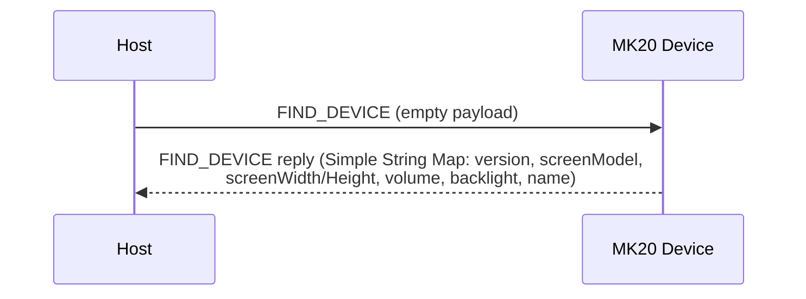
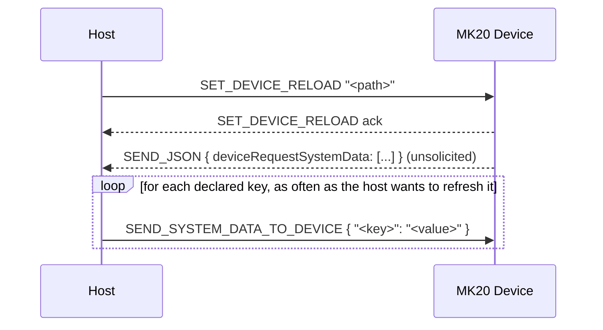
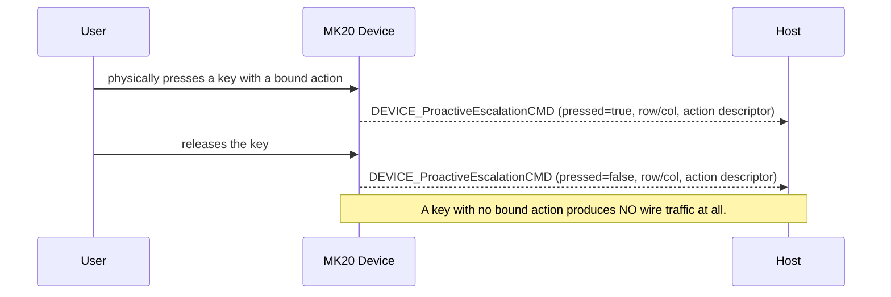
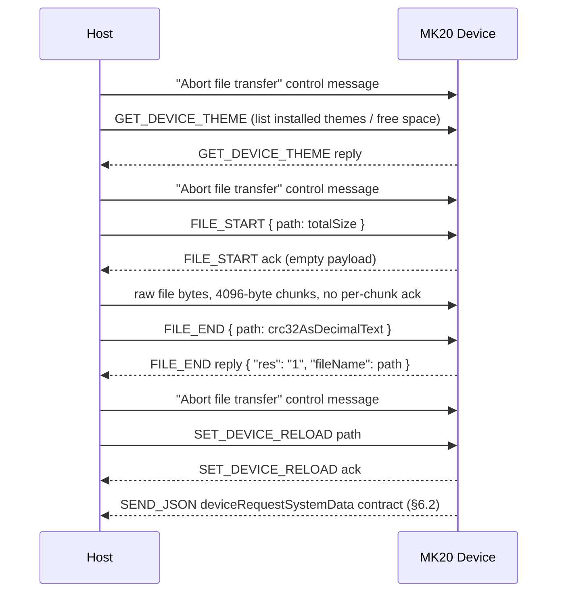
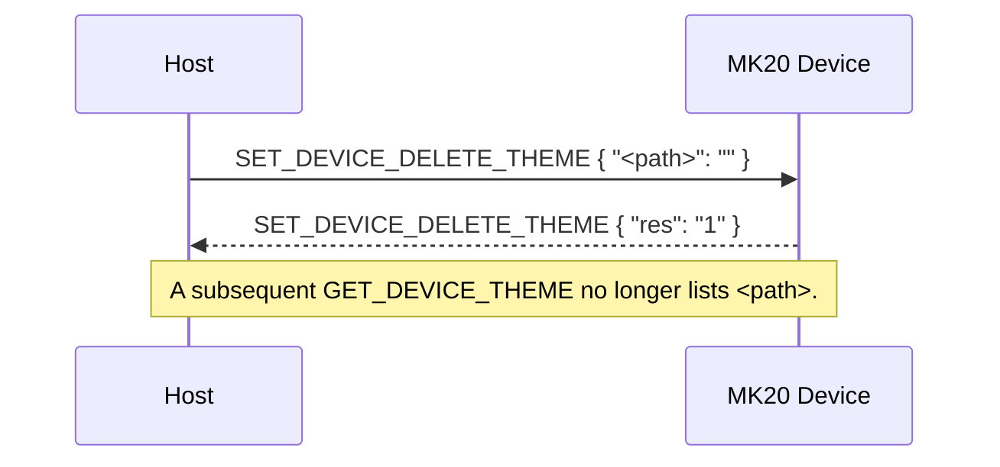
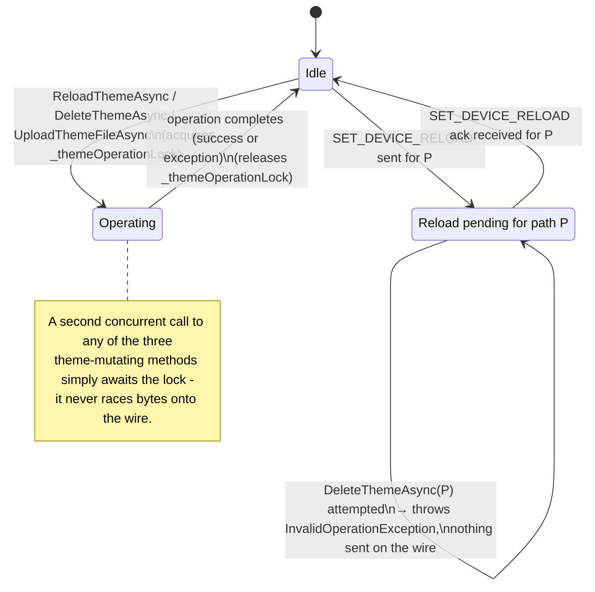
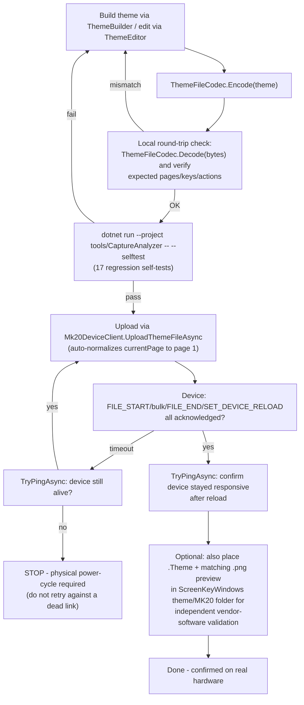
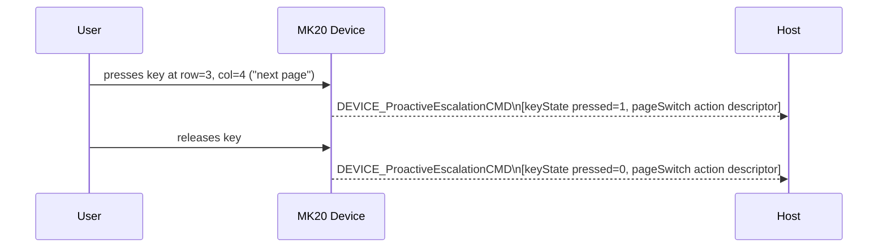
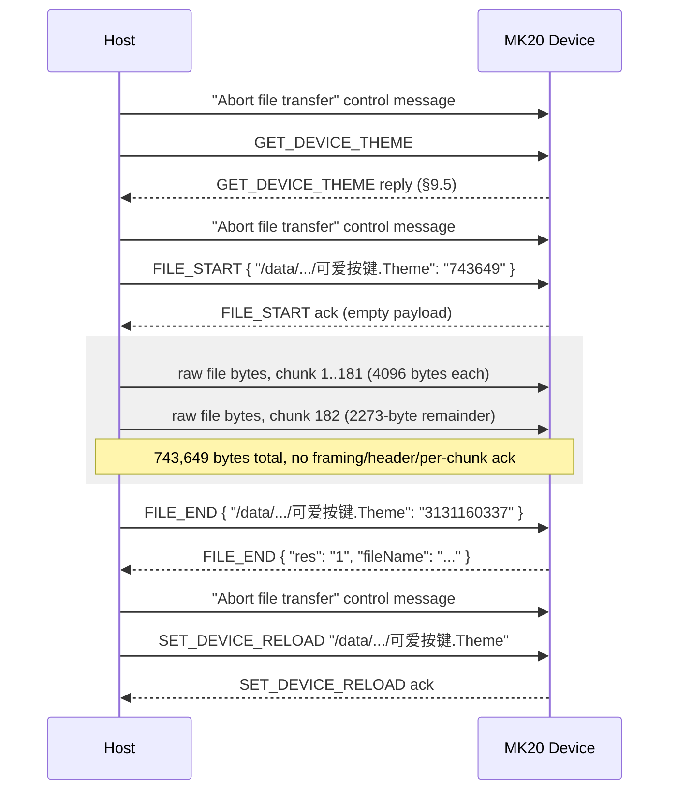

# Waveshare MK20 Host Protocol — Datasheet

**Document revision:** 2.2
**Applies to:** MK20 firmware `V2.32`, ScreenKeyWindows `v1.1`
**Status:** Confirmed by USB capture and live-device testing (see §12 for method)
**Reference implementation:** `Mk20Control.Protocol` (this repository)

For build/run instructions and project layout, see [`README.md`](./README.md). For the
`Mk20Control.Protocol` library's consumer-facing API surface (connecting, building/editing
themes, uploading, widgets), see [`Mk20Control.Protocol.API.md`](./Mk20Control.Protocol.API.md).

---

## 1. Scope

This document specifies the USB host-control protocol used by the Waveshare MK20
programmable keypad. It covers the physical/transport layer, wire frame format, command
set, payload encodings, and the on-disk `.Theme` file format that themes are delivered in.

All information is derived from live USB capture of the vendor application
(ScreenKeyWindows v1.1) communicating with physical hardware, plus direct interrogation of
a connected device. Static disassembly of the vendor executable was **not** used (it is
protected by Enigma Protector); all facts below were obtained by legitimate black-box wire
and file-format analysis.

Each fact is tagged:

| Tag | Meaning |
|---|---|
| **C** | Confirmed — observed directly on the wire or in a live device reply |
| **I** | Inferred — a reasonable but unverified interpretation |
| **U** | Unconfirmed — known to exist, exact behavior/schema not yet observed |

---

## 2. Physical & Transport Layer

| Parameter | Value |
|---|---|
| Interface | USB, CDC-ACM (virtual serial port) |
| USB VID:PID | `1D6B:0104` (Linux Foundation gadget) or `1234:5678` |
| Serial parameters | 115200 baud, 8N1, no flow control **(C, host side; device ignores line-rate over CDC-ACM)** |
| Endianness | Frame header fields: **little-endian**. Payload-internal length/count fields: **big-endian**. Two different serializers are in play — do not assume one endianness for the whole stack. |
| Checksum | CRC-32 (zlib variant: poly `0xEDB88320`, init `0xFFFFFFFF`, final XOR `0xFFFFFFFF`) |

---

## 3. Wire Frame Format **(C)**

Every command frame has a fixed 38-byte header followed by a variable-length payload.

```
Offset  Size  Field          Type      Notes
──────  ────  ─────────────  ────────  ─────────────────────────────────────────
 0      22    header         ASCII     Literal "AA551234 FIXEDCMDHEAD " (trailing space included)
22       4    packetType     u32 LE    0 = request (host→device), 2 = reply (device→host)
26       4    commandId      u32 LE    See §4 command table
30       4    payloadLength  u32 LE    Byte length of payload
34       4    payloadCrc32   u32 LE    CRC-32 of payload (zlib variant)
38    payloadLength  payload  bytes   Command-specific, see §4/§5
```

Total frame length = 38 + `payloadLength`.

### 3.1 Control message (out-of-band, not length-prefixed)

A second, distinct wire construct exists — a bare ASCII literal with no header fields and
no payload:

```
"AA551234 Abort file transfer 123455AA"
```

Observed sent host→device around file-transfer sequences (see §4, `FILE_START`/`FILE_END`).
Not a command frame — do not attempt to parse a header out of it.

**CONFIRMED exact placement** (message-by-message across every real capture examined, zero
exceptions): exactly one abort-transfer message is sent immediately before every
`FILE_START`, and exactly one more immediately after `FILE_END` and before
`SET_DEVICE_RELOAD` — the host does **not** wait for `FILE_END`'s reply before sending the
abort-transfer + `SET_DEVICE_RELOAD` that follows it; all three requests are pipelined
back-to-back (typically 1-7ms apart) and replies are collected afterward in FIFO order
(`FILE_END`'s reply arrives first, then `SET_DEVICE_RELOAD`'s). A **standalone** reload of
an already-installed theme (no re-upload) is *not* preceded by an abort-transfer message.
Omitting this message and/or waiting for `FILE_END`'s reply before sending the reload
request (this client's original behavior) was confirmed via real-hardware testing to cause
the device to never acknowledge `FILE_END`/`SET_DEVICE_RELOAD` — see §10 Open Item #6.

### 3.2 Parser resynchronization

A receiver must scan for the ASCII sequence `AA551234` to locate a frame boundary in a
byte stream (this is not a single-byte binary magic). On an implausible `payloadLength` or
a CRC mismatch, resynchronize by scanning past the current magic occurrence rather than
assuming a fixed frame size — corrupted data must not cause a subsequent valid frame to be
silently skipped.

> ⚠ **Note:** an early reverse-engineering pass (prior to live capture) guessed a
> different, entirely binary framing (`0xA1 0xA5 0x5A 0x5E` magic) based on static
> string/symbol analysis of the vendor firmware and applications. That framing was never
> observed on real hardware and has been fully superseded by the ASCII-prefixed framing
> above — do not implement against it.

---

## 4. Command Table (`commandId`)

| ID | Name | Direction | Payload encoding | Status |
|----|------|-----------|-------------------|--------|
| 0  | `FIND_DEVICE` | H↔D | Request: empty. Reply: Simple String Map (§5.1) | **C** |
| 1  | `SEND_SYSTEM_DATA_TO_DEVICE` | H→D | Simple String Map, big-endian variant (§5.3) | **C** |
| 2  | `SET_DEVICE_RELOAD` | H↔D | Plain UTF-8 path string, **no length prefix** | **C** |
| 3  | `GET_DEVICE_THEME` | H↔D | Request: empty. Reply: Simple String Map (§5.1) | **C** |
| 4  | `SET_DEVICE_BL` | H→D | ASCII decimal text (e.g. `"80"`), no binary encoding | **C** |
| 5  | `SET_DEVICE_SCAN_STATE` | — | — | **U** (ordering only) |
| 6  | `FILE_START` | H↔D | Simple String Map, single entry: `{path: totalSize}` | **C** — full sequence confirmed, see §4.1 |
| 7  | `FILE_END` | H↔D | Simple String Map: `{path: crc32}` (H→D) / `{"res":"1","fileName":path}` (D→H) | **C** — full sequence confirmed, see §4.1 |
| 8  | `GET_DEVICE_VERSION` | — | — | **U** (ordering only) |
| 9  | `SET_DEVICE_CANVASFLIP` | — | — | **U** (ordering only) |
| 10 | `GET_DEVICE_SCREENMESSAGE` | — | — | **U** (ordering only) |
| 11 | `SET_DEVICE_DELETE_THEME` | H↔D | Simple String Map (§5.1): `{path: ""}` (H→D) / `{"res":"1"}` (D→H) | **C** |
| 12 | `SEND_PIXMAP` | D→H (observed) | JPEG wrapped in a Tagged-Value Map (§5.2) under key `"ScreenKey"` | **C** receive-only; wrapping type-tag not fully decoded, send path not implemented |
| 13 | `DEVICE_ProactiveEscalationCMD` | D→H | Array of Tagged-Value Maps (§5.2) | **C** |
| 14 | `REQUEST_UPLOAD_KEY` | — | — | **U** (ordering only) |
| 15 | `SEND_JSON` | H↔D | UTF-8 JSON text | **C** |

IDs 5, 8–10, 14 are known only from the vendor firmware's string ordering; they have never
been observed on the wire. Do not assume their payload schema.

### 4.1 File transfer (theme upload) — fully confirmed

`FILE_START` / `FILE_END` mark the beginning/end of a theme file upload. The complete
three-step sequence is **confirmed by capturing a real theme install** (capture14.pcapng)
and reconstructing the transferred bytes from the capture, verifying them byte-for-byte
identical to the source `.Theme` file and confirming the reported CRC-32 matched:

```
1. → FILE_START   {"<device path>": "<totalSize>"}     (Simple String Map, §5.1)
   ← FILE_START   (empty payload ack)
2. Raw file bytes are written directly to the same bulk OUT endpoint (0x01) in fixed
   4096-byte chunks, back-to-back, with NO additional per-chunk header/framing of any
   kind and NO per-chunk acknowledgment - it is exactly the file's bytes, split at
   4096-byte boundaries. The final chunk is a shorter remainder
   (totalSize mod 4096 bytes, or a full 4096-byte chunk if it divides evenly).
3. → FILE_END     {"<device path>": "<crc32AsDecimalText>"}
   ← FILE_END     {"res": "1", "fileName": "<device path>"}
```

Confirmed example: a 743,649-byte theme file was sent as 181 chunks of exactly 4096 bytes
followed by one 2273-byte remainder chunk (181×4096 + 2273 = 743,649); the reconstructed
bytes from the capture were byte-for-byte identical to the source file, and both matched
CRC-32 `3131160337`, the exact value the device echoed back in the `FILE_END` reply.

After a successful `FILE_END` reply, `SET_DEVICE_RELOAD` is sent for the same path to
activate the newly uploaded theme (see §8.6).

### 4.2 Reply correlation

There is **no per-request correlation ID** anywhere in this protocol. A reply is matched to
a request only by `commandId` (and `packetType = 2`), on a FIFO basis. Do not invent or
rely on a request/response ID field.

---

## 5. Payload Encodings

Two **mutually incompatible** map serializations exist in this protocol. Confusing them
produces plausible-looking but wrong decodes — this was confirmed to be a real
implementation hazard by testing against physical hardware (see §12).

### 5.1 Simple String Map — `FIND_DEVICE`, `GET_DEVICE_THEME`, `FILE_START`, `FILE_END`

```
count(u32 BE)
count × { keyLen(u32 BE) + key(UTF-16BE) + valueLen(u32 BE) + value(UTF-16BE) }
```

Every value is plain text — **including values that look numeric**, such as a CRC-32 or a
volume level. There is no type tag and no null sentinel field.

Confirmed `FIND_DEVICE` reply (8 entries, live device):

```json
{
  "version": "V2.32",
  "upgradeToLatestMethod": "1",
  "screen_width": "640",
  "screen_model": "MK20",
  "screen_height": "656",
  "deviceVolume": "7",
  "deviceName": "ScreenKey",
  "deviceBl": "80"
}
```

Confirmed `GET_DEVICE_THEME` reply shape:

```json
{
  "bytesTotal": "2648",
  "bytesAvailable": "2483",
  "/data/theme/MK20/<name>/<name>.Theme": "<crc32 as decimal text>"
}
```
(one path→CRC entry per installed theme, in addition to the two fixed free-space fields)

### 5.2 Tagged-Value Map — `DEVICE_ProactiveEscalationCMD`, `.Theme` file internals

```
map:          count(u32 BE) + count × (string key + tagged value)
tagged value: typeId(u32 BE) + isNull(u8) + type-specific data

  typeId  Type          Encoding
  ──────  ────────────  ─────────────────────────────────────────
  1       bool          1 byte
  2       Int32         4 bytes, BE
  6       Double        8 bytes, BE
  8       map           nested map (recursive)
  9       list          count(u32 BE) + count × tagged value
  10      string        byteLen(u32 BE) + UTF-16BE; byteLen=0xFFFFFFFF ⇒ null
  12      byte array    byteLen(u32 BE) + raw bytes; byteLen=0xFFFFFFFF ⇒ null
```

For string/byte-array values, the `isNull` byte is conventionally written `0`, with
nullability instead signaled by the length field being `0xFFFFFFFF`. Any other `typeId` is
unspecified — treat as a decode error, not a guessable case.

`DEVICE_ProactiveEscalationCMD` payload is `count(u32 BE) + count × map` (an **array** of
tagged-value maps, not a single map).

Confirmed event — key at row 3, col 4, assigned "next page":

```json
[
  { "type": "keyState", "row": 3, "col": 4, "pressed": 1 },
  { "type": "pageSwitch", "pageSwitchMode": 2, "jumpToPage": 0,
    "iconPath": "/static/icon/dark/PageSwitch.png", "description": "Page switching" }
]
```

`pageSwitchMode`: `1` = previous page, `2` = next page.

Encoder-function events use a sentinel key position instead of a real matrix cell:
`row`/`col` observed as `100`–`105` depending on which encoder/edge fired (not a physical
key location).

### 5.3 System Data Map — `SEND_SYSTEM_DATA_TO_DEVICE`

Structurally identical to §5.1 (big-endian length-prefixed UTF-16BE string pairs), used
one-way host→device to push live telemetry values that a loaded theme displays.

```
count(u32 BE)
count × { keyLen(u32 BE) + key(UTF-16BE) + valueLen(u32 BE) + value(UTF-16BE) }
```

Confirmed data-source keys observed in captures: `GPU Usage`, `GPU Temperature`,
`CPU Usage`, `CPU Temperature`, `RAM Usage`, `RAM Total Memory`, `Volume`, `device_bl`.
Key names are theme-defined, not a fixed enum — see §6.2.

---

## 6. Behavioral Model

### 6.1 Identity / keepalive

`FIND_DEVICE` with an empty payload elicits a reply carrying the device identity map
(§5.1). No dedicated keepalive interval is specified; poll as needed.



### 6.2 Telemetry push contract (`deviceRequestSystemData`)

Immediately after every successful `SET_DEVICE_RELOAD`, the device sends an unsolicited
`SEND_JSON` (commandId 15) reply declaring which data-source keys the **newly loaded
theme** requires:

```json
{
  "deviceRequestSystemData": ["CPU Usage", "GPU Usage", "RAM Usage"],
  "deviceRequestSystemDataShowUnit": true,
  "themePageSwitch": true
}
```

The host is expected to push only the declared keys via `SEND_SYSTEM_DATA_TO_DEVICE`
(§5.3) afterward. This is a per-theme declarative contract, not a fixed global list — a
custom theme can declare arbitrary key names, since a progress-bar/text UI element simply
binds to a `system_data_name` string defined in its own theme JSON (§7).



**Value format:** confirmed real values pushed by ScreenKeyWindows are always
pre-formatted display strings, not bare numbers — even for keys bound to a numeric-range
gauge (`system_data_min_value`/`max_value`). Examples from a real capture
(`capture20_widget_data.pcapng`): `"CPU Usage": "22%"`, `"CPU Temperature": "0℃"`,
`"RAM Used Memory": "20 GB"`, `"CPU Model": "13th Gen Intel Core i7-13700K"` (a free-text
value bound to a gauge with `min=0/max=10000` — the device/renderer apparently tolerates a
non-numeric string on a numeric-bound gauge without erroring). This applies uniformly
across text items, progress bars, linear/radial/circular gauges. The renderer parses the
leading numeric portion for gauge fill level and ignores the rest.

### 6.3 Key press / encoder events

`DEVICE_ProactiveEscalationCMD` (commandId 13) fires **only** for a key or encoder that has
a "rich" action bound to it in the currently loaded theme (page-switch, encoder function,
etc.). A key with no bound action produces **no wire traffic at all** on press — there is
no generic "any key pressed" event.

Encoder rotation is **not** a discrete event. Turning a brightness/volume-bound encoder
instead causes the host to continuously push the live value via
`SEND_SYSTEM_DATA_TO_DEVICE` (e.g. `device_bl=80`), rendered by an on-screen element bound
to that key. No "rotated by N detents" message exists on the wire.



### 6.4 Setting a key's picture or function

There is **no live per-key command** to set an icon or assign a function to a single key.
Every observed key remap / icon change / GIF assignment was performed by rebuilding the
**entire theme file** and pushing it through:

```
GET_DEVICE_THEME                          (list installed themes / free space)
FILE_START   {path: totalSize}
             … 4096-byte bulk chunks, confirmed, see §4.1 …
FILE_END     {path: crc32}
SET_DEVICE_RELOAD  path                   (activate)
```



A theme containing an animated GIF is simply a larger `.Theme` file (embedded assets) —
GIFs, videos (`.mp4`), and PNGs are not distinct wire concepts.

**Which page opens after activation.** `"main"."currentPage"` (a page GUID) names the page
shown immediately after `SET_DEVICE_RELOAD` — it is not required to match `pages[0]` and
can drift (e.g. after re-saving in an external editor). `Mk20DeviceClient.UploadThemeFileAsync`
normalizes this automatically: before every upload it re-encodes the file with `currentPage`
set to `pages[0]` if they don't already match.

### 6.5 Secondary screen

A secondary-screen theme uses the identical `GET_DEVICE_THEME` / `FILE_START` / `FILE_END`
/ `SET_DEVICE_RELOAD` sequence and the same `deviceRequestSystemData` contract as a
main-screen theme — it is simply another theme file/slot, not a separate protocol path.

**Embedding secondary-screen content in a main-screen file.** A dedicated `.Theme` file
with a 428x142 canvas (`theme/MK20/SecondaryScreen/<N>/<N>.theme`) is one option. A second,
confirmed option: embed a `DynamicImageItem` (type 114) at the fixed position
`x=106, y=0, w=428, h=142` with `"backgroundType":"secondary"` directly inside a 640x656
main-screen page, driving both screens from one theme file. See
`DynamicImageItemBuilder.SecondaryScreenBackground(...)`. Confirmed working with an
animated GIF on real hardware.

**Main-screen background: two independent mechanisms.**

| Mechanism | Item type | Content | Asset path | Position |
|---|---|---|---|---|
| Video background | `BackgroundItem` (100) | `.mp4` only | `/theme/MK20-PLUS/MainScreen/<file>` | `x=0,y=144,w=640,h=512,z=-2` |
| Picture/GIF background | `DynamicImageItem` (114), `backgroundType="main"` | static image or GIF | `/image/640x656/cache/<file>` | `x=0,y=144,w=640,h=512,z=-2` |

Every vendor-shipped theme examined uses the video mechanism. The picture/GIF mechanism was
confirmed by capturing a genuine ScreenKeyWindows save of a picture, then separately a GIF,
as the main-screen background. Both item types occupy the identical position/size; only the
item type, asset namespace, and content type differ. The `DynamicImageItem` field set is
identical between the picture and GIF case (`backgroundType, h, id, lock, maxHeight,
maxWidth, path, rotate, scale, type, w, x, y, z`, no `paths`/`system_data_flag`/
`backupX`/`backupY`) — only the asset's extension/content differs. One confirmed rendering
difference: a static image is resized/cropped to exactly fill 640x512; a GIF is embedded at
its original, unresized size. This library has no MP4 encoder — `BackgroundItemBuilder
.MainScreen(...)` accepts pre-encoded MP4 bytes; `DynamicImageItemBuilder
.MainScreenBackground(...)` is the mechanism for a picture or GIF built from scratch.
Confirmed visually on real hardware for both a static image and a GIF.

### 6.6 Deleting a theme

`SET_DEVICE_DELETE_THEME` (commandId 11) removes an installed theme by its device-side
path. Confirmed request/reply shape (both Simple String Map, §5.1):

```
→ SET_DEVICE_DELETE_THEME   {"<path>": ""}
← SET_DEVICE_DELETE_THEME   {"res": "1"}
```



A subsequent `GET_DEVICE_THEME` no longer lists the deleted path. The value half of the
request entry is an empty string - the path itself is the only meaningful data, carried as
the map *key* (the same "path as dictionary key" shape used by `GET_DEVICE_THEME`, §5.1).
Deleting the currently-active theme was not tested; behavior in that case is unconfirmed.

### 6.7 Client-side operational discipline

The protocol has no device-side "cancel" or "reset stuck operation" command beyond the
abort-transfer control message (§3.1), which is sent proactively before a new operation,
not as runtime recovery for one already in flight. Correctness therefore depends on host
discipline. `Mk20DeviceClient` enforces two rules observed in every real capture:

1. **Never overlap theme-mutating operations.** `ReloadThemeAsync`, `DeleteThemeAsync`, and
   `UploadThemeFileAsync` are serialized against each other via an internal lock — a second
   call made before the first finishes waits its turn.
2. **Never delete a theme whose reload hasn't been confirmed.** Deleting a theme while its
   `SET_DEVICE_RELOAD` was still unacknowledged (confirmed via direct testing; a client-side
   timeout does not prove the device gave up) left the render subsystem stuck, requiring a
   physical power-cycle — `FIND_DEVICE`/`GET_DEVICE_THEME` kept responding normally
   throughout. `DeleteThemeAsync` now refuses to delete a path with an unconfirmed pending
   reload, throwing `InvalidOperationException` before sending anything; use
   `IsReloadPending`/`ClearPendingReloadState` to inspect or override once independently
   confirmed safe (e.g. after a power-cycle).



### 6.8 End-to-end theme authoring workflow (recommended)

This is the confirmed-safe sequence for building and validating a new/edited theme against
real hardware, as used throughout this project's own testing:



---

## 7. `.Theme` File Format

Themes are delivered to the device as a single binary file with this layout:

```
[header: Tagged-Value Map — language(int), keyMacroValue(bytes), keyMacro(bytes|null)]
[8 bytes — 4 zero bytes + a big-endian uint32 equal to (JSON byte length + 1); CONFIRMED
 via direct byte comparison against multiple real files - NOT arbitrary padding]
[UTF-8 JSON — layout: {"main":{"currentPage","version"},"pages":[...]}]
[1 byte reserved, observed 0x0A]
[assetCount(u32 BE)]
assetCount × {
    pathLen(u32 BE) + path(UTF-16BE)      // e.g. "/image/428x142/PhotoAlbum/x.gif"
    dataLen(u32 BE) + data(bytes)          // PNG / GIF / MP4, per magic bytes
}
```

Decoding does not need to trust the 8-byte length field - scanning for balanced `{}`/`[]`
(respecting quoted-string escapes) finds the JSON's true end correctly regardless - but
**encoding must write the correct value**: a themed file whose header claims the wrong JSON
length was one of several confirmed contributing causes of ScreenKeyWindows itself locking
up when loading a file this library produced (see §10 Item #10).

**Confirmed real JSON formatting** (matters for producing a file ScreenKeyWindows accepts,
not just one this codec can decode): 4-space indentation, Unix `\n` line endings (not
`\r\n`), object keys in alphabetical order at every nesting level, and minimal string
escaping (`\"` for a literal quote, not `\u0022`).

**Note:** all numeric-looking JSON fields (`x`, `y`, `z`, `w`, `h`, `rotate`, `scale`, `id`,
…) are serialized as **JSON strings**, not JSON numbers.

**`main.currentPage`:** the page GUID (must match one entry in `"pages"[].pageName`) the
device renders immediately upon activation via `SET_DEVICE_RELOAD` - see §6.4 for the
confirmed drift hazard (it is not guaranteed to match `pages[0]`) and how
`Mk20DeviceClient.UploadThemeFileAsync` now corrects it automatically before every upload.

**Page count:** a theme is not required to have more than 1 page — confirmed by a real
user-created theme (5 keys, no background, 1 page) reloading normally.

**Required page-level field `"encoder"`:** every main-screen page carries an `"encoder"`
array alongside `"canvas"`/`"items"`/`"pageName"`, describing the physical rotary-encoder
hardware:
```json
"encoder": [
    {"col": 0, "keyString": "", "keycode": 0, "row": 103},
    {"col": 0, "keyString": "", "keycode": 0, "row": 104}
]
```
Absent only from secondary-screen/sub-page theme files (`Key/*.theme`,
`SecondaryScreen/*.theme`, `Encoder/relatedTheme/*.Theme`). Omitting it from a main-screen
theme causes ScreenKeyWindows to lock up when loading the file. `ThemeFileCodec` always
emits this field, preserved from source or defaulted for a new page.

### 7.1 Page item types (`items[].type`)

| Code | Name | Purpose | Key fields |
|------|------|---------|-----------|
| 100 | Background | `.mp4` video background (main or secondary screen) | `backgroundType`: `main`\|`secondary`, `path` |
| 101 | Circular gauge | Data-bound solid-color ring/dial, no gradient/angle range | `system_data_name`, `front_color`/`back_color`, `margin`, `radius` |
| 102 | Progress bar | Data-bound circular/linear bar | `system_data_name`, `system_data_min_value`/`max_value` |
| 103 | Linear gauge | Data-bound bar, solid front/back/border colors | `system_data_name`, `front_color`/`back_color`/`border_color` |
| 104 | Segmented circular gauge ("seg-circular") | Same JSON field set as type 101; editor renders it as a segmented/notched ring instead of a solid arc | `system_data_name`, `front_color`/`back_color`, `margin`, `radius` |
| 109 | Radial gauge | Data-bound arc gauge, up to 3 gradient stops | `system_data_name`, `angleMinValue`/`angleMaxValue`, `gradientColor1`–`3`, `Clockwise` |
| 110 | Light-shadow gauge | Data-bound ring, separate arc stroke color/width plus a glow/shadow highlight | `system_data_name`, `back_color`, `arcColor`/`arcWidth`, `lightShadowColor`/`Lighter`/`Position`, `Clockwise`, `DisplayDirection` |
| 111 | Digital clock | Live clock field (one item per field) | `system_data_name`: `hour`\|`minute`\|`second` |
| 113 | Text | Static or data-bound text | `system_data_name`, `text_font`, `text_str` |
| 114 | Dynamic image | Decorative animated GIF (item-local); also the mechanism for a main/secondary-screen picture or GIF background (`backgroundType`) — see §6.5 | `path` → embedded asset |
| 115 | Key | Physical key definition | `row`, `col`, `path` (icon), `controlData` (base64, see §7.2) |
| 116 | Multi-line text | Same field set as type 113 plus explicit `w`/`h` wrap bounds | `system_data_name`, `text_font`, `text_str`, `w`, `h` |
| 117 | Shadow text | Same field set as type 113 plus a drop-shadow style | `system_data_name`, `text_font`, `text_str`, `border_color`/`border_width`, `shadeColor`, `shadeSize` |

All type 101/104/110/116/117 rows confirmed via `widgetThemeDemo.Theme` (ScreenKeyWindows
editor's "widget" demo, decoded 2026-08-13) — the editor's UI groups image / text /
multiline text / shadow text / circular progress bar (plain, segmented, light-shadow) /
horizontal progress bar / clock widgets; only a horizontal-progress-bar segmented variant
("seg-hor") and an analog clock face remain unconfirmed (§10 Open Item #15).

**Required fields for a type-115 Key item:** `id`, `itemName` (e.g. `"control1"`), `x`,
`y`, `z`, `rotate`, `scale`, `lock`, `row`, `col`, `path`, `controlData`, `maxWidth`,
`maxHeight`, `scaledWidthTo`, `scaledHeightTo`, `opacity`, `paths` (usually empty),
`soundFile` (usually empty), `title` (usually empty), `titleParam` (JSON-string-encoded
object with `FontFamily`/`FontSize`/etc.). Omitting any of these — most notably `itemName`
— causes ScreenKeyWindows to lock up loading the file. Key items never carry `w`/`h`,
unlike Background items (type 100), which carry `w`/`h` *and* `maxWidth`/`maxHeight`
together. Boolean-looking fields (e.g. `lock`) are strings `"0"`/`"1"`, not JSON booleans.
`lock` is always `"1"` on a real key item.

**Required `controlData` fields for a `keyboard` action** (base64-decoded tagged-value
map, §5.2): `type` (`"keyboard"`), `description` (`"Keyboard"`), `parentDescription`
(`"System input control"`), `iconPath` (`"/static/icon/dark/keyboard.png"`), `keycode`,
`keyString`, `AISoundControlKeyword` (empty string). Omitting any of these produces a
`controlData` blob ScreenKeyWindows locks up loading.

**Modifier combos (e.g. Ctrl+Alt+Del):** a key with held modifiers packs the standard
USB HID keyboard-report modifier bitmask into the *upper byte* of the same 16-bit
`keycode` field: `(modifierBitmask << 8) | baseKeycode`. Confirmed via capture:
`keycode = 0x054C` for Ctrl+Alt+Del, decomposing as modifier byte `0x05`
(bit0=Left Ctrl, bit2=Left Alt) + base keycode `0x4C` (USB HID Delete), `keyString =
"L Ctrl L Alt Del"`.
This is the standard USB HID Boot Keyboard modifier-byte convention, packed into the upper
byte rather than sent as a separate field — only Left Ctrl/Left Alt individually confirmed
against this device; the same bit layout is expected to generalize (see
`Mk20Control.Protocol.Theme.Building.KeyModifiers`):

| Bit | Modifier | Confirmed? |
|---|---|---|
| 0 (`0x01`) | Left Ctrl | **C** |
| 1 (`0x02`) | Left Shift | U |
| 2 (`0x04`) | Left Alt | **C** |
| 3 (`0x08`) | Left Win | U |
| 4 (`0x10`) | Right Ctrl | U |
| 5 (`0x20`) | Right Shift | U |
| 6 (`0x40`) | Right Alt | U |
| 7 (`0x80`) | Right Win | U |

Use `KeyActions.KeyboardCombo(modifiers, key, ...)`, combining `KeyModifiers` with `|` and
passing the base key as a `HidKey` enum value (e.g. `HidKey.Delete`) instead of a raw
integer — every combo goes through this one strongly-typed function. See `README.md`'s
"Keyboard modifiers and combos" section for worked examples.

**Text/title over a button and icon transparency** (`title`/`opacity`/`titleParam`):
confirmed via capture that these are fields on the *same* `KeyItem`, not a separate overlay
item:
- `"title"`: on-screen text shown over the icon.
- `"opacity"`: `"100"` (opaque, default) down to `"15"` observed — the vendor UI's
  "transparency" control writes this same field a key's icon opacity already uses.
- `titleParam`: JSON-string-encoded font/alignment/color object; observed values
  `Microsoft YaHei`, size 24, white, `"top"`/`"bottom"` alignment only (`"center"` has no
  visible effect on real hardware).

Implemented as `KeyItemBuilder.Title(string)`, `.Opacity(int 0-100)`, `.TitleStyle(fontFamily,
fontSize, alignment, colorHex)`, and `ThemeEditor.PageEditor.SetKeyOpacity(row, column, opacityPercent)`.

**Required key icon PNG format:** exactly 128x128 pixels, RGB (no alpha channel), 8-bit
depth. `scaledWidthTo`/`scaledHeightTo` describe the *rendered* size but do not substitute
for the asset itself being correctly sized — a wrong-size or alpha-carrying icon causes
ScreenKeyWindows to lock up loading the file. `KeyItemBuilder.Icon`/`ThemeEditor.SetKeyIcon`
normalize any input image to this format automatically.

**Animated key icons:** leave `path` empty, set `paths` to a folder path (e.g.
`/image/MK20/cache/pop-cat_1`) and `frameDelays` to a comma-separated per-frame delay list
in milliseconds. Each frame is a separate PNG asset under that folder (`frame_0.png`,
`frame_1.png`, ...) — distinct from the type-114 Dynamic Image item's single embedded GIF
asset, even though both render an animation.

### 7.2 Key actions (`controlData`, base64 of a Tagged-Value Map)

| `type` | Purpose | Key fields |
|---|---|---|
| `keyboard` | Emit a keystroke (optionally with held modifiers) | `keycode` (USB HID usage; upper byte = modifier bitmask for combos, see below), `keyString` |
| `openWeb` | Open a URL | `Url` |
| `qmk_mouse` | Mouse click/move/scroll | `qmk_mouse_key`, `qmk_mouse_event`, `mouse_x`/`y`/`v`/`h` |
| `pageSwitch` | Relative page navigation | `pageSwitchMode`: `1`=previous, `2`=next |
| `openPage` | Jump to a specific page | `pageName` (target page GUID) |
| `oneLevelUp` | Navigate to parent page | `pageName` = fixed sentinel `"parentPage"` |
| `keyboard_switch` | Toggle keyboard layout | — |
| `Microphone` / `Loudspeaker` | Adjust a named OS audio device's volume | `volumeAdjustDevice`, `volumeAdjustMode`, `volumeadjustValue` |
| `text` | Inject typed text | `inputText`, `isInputEnter`, `isCopyPaste` |
| `ControlFlow` | Multi-step macro | `controlDataList` (bytes) — populated-step schema not yet observed |
| `encoder_system_volume` / `encoder_system_media` / `encoder_device_brightness` | Encoder function | `category`="encoder", optional `relatedTheme` (a `.Theme` path shown on the encoder's mini-display) |
| `encoder_keyboard` | Encoder bound to 3 keystrokes | `encoder_left_keycode`/`middle`/`right_keycode` (+ `keyString` each) |

### 7.3 Theme builder/editor API (`Mk20Control.Protocol.Theme.Building`)

For programmatic theme construction/editing without hand-writing JSON:

- **`ThemeBuilder`** — fluent builder for a new `ThemeFile`. Chain `.AddPage(page => ...)`,
  and within a page use `.AddKey(row, col, key => ...)`, `.AddBackground(bg => ...)`,
  `.AddText(...)`, `.AddProgressBar(...)`, `.AddLinearGauge(...)`, `.AddRadialGauge(...)`,
  `.AddDigitalClockField(...)`, `.AddDynamicImage(...)`. Call `.Build()` then
  `ThemeFileCodec.Encode(...)` for bytes ready for `Mk20DeviceClient.UploadThemeFileAsync`.
- **`ThemeEditor`** — wraps a decoded `ThemeFile` for targeted edits:
  `editor.Page(n).SetKeyIcon(row, col, ...)`, `.SetKeyAction(...)`, `.SetKeyTitle(...)`,
  `.SetKeyOpacity(...)`, `.AddKey(...)`, `.RemoveKey(...)`, `.SetMainBackground(...)`. Call
  `editor.Save()` for the updated `ThemeFile`.
- **`KeyActions`** — factory methods for every `KeyAction` variant from §7.2
  (`.Keyboard(HidKey key, label)` / `.Keyboard(int keycode, label)`,
  `.KeyboardCombo(KeyModifiers modifiers, HidKey key, label)`, `.OpenWeb(url)`,
  `.Mouse(...)`, `.PreviousPage()`/`.NextPage()`, `.OpenPage(pageId)`, `.OneLevelUp()`,
  `.TypeText(...)`, `.AudioVolume(...)`, `.KeyboardSwitch()`, `.EncoderKeyboard(...)`,
  `.EncoderFunction(rawType, ...)`).

Every item produced by this API matches the confirmed-required JSON field skeleton from
§7.1. Cross-check method: decode a real theme file, rebuild its items through this API from
the decoded data, re-encode, re-decode, and diff — reproduces every key's icon and action
with zero mismatches. Exact byte-for-byte file equality is not the bar (the real editor
embeds bookkeeping fields with no confirmed device-behavior effect); see
`CaptureAnalyzer --builder-byte-diff <file.Theme>` to reproduce this check.

---

## 8. Command Reference — Quick Index

Practical sequences already illustrated in §6 (with sequence diagrams); this is a quick
lookup table only.

| Task | Commands | See |
|---|---|---|
| Connect / identify | `FIND_DEVICE` | §6.1 |
| Set backlight | `SET_DEVICE_BL "<0-100>"` | §4 |
| Push telemetry | `SEND_SYSTEM_DATA_TO_DEVICE` | §6.2 |
| List installed themes | `GET_DEVICE_THEME` | §8.4 below |
| Load a theme | `SET_DEVICE_RELOAD` → `SEND_JSON` contract | §6.2 |
| Upload + activate a theme | `GET_DEVICE_THEME` → `FILE_START` → bulk → `FILE_END` → `SET_DEVICE_RELOAD` | §6.4 |
| Delete a theme | `SET_DEVICE_DELETE_THEME` | §6.6 |

### 8.4 `GET_DEVICE_THEME` reply shape

```
← GET_DEVICE_THEME   Simple String Map (§5.1) — bytesTotal/bytesAvailable + path→CRC pairs
```

---

## 9. Wire-Level Examples

Every example below is a **verbatim byte sequence** taken from a real capture or a real
`.Theme` file (source noted per example), shown as the complete 38-byte header + payload,
hex-encoded. Use these to validate an independent implementation byte-for-byte.

### 9.1 Connect / identify — `FIND_DEVICE`

Request (host → device), empty payload:
```
4141353531323334204649584544434D44484541442000000000000000000000000000000000
```

Reply (device → host), 316-byte payload, Simple String Map (§5.1):
```
4141353531323334204649584544434D44484541442002000000000000003C0100009088F6E3
000000080000000E00760065007200730069006F006E0000000A00560032002E003300320000
002A00750070006700720061006400650054006F004C00610074006500730074004D00650074
0068006F00640000000200310000001800730063007200650065006E005F0077006900640074
0068000000060036003400300000001800730063007200650065006E005F006D006F00640065
006C00000008004D004B003200300000001A00730063007200650065006E005F006800650069
00670068007400000006003600350036000000180064006500760069006300650056006F006C
0075006D006500000002003700000014006400650076006900630065004E0061006D00650000
001200530063007200650065006E004B00650079000000100064006500760069006300650042
006C00000006003100300030
```
Decodes to:
```json
{"version":"V2.32","upgradeToLatestMethod":"1","screen_width":"640","screen_model":"MK20",
 "screen_height":"656","deviceVolume":"7","deviceName":"ScreenKey","deviceBl":"100"}
```

### 9.2 Set backlight — `SET_DEVICE_BL`

Request, 2-byte ASCII payload `"99"`:
```
4141353531323334204649584544434D4448454144200000000004000000020000004D175810
3939
```
`payload = 39 39` = ASCII `"99"`.

### 9.3 Push telemetry — `SEND_SYSTEM_DATA_TO_DEVICE`

Request, 108-byte payload (3 key/value pairs):
```
4141353531323334204649584544434D44484541442000000000010000006C000000BC1A9404
0000000300000012004700500055002000550073006100670065000000040030002500000012
004300500055002000550073006100670065000000060031003700250000001E004300500055
002000540065006D007000650072006100740075007200650000000400302103
```
Decodes to `{"GPU Usage":"0%","CPU Usage":"17%","CPU Temperature":"0℃"}` — this is the
Simple String Map format (§5.1), not the tagged-value format.

### 9.4 Key press event — `DEVICE_ProactiveEscalationCMD`



Reply, 515-byte payload — physical key at row 3 / col 4 (assigned "next page"), pressed:
```
4141353531323334204649584544434D444845414420020000000D00000003020000D63FCD64
00000002000000040000000800740079007000650000000A0000000010006B00650079005300
74006100740065000000060072006F00770000000200000000030000000E0070007200650073
007300650064000000020000000001000000060063006F006C00000002000000000400000007
0000000800740079007000650000000A00000000140070006100670065005300770069007400
630068000000220070006100720065006E007400440065007300630072006900700074006900
6F006E0000000A000000001C005000610067006500200073007700690074006300680069006E
00670000001C0070006100670065005300770069007400630068004D006F0064006500000002
000000000200000014006A0075006D00700054006F0050006100670065000000020000000000
0000001000690063006F006E00500061007400680000000A0000000040002F00730074006100
7400690063002F00690063006F006E002F006400610072006B002F0050006100670065005300
770069007400630068002E0070006E0067000000160064006500730063007200690070007400
69006F006E0000000A000000001C005000610067006500200073007700690074006300680069
006E00670000002A004100490053006F0075006E00640043006F006E00740072006F006C004B
006500790077006F007200640000000A0000000000
```
Decodes to (§5.2 tagged-value array):
```json
[
  { "type": "keyState", "row": 3, "col": 4, "pressed": 1 },
  { "type": "pageSwitch", "parentDescription": "Page switching", "pageSwitchMode": 2,
    "jumpToPage": 0, "iconPath": "/static/icon/dark/PageSwitch.png",
    "description": "Page switching", "AISoundControlKeyword": "" }
]
```

### 9.5 List installed themes — `GET_DEVICE_THEME`

Reply, 268-byte payload:
```
4141353531323334204649584544434D44484541442002000000030000000C010000CE6CC2EE
0000000400000014006200790074006500730054006F00740061006C00000008003200360034
00380000001C006200790074006500730041007600610069006C00610062006C006500000008
003200350032003200000040002F0064006100740061002F007400680065006D0065002F004D
004B00320030002F65F65C1A6309952E002F65F65C1A6309952E002E005400680065006D0065
00000014003100330036003900310039003100350034003400000040002F0064006100740061
002F007400680065006D0065002F004D004B00320030002F53EF72316309952E002F53EF7231
6309952E002E005400680065006D006500000014003200320038003300310039003900320030
0033
```
Decodes to:
```json
{"bytesTotal":"2648","bytesAvailable":"2522",
 "/data/theme/MK20/时尚按键/时尚按键.Theme":"1369191544",
 "/data/theme/MK20/可爱按键/可爱按键.Theme":"2283199203"}
```

### 9.6 Load / activate a theme — `SET_DEVICE_RELOAD`

Request, 48-byte payload (plain UTF-8, no length prefix):
```
4141353531323334204649584544434D44484541442000000000020000003000000040A6368A
2F646174612F7468656D652F4D4B32302FE697B6E5B09AE68C89E994AE2FE697B6E5B09AE68C
89E994AE2E5468656D65
```
`payload = "/data/theme/MK20/时尚按键/时尚按键.Theme"`.

### 9.7 Upload a theme file — `FILE_START` / `FILE_END` / bulk transfer

Confirmed from a real theme install (capture14.pcapng): uploading `可爱按键.Theme`
(743,649 bytes, CRC-32 `3131160337`).



**Confirmed sequencing (5/5 independent real upload sequences checked, zero exceptions):**
`GET_DEVICE_THEME` request/reply, then the abort-transfer control message, then
`FILE_START`. Every real upload examined sends a fresh theme-listing request immediately
before starting the transfer.

`FILE_START` request (90-byte payload — `{path: totalSize}`):
```
4141353531323334204649584544434D44484541442000000000060000005800000086D75F53
0000000100000040002F0064006100740061002F007400680065006D0065002F004D004B0032
0030002F53EF72316309952E002F53EF72316309952E002E005400680065006D00650000000C
003700340033003600340039
```
Decodes to `{"/data/theme/MK20/可爱按键/可爱按键.Theme":"743649"}` (total size in bytes).

Device replies with an empty `FILE_START` ack, then the host writes the raw file bytes
directly to the bulk OUT endpoint in 182 back-to-back chunks (181 × 4096 bytes + one
2273-byte remainder), **with no header, length prefix, or framing of any kind** - this is
confirmed by reconstructing all 743,649 transferred bytes directly from the capture and
finding them byte-for-byte identical to the original file. The first chunk begins with the
`.Theme` file's own header (§7) directly - e.g. its first 16 bytes:
```
0000000300000010006C0061006E0067007500610067006500000002000000
```
(the start of the confirmed `.Theme` header's tagged-value map, §5.2/§7 - not a
transfer-specific header).

`FILE_END` request (100-byte payload — `{path: crc32AsDecimalText}`):
```
4141353531323334204649584544434D4448454144200000000007000000600000003B67466C
0000000100000040002F0064006100740061002F007400680065006D0065002F004D004B0032
0030002F53EF72316309952E002F53EF72316309952E002E005400680065006D006500000014
0033003100330031003100360030003300330037
```
Decodes to `{"/data/theme/MK20/可爱按键/可爱按键.Theme":"3131160337"}` (final CRC-32 - matches
both the source file's actual CRC-32 and the CRC-32 the device echoes back on success).

### 9.7a Re-activating an already-present theme (no bulk transfer)

The example below (a different capture) shows `FILE_START`/`FILE_END` with no intervening
bulk data - this happens when the app re-activates a theme that's already fully present on
the device (no new bytes need transferring), not because the transfer mechanism is
unconfirmed (see §9.7 above for a genuine upload).

`FILE_START` request (90-byte payload — `{path: totalSize}`):
```
4141353531323334204649584544434D44484541442000000000060000005A0000001C972043
0000000100000040002F0064006100740061002F007400680065006D0065002F004D004B0032
0030002F65F65C1A6309952E002F65F65C1A6309952E002E005400680065006D00650000000E
0032003500360031003800360038
```
Decodes to `{"/data/theme/MK20/时尚按键/时尚按键.Theme":"2561868"}` (total size 2,561,868 bytes).

`FILE_END` request (96-byte payload — `{path: crc32}`):
```
4141353531323334204649584544434D44484541442000000000070000006000000016605CC2
0000000100000040002F0064006100740061002F007400680065006D0065002F004D004B0032
0030002F65F65C1A6309952E002F65F65C1A6309952E002E005400680065006D006500000014
0034003200370031003500340035003400360032
```
Decodes to `{"/data/theme/MK20/时尚按键/时尚按键.Theme":"4271545462"}` (final CRC-32).

### 9.8 Generic JSON — `SEND_JSON`

Request, 24-byte payload:
```
4141353531323334204649584544434D444845414420000000000F0000001800000008C10078
7B0A2020202022636F6E6E656374223A20747275650A7D0A
```
Decodes to `{"connect":true}`.

### 9.9 Delete a theme — `SET_DEVICE_DELETE_THEME`

Request (host → device), 68-byte payload — Simple String Map (§5.1), single entry mapping
the target path to an empty value:
```
4141353531323334204649584544434D444845414420000000000B000000440000003FCAE1EB
0000000100000038002F0064006100740061002F007400680065006D0065002F004D004B0032
0030002F5B576BCD002F5B576BCD002E005400680065006D006500000000
```
Decodes to `{"/data/theme/MK20/字母/字母.Theme":""}`.

Reply (device → host), 20-byte payload:
```
4141353531323334204649584544434D444845414420020000000B0000001400000028BEF617
0000000100000006007200650073000000020031
```
Decodes to `{"res":"1"}`.

### 9.10 Key setup — assigning a keyboard remap in a `.Theme` file

This is **not** a live wire command (see §6.4) — it is a `controlData` field inside a
`.Theme` file's JSON (a base64-encoded Tagged-Value Map, §5.2/§7.2). Real example from
`时尚按键.Theme`, key at row 1 / col 0, assigned keycode 4 (USB HID 'A'):

Base64 (as stored in the `"controlData"` JSON field):
```
AAAABAAAAAgAdAB5AHAAZQAAAAoAAAAAEABrAGUAeQBiAG8AYQByAGQAAAAOAGsAZQB5AGMAbwBkAGUA
AAACAAAAAAQAAAASAGsAZQB5AFMAdAByAGkAbgBnAAAACgAAAAACAEEAAAAWAGQAZQBzAGMAcgBpAHAA
dABpAG8AbgAAAAoAAAAABJUudtg=
```
Decoded bytes (140 bytes, Tagged-Value Map):
```
000000040000000800740079007000650000000A0000000010006B006500790062006F006100
7200640000000E006B006500790063006F0064006500000002000000000400000012006B0065
00790053007400720069006E00670000000A0000000002004100000016006400650073006300
720069007000740069006F006E0000000A0000000004952E76D8
```
Decodes to the tagged-value map:
```json
{"type":"keyboard","keycode":4,"keyString":"A","description":"键盘"}
```
The device only receives this bundled inside a re-uploaded `.Theme` file (§6.4/§9.7) —
there is no live command to push a single key's `controlData` on its own.

### 9.11 Picture / GIF asset — `.Theme` file asset entry

Real asset entry from `时尚按键.Theme` (§7 asset section), one PNG icon:
```
00000040002F0069006D006100670065002F004D004B00320030002D0050004C00550053002F
00630061006300680065002F004100490074005F0031002E0070006E00670000033789504E47
0D0A1A0A0000000D
```
(first 16 bytes of the 823-byte PNG payload shown; full entry continues with the rest of
the PNG file)
Field breakdown:
- `pathLen = 0x00000040` = 64 bytes → path `"/image/MK20-PLUS/cache/AIt_1.png"` (UTF-16BE)
- `dataLen = 0x00000337` = 823 bytes → raw PNG data, starting with the standard PNG magic
  `89 50 4E 47 0D 0A 1A 0A`

An animated GIF or `.mp4` background asset uses the identical entry shape — only the
`dataLen` and the magic bytes of `data` differ (`47 49 46 38` = "GIF8" for GIF,
`... 66 74 79 70` = an `ftyp` box for MP4). There is no separate wire concept for
picture vs. GIF vs. video — only a bigger/smaller asset entry inside the same file.

---

## 10. Open Items

| # | Item | Status |
|---|------|--------|
| 1 | `SEND_PIXMAP` (12) send-path tagged-value wrapping | **U** — receive/detect only; exact wrapper type not decoded |
| 2 | Command IDs 5, 8, 9, 10, 14 | **U** — ordering only, no observed payload |
| 3 | `ControlFlow` action with actual configured steps | **U** — only an empty/never-configured instance observed |
| 4 | Achievable telemetry push rate | **U** — not benchmarked |
| 5 | Bulk-transfer resilience: whether the device rejects/retries on a corrupt chunk or dropped connection mid-transfer | **U** — a retried upload was observed in the confirming capture but the retry-trigger condition was not isolated |
| 7 | A specific 1-page/5-key synthesized test theme reloads far slower than any real theme | **Open, low severity.** Uploads successfully, does not freeze the device, CRC verifies correctly, but `SET_DEVICE_RELOAD` ack was not observed even after 60s (vs. 1-16s for real themes up to 33MB). Not isolated to a specific cause; deprioritized since every real-world theme tested (13/13 vendor themes) reloads normally. |
| 15 | ScreenKeyWindows editor widget sub-variants: horizontal progress bar "seg-hor" variant, and clock face style (`analog` vs `digital`) | **U** — resolved for multiline text (type 116), shadow text (type 117), and circular gauge variants (type 101 plain, type 104 "seg-circular", type 110 "light-shadow") via `widgetThemeDemo.Theme` + `capture20_widget_data.pcapng`, decoded 2026-08-13 (see §7.1). Still unconfirmed: a segmented/notched horizontal progress bar ("seg-hor") and an analog clock face — type 111 (`DigitalClockItem`) is confirmed digital-only. |

### Resolved items

Previously-open issues, now closed - kept as terse historical notes only.

| # | Item | Resolution summary |
|---|------|--------|
| 6 | Real hangs during `FILE_END`/`SET_DEVICE_RELOAD` | Root cause was 3 client-side bugs: missing abort-transfer control message before `FILE_START`/`SET_DEVICE_RELOAD`, awaiting `FILE_END`'s ack before sending reload (real host doesn't), and missing serial write backpressure. Fixed in `Mk20DeviceClient`/`SerialPortTransport`. |
| 8 | Deleting a theme mid-reload could stick the render engine | `DeleteThemeAsync` now refuses to delete a path with an unconfirmed pending reload; all theme-mutating ops are serialized. |
| 9 | Synthetic themes reloaded slowly or hung | Fixed missing `lock:"1"`, missing pre-upload `GET_DEVICE_THEME` call, and write backpressure; added retry-with-health-check for a residual low-probability firmware hang. All 13 vendor themes upload cleanly. |
| 10 | Builder-produced `.Theme` files locked up ScreenKeyWindows itself | Root cause was a missing `itemName`, incomplete `KeyboardAction.controlData`, wrong icon PNG format, wrong asset namespace, missing page `"encoder"` array, and 3 serialization bugs (header length field, JSON formatting, string escaping). Confirmed byte-identical to a real reference file; confirmed loading in ScreenKeyWindows itself. |
| 11 | Multi-page theme could activate on the wrong page | `main.currentPage` could drift from `pages[0]`. `UploadThemeFileAsync` now normalizes it automatically before every upload. |
| 12 | How to encode a keyboard combo (e.g. Ctrl+Alt+Del) | Modifiers are packed into the upper byte of the 16-bit `keycode` field. Implemented as `HidKey` + `KeyModifiers` enums and `KeyActions.KeyboardCombo(...)`. |
| 13 | How "title over button" + "transparency" are encoded | Same key item, not an overlay: `title` + `opacity` fields. Added `KeyItemBuilder.Opacity`/`.TitleStyle` and `ThemeEditor.SetKeyOpacity`. |
| 14 | How to set a main-screen + secondary-screen background | Both are `DynamicImageItem` (type 114), not `BackgroundItem` (which is `.mp4`-video-only). Main: `x=0,y=144,w=640,h=512`, path `/image/640x656/cache/<file>`. Secondary: `x=106,y=0,w=428,h=142`, path `/image/428x142/PhotoAlbum/<file>`. Confirmed visually on real hardware for both a static image and a GIF. Added `DynamicImageItemBuilder.MainScreenBackground`/`.SecondaryScreenBackground`. |

---

## 11. Reference Implementation Map

| Spec section | Implementation |
|---|---|
| §3 Frame format | `Mk20Control.Protocol.Framing.DeviceFrame`, `DeviceFrameHeader`, `DeviceFrameParser` |
| §4 Command table | `Mk20Control.Protocol.Model.CommandId` |
| §5.1/§5.3 Simple String Map | `Mk20Control.Protocol.Codecs.SimpleStringMapCodec` |
| §5.2 Tagged-Value Map | `Mk20Control.Protocol.Codecs.VariantMapCodec` |
| §7 `.Theme` file format | `Mk20Control.Protocol.Codecs.ThemeFileCodec`, `Mk20Control.Protocol.Theme.*` |
| §7.3 Theme builder/editor API | `Mk20Control.Protocol.Theme.Building.*` (`ThemeBuilder`, `ThemeEditor`, `KeyActions`) |
| §8 Command sequences | `Mk20Control.Protocol.Client.Mk20DeviceClient` |

See `README.md` for build/usage instructions and additional narrative detail on how each
fact in this document was derived.

---

## 12. Verification Method

Every **C**-tagged fact in this document was established by one or both of:

1. **Live USB capture** (USBPcap/Wireshark) of the vendor ScreenKeyWindows v1.1 application
   communicating with a physical MK20 over its CDC-ACM serial port, decoded via this
   repository's `CaptureAnalyzer` tool.
2. **Direct device interrogation** — connecting to a physical MK20 over its serial port
   with this repository's `Mk20Control.Protocol.Client.Mk20DeviceClient` and comparing
   decoded replies against raw captured bytes.

No vendor binary was disassembled or decompiled to produce this document.

---

*End of document.*
